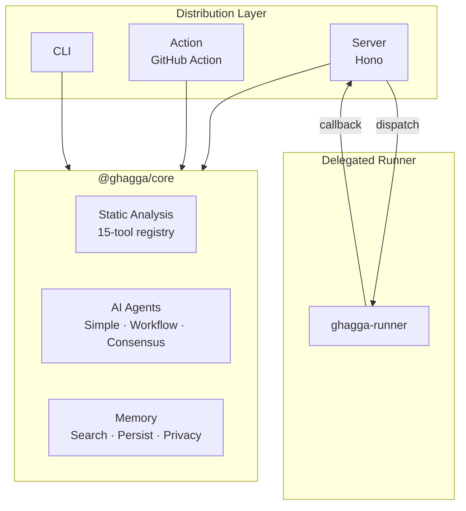

# GHAGGA

> **AI-Powered Multi-Agent Code Review**

GHAGGA is a code review tool that posts intelligent comments on your Pull Requests. It combines LLM analysis with up to 15 static analysis tools and a project memory system that learns across reviews.

## New Here? Start with Your Guide

| Your situation | Start here |
|---|---|
| **I want the easiest setup** | [SaaS Guide (GitHub App)](saas-getting-started.md) ⭐ Recommended |
| I want CI/CD integration | [GitHub Action](github-action.md) |
| I want local CLI reviews | [CLI](cli.md) |
| I want to self-host | [Self-Hosted (Docker)](self-hosted.md) |
| I just want to explore | Keep reading below, then check [Quick Start](quick-start.md) |

## How It Works

1. **Receives** a PR diff (via webhook, CLI, or GitHub Action)
2. **Scans** it with static analysis tools — zero LLM tokens for known issues
3. **Searches** project memory for past decisions, patterns, and bug fixes
4. **Sends** the diff + static findings + memory to AI agents
5. **Posts** a structured review comment with findings, severity, and suggestions
6. **Learns** by extracting observations and storing them for next time

## Key Features

| Feature | Description |
|---------|-------------|
| **3 Review Modes** | Simple (single LLM), Workflow (5 specialist agents), Consensus (multi-model voting) |
| **15 Static Analysis Tools** | Semgrep, Trivy, CPD, Gitleaks, ShellCheck, markdownlint, Lizard + 8 auto-detect tools — zero tokens |
| **Delegated Runner** | Static analysis runs on user-owned GitHub Actions runners (7GB RAM, free for public repos) |
| **Project Memory** | Learns patterns, decisions, and bug fixes across reviews (PostgreSQL + tsvector FTS for Server / SQLite + FTS5 for CLI & Action) |
| **Multi-Provider** | 6 providers: GitHub Models (free), Anthropic, OpenAI, Google, Ollama (local), Qwen (Alibaba) — bring your own key |
| **3 Distribution Modes** | SaaS, GitHub Action, CLI |
| **Comment Trigger** | Type `ghagga review` on any PR to re-trigger a review on demand |
| **Dashboard** | React SPA on GitHub Pages — review history, stats, settings, memory browser |
| **BYOK Security** | AES-256-GCM encryption, HMAC-SHA256 webhook verification, privacy stripping |

## Architecture at a Glance

The review engine (`@ghagga/core`) is distribution-agnostic. Each app is a thin adapter that feeds diffs into the core and handles I/O.

## Quick Links

- **[Quick Start](quick-start.md)** — Get running in 5 minutes
- **[Architecture](architecture.md)** — Core + Adapters pattern explained
- **[Review Modes](review-modes.md)** — Simple, Workflow, and Consensus
- **[Static Analysis](static-analysis.md)** — 15 tools, tier system, per-tool control
- **[Runner Architecture](runner-architecture.md)** — Delegated static analysis on GitHub Actions
- **[Memory System](memory-system.md)** — How GHAGGA learns across reviews
- **[Configuration](configuration.md)** — Environment variables and config files
- **[GitHub Action](github-action.md)** — The fastest way to get started
- **[CLI](cli.md)** — Review local changes from your terminal
- **[Self-Hosted](self-hosted.md)** — Full deployment with Docker

## Origins

GHAGGA is a complete rewrite of [Gentleman Guardian Angel (GGA)](https://github.com/Gentleman-Programming/gentleman-guardian-angel) by [Gentleman Programming](https://youtube.com/@GentlemanProgramming). Memory system design patterns inspired by [Engram](https://github.com/Gentleman-Programming/engram).
