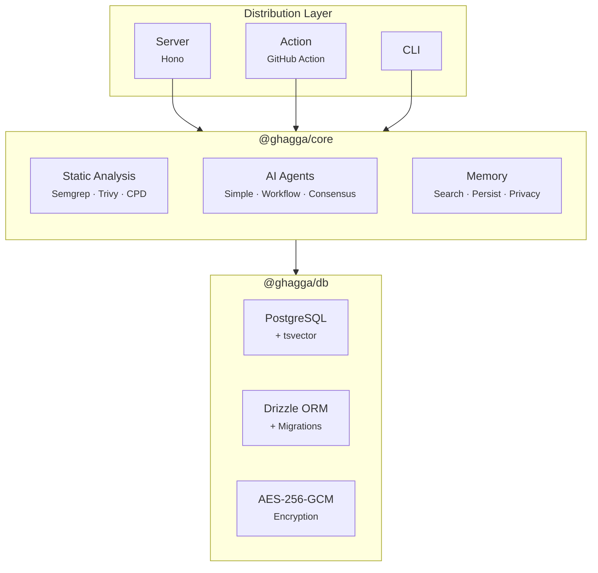

# Architecture

## Core + Adapters Pattern

GHAGGA uses a **Core + Adapters** architecture. The review engine (`@ghagga/core`) is pure logic with zero I/O dependencies — it knows nothing about HTTP, webhooks, or CLI. Each distribution mode is a thin adapter.



## Adapter Responsibilities

Each adapter does the minimum work necessary to bridge between its I/O world and the core engine:

| Adapter | Input | Output | Memory |
|---------|-------|--------|--------|
| **Server** | GitHub webhook | PR comment via GitHub API | Yes (PostgreSQL) |
| **Action** | PR event in GitHub Actions | PR comment via Octokit | No |
| **CLI** | Local `git diff` | Terminal output (markdown/json) | No |

## Monorepo Structure

```
ghagga/
├── packages/
│   ├── core/           # @ghagga/core — Review engine (zero I/O)
│   │   └── src/
│   │       ├── pipeline.ts     # Main orchestrator
│   │       ├── types.ts        # All TypeScript interfaces
│   │       ├── agents/         # Simple, Workflow, Consensus
│   │       ├── tools/          # Semgrep, Trivy, CPD runners
│   │       ├── memory/         # Search, persist, privacy
│   │       ├── providers/      # Vercel AI SDK multi-provider
│   │       └── utils/          # Diff parsing, stack detect, tokens
│   └── db/             # @ghagga/db — Database layer
│       └── src/
│           ├── schema.ts       # Drizzle table definitions
│           ├── crypto.ts       # AES-256-GCM encrypt/decrypt
│           └── queries.ts      # Typed database queries
├── apps/
│   ├── server/         # Hono API (webhook + REST + Inngest)
│   ├── dashboard/      # React SPA (GitHub Pages)
│   ├── cli/            # CLI tool (Commander.js)
│   └── action/         # GitHub Action (node20 + Docker)
├── Dockerfile          # Multi-stage with Semgrep, Trivy, CPD
└── docker-compose.yml  # PostgreSQL + server for local dev
```

## Design Decisions

### Vercel AI SDK over LangChain/LangGraph

GHAGGA's review flow is **predictable** (Layer 0 → 1 → 2 → 3), not a dynamic graph. Vercel AI SDK gives multi-provider support (Anthropic, OpenAI, Google) with streaming, structured output, and tool calling — without the overhead of graph management.

### Hono over Express/Fastify

Hono is the fastest TypeScript framework at ~14KB. It runs on Node.js, Bun, Deno, and Cloudflare Workers. Express is legacy, Fastify is heavier than needed for this use case.

### Drizzle ORM over Prisma

Zero-overhead SQL with excellent TypeScript inference. No binary dependencies (unlike Prisma). Supports raw tsvector operations for the memory system's full-text search.

### PostgreSQL Memory over Engram

[Engram](https://github.com/Gentleman-Programming/engram) has great design patterns (session model, topic-key upserts, deduplication, privacy stripping) but no multi-tenancy, no auth, and is SQLite single-writer. We adopted its patterns directly in PostgreSQL.

### Inngest over BullMQ

Zero infrastructure — no Redis server, no worker processes. 50k events/month free. Step-based checkpointing means LLM retries don't re-run static analysis. Fallback to sync execution if unavailable.

### Binary Execution for Static Analysis

Semgrep, Trivy, and CPD are called as child processes — no separate microservices, no network latency, no SSRF concerns. All three tools output JSON/XML that's parsed locally.
