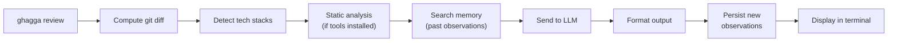

# CLI Guide

Review local code changes from your terminal with AI-powered analysis. The CLI is the fastest way to get feedback before you push — no server, no CI pipeline, no Docker required.

> **Not looking for the CLI?** If you want zero-config SaaS, try the [GitHub App](saas-getting-started.md). For automated PR reviews, see the [GitHub Action](github-action.md). For full self-hosted control, see the [Self-Hosted Guide](self-hosted.md).

---

## When to Choose the CLI

The CLI is best for:

- **Local development** — review changes before committing or pushing
- **Pre-commit hooks** — automatic review on every commit via `ghagga hooks install`
- **Pre-push checks** — catch issues before they hit CI
- **CI/CD pipelines** — integrate reviews into any pipeline with exit codes
- **Reviewing specific files** — target a directory or subdirectory with `ghagga review ./src`

---

## Prerequisites

- **Node.js >= 20.0.0** (check: `node --version`)
- **Git** (required for computing diffs)
- **A GitHub account** (required for `ghagga login` and free GitHub Models access)

---

## Cost

| Component | Cost |
|-----------|------|
| **GHAGGA CLI** | Free and open source (MIT license) |
| **GitHub Models** (`gpt-4o-mini`) | **Free** — default provider, no API key needed |
| **Ollama** | **Free** — runs locally, 100% offline, no API key |
| **Other LLM providers** (Anthropic, OpenAI, Google, Qwen) | BYOK — you pay those providers directly at their standard rates |
| **Static analysis** (up to 15 tools) | Free — runs locally if installed |

> 💡 **TL;DR**: 100% free with `ghagga login` (GitHub Models) or `--provider ollama` (local). No credit card, no signup beyond GitHub.

---

## Step 1: Install

Install globally or use `npx` (no install required):

```bash
# Option A: Global install
npm install -g ghagga

# Option B: Run directly with npx (no install)
npx ghagga --version
```

> ✅ **Verification**: Run `ghagga --version` (or `npx ghagga --version`). You should see the version number (e.g., `2.1.0`).

---

## Step 2: Login

Authenticate with GitHub to get free access to AI models via [GitHub Models](https://github.com/marketplace/models):

```bash
ghagga login
```

The login process uses **GitHub Device Flow**:

1. The CLI displays a one-time code and opens your browser to `https://github.com/login/device`
2. Enter the code in the browser and click **"Authorize"**
3. The CLI detects authorization and saves your token

Your credentials are stored at `~/.config/ghagga/config.json` (following the [XDG Base Directory](https://specifications.freedesktop.org/basedir-spec/latest/) specification).

> ✅ **Verification**: Run `ghagga status`. You should see `Auth: Logged in` with your GitHub username.

---

## Step 3: Review Your Code

Make some code changes (staged or uncommitted), then:

```bash
ghagga review
```

The CLI computes a `git diff`, sends it to the AI, and prints the review to your terminal.

> 💡 **Tip**: If you see "No changes detected", stage some changes with `git add` or make uncommitted edits.

> ✅ **Verification**: You should see the GHAGGA review output with status, summary, and findings.

---

## Step 4: Explore Options

```bash
# Thorough review with 5 specialist agents
ghagga review --mode workflow

# JSON output for CI integration
ghagga review --format json | jq '.status'

# See real-time progress of each pipeline step
ghagga review --mode workflow --verbose

# Review a specific directory
ghagga review ./src

# Use a local Ollama model (100% offline, free)
ghagga review --provider ollama --model qwen2.5-coder:7b
```

> ✅ **Verification**: Try `ghagga review --verbose` to see each step of the pipeline in real time.

---

## How It Works



1. The CLI runs `git diff` (staged changes first, then falls back to uncommitted changes; `--staged` forces `git diff --cached` only)
2. The diff is parsed and the tech stack is auto-detected from file extensions
3. If static analysis tools are installed locally, they run first (zero LLM tokens) — up to 15 tools via the plugin registry
4. Relevant observations are retrieved from the local memory database via FTS5 full-text search
5. The diff + static findings + memory context are sent to the configured LLM provider (default: GitHub Models `gpt-4o-mini`)
6. The LLM returns a structured review with findings, severity, and suggestions
7. New observations (decisions, patterns, bugs) are extracted and persisted to memory
8. The result is formatted as markdown (default) or JSON and printed to stdout

### Git Hooks Workflow

When git hooks are installed via `ghagga hooks install`, the review runs automatically on each commit:

- **pre-commit**: Runs `ghagga review --staged --plain --exit-on-issues`. Uses `--quick` mode by default for fast feedback (~5-10s). If critical/high issues are found, the commit is blocked.
- **commit-msg**: Runs `ghagga review --commit-msg <file> --plain --exit-on-issues`. Validates message format (empty, too short, subject >72 chars, trailing period, missing body separation).

Hooks auto-detect `ghagga` in PATH and skip gracefully if not found, so they won't break your workflow if GHAGGA is uninstalled.

> 💡 **Memory**: The CLI includes a local SQLite memory database (via `sql.js` WASM) stored at `~/.config/ghagga/memory.db`. Past observations are searched using FTS5 full-text search and injected into agent prompts, just like the Server mode. Observations from each review are persisted locally so your project memory grows over time. Use `--no-memory` to disable memory for a single review, or manage stored observations with `ghagga memory`. Alternatively, use `--memory-backend engram` to store observations in [Engram](https://github.com/Gentleman-Programming/engram), enabling cross-tool memory sharing with Claude Code, OpenCode, Gemini CLI, and other Engram-compatible tools. If Engram is unreachable, the CLI falls back to SQLite automatically.

---

## Commands

The CLI has 6 commands:

### `ghagga login`

Authenticate with GitHub using Device Flow. Stores your token at `~/.config/ghagga/config.json` and sets the default provider to `github` with model `gpt-4o-mini` (free).

```bash
ghagga login
```

If you're already logged in, the CLI shows your username and suggests `ghagga logout` to switch accounts.

### `ghagga logout`

Clear stored credentials from `~/.config/ghagga/config.json`.

```bash
ghagga logout
```

### `ghagga status`

Show current authentication and configuration:

```bash
ghagga status
```

Example output:

```
🤖 GHAGGA Status

   Config: /home/user/.config/ghagga/config.json
   Auth:   Logged in as octocat
   Provider: github
   Model:    gpt-4o-mini
   Session: Valid (octocat)
```

### `ghagga review [path]`

Run an AI code review on local changes. This is the main command.

```bash
# Review changes in current directory (default)
ghagga review

# Review changes in a specific directory
ghagga review ./src

# Review with all options
ghagga review --mode workflow --provider openai --api-key sk-xxx --verbose
```

### `ghagga memory`

Inspect, search, and manage the local review memory database. See [Memory Subcommands](#memory-subcommands) below for full details.

```bash
# List stored observations
ghagga memory list

# Search observations
ghagga memory search "error handling"

# Show database statistics
ghagga memory stats
```

### `ghagga hooks`

Install, uninstall, and check status of git hooks for automated code review on commit.

#### `ghagga hooks install [--force] [--pre-commit] [--commit-msg]`

Install GHAGGA-managed git hooks in the current repository. By default, installs both `pre-commit` and `commit-msg` hooks. Use `--pre-commit` or `--commit-msg` to install only one.

```bash
ghagga hooks install                  # Install both hooks
ghagga hooks install --pre-commit     # Only pre-commit hook
ghagga hooks install --commit-msg     # Only commit-msg hook
ghagga hooks install --force          # Overwrite existing hooks (backs up originals)
```

- Hooks auto-detect `ghagga` in PATH and fail gracefully if not found.
- `--force` backs up existing hooks (e.g., `pre-commit.bak`) before overwriting.
- Installed hooks use `--plain --exit-on-issues` automatically.

#### `ghagga hooks uninstall`

Remove GHAGGA-managed hooks from the current repository.

```bash
ghagga hooks uninstall
```

#### `ghagga hooks status`

Show the current status of git hooks in the repository (installed, not installed, or third-party).

```bash
ghagga hooks status
```

---

## Review Command Options

| Option | Short | Default | Description |
|--------|-------|---------|-------------|
| `[path]` | — | `.` | Optional path to repository or subdirectory |
| `--mode <mode>` | `-m` | `simple` | Review mode: `simple`, `workflow`, `consensus` |
| `--provider <provider>` | `-p` | `github` | LLM provider: `github`, `anthropic`, `openai`, `google`, `ollama`, `qwen` |
| `--model <model>` | — | Auto | Model identifier (auto-selects best model per provider) |
| `--api-key <key>` | — | — | LLM provider API key (or use env vars) |
| `--format <format>` | `-f` | `markdown` | Output format: `markdown`, `json` |
| `--enable-tool <name>` | — | — | Force-enable a specific tool (can be repeated) |
| `--disable-tool <name>` | — | — | Force-disable a specific tool (can be repeated) |
| `--list-tools` | — | — | Show all 15 available tools with status, tier, and languages |
| `--no-semgrep` | — | — | ⚠️ Deprecated — use `--disable-tool semgrep`. Disable Semgrep |
| `--no-trivy` | — | — | ⚠️ Deprecated — use `--disable-tool trivy`. Disable Trivy |
| `--no-cpd` | — | — | ⚠️ Deprecated — use `--disable-tool cpd`. Disable CPD |
| `--no-memory` | — | — | Disable review memory (skip search and persist steps) |
| `--memory-backend <type>` | — | `sqlite` | Memory backend: `sqlite` or `engram` |
| `--config <path>` | `-c` | `.ghagga.json` | Path to config file (must be a file path, not inline JSON) |
| `--staged` | — | — | Review only staged files (uses `git diff --cached`; designed for pre-commit hook) |
| `--quick` | — | — | Static analysis only, skip AI review (~5-10s vs ~30-60s) |
| `--commit-msg <file>` | — | — | Validate commit message from file (empty, too short, subject >72 chars, trailing period, body separation) |
| `--exit-on-issues` | — | — | Exit with code 1 if critical/high issues found |
| `--verbose` | `-v` | — | Show real-time progress of each pipeline step |

---

## Global Options

| Option | Description |
|--------|-------------|
| `--plain` | Disable styled terminal output (colored headers, spinners). Automatically enabled in non-TTY environments and CI (`!process.stdout.isTTY \|\| !!process.env.CI`). |
| `--version` | Show version number |
| `--help` | Show help |

> 💡 **Terminal UI**: The CLI uses [`@clack/prompts`](https://github.com/natemoo-re/clack) for styled terminal output — colored headers, spinners, and structured results. In non-TTY or CI environments, output automatically falls back to plain `console.log` with zero ANSI escape codes. Use `--plain` to force plain output in any environment.

---

## Environment Variables

The CLI supports environment variables as an alternative to CLI flags:

```bash
GHAGGA_API_KEY=<key>              # API key for the LLM provider
GHAGGA_PROVIDER=<provider>        # LLM provider override
GHAGGA_MODEL=<model>              # Model identifier override
GHAGGA_MEMORY_BACKEND=<type>      # Memory backend: sqlite (default) or engram
GHAGGA_ENGRAM_HOST=<url>          # Engram server URL (default: http://localhost:7437)
GHAGGA_ENGRAM_TIMEOUT=<seconds>   # Engram connection timeout (default: 5)
GITHUB_TOKEN=<token>              # GitHub token (fallback for github provider)
```

### Resolution Priority

The CLI resolves configuration in this order (highest to lowest priority):

1. **CLI flags** (`--provider`, `--model`, `--api-key`)
2. **Environment variables** (`GHAGGA_PROVIDER`, `GHAGGA_MODEL`, `GHAGGA_API_KEY`)
3. **Stored config** (from `ghagga login` — saved at `~/.config/ghagga/config.json`)
4. **Defaults** (`provider: github`, `model: gpt-4o-mini`)

### `GITHUB_TOKEN` Fallback

If the provider is `github` and no `--api-key` is provided, the CLI automatically falls back to the `GITHUB_TOKEN` environment variable, then to the stored token from `ghagga login`. This means you can skip `ghagga login` in CI environments where `GITHUB_TOKEN` is already set:

```bash
export GITHUB_TOKEN=ghp_xxxxxxxxxxxx
ghagga review  # Uses GITHUB_TOKEN for GitHub Models
```

---

## Config File

Place a `.ghagga.json` in your project root for project-level defaults:

```json
{
  "mode": "workflow",
  "provider": "github",
  "enabledTools": ["ruff", "bandit"],
  "disabledTools": ["markdownlint"],
  "customRules": [".semgrep/custom-rules.yml"],
  "ignorePatterns": ["*.test.ts", "*.spec.ts", "docs/**"],
  "reviewLevel": "strict"
}
```

Use `--config` to point to a specific config file:

```bash
ghagga review --config ./config/strict.ghagga.json
```

> ⚠️ **Important**: `--config` expects a **file path**, not inline JSON. The CLI reads the file with `readFileSync`.

**Priority**: CLI flags > config file > environment variables > defaults.

---

## Config Storage

Auth credentials and preferences are stored at:

```
~/.config/ghagga/config.json
```

Or, if `$XDG_CONFIG_HOME` is set:

```
$XDG_CONFIG_HOME/ghagga/config.json
```

This file is created by `ghagga login` and contains your GitHub token, username, default provider, and default model. Run `ghagga logout` to clear it.

---

## Provider Examples

### GitHub Models (default — free)

No API key needed after `ghagga login`:

```bash
ghagga review
```

> **SaaS mode note**: In the SaaS server (GitHub App), GitHub Models requires a personal access token with `models:read` scope configured in the provider chain. Installation tokens (`ghs_*`) do not have this permission, so `github` provider entries without an explicit API key are silently filtered out at review time. This does not affect CLI or GitHub Action usage.

### OpenAI

```bash
ghagga review --provider openai --api-key sk-xxx
```

### Anthropic

```bash
ghagga review --provider anthropic --api-key sk-ant-xxx
```

### Google

```bash
ghagga review --provider google --api-key AIzaXXX
```

### Qwen (Alibaba Cloud)

```bash
ghagga review --provider qwen --api-key sk-xxx
```

### Ollama (local, free, 100% offline)

Requires [Ollama](https://ollama.com/) installed locally. No API key or internet needed:

```bash
# Pull a model first
ollama pull qwen2.5-coder:7b

# Review with local AI
ghagga review --provider ollama
ghagga review --provider ollama --model codellama:13b
```

---

## Static Analysis

The CLI supports up to **15 static analysis tools** organized in two tiers — zero tokens consumed for known issues. See [Static Analysis](static-analysis.md) for the full tool table.

### Tool Tiers

- **always-on** (7 tools) — Run on every review: Semgrep, Trivy, CPD, Gitleaks, ShellCheck, markdownlint, Lizard
- **auto-detect** (8 tools) — Activate when matching files are in the diff: Ruff, Bandit, golangci-lint, Biome, PMD, Psalm, clippy, Hadolint

Tools are **optional**. If a tool isn't installed, it's silently skipped. The review continues with whatever tools are available.

### Controlling Tools

```bash
# List all tools and their status
ghagga review --list-tools

# Force-enable specific tools
ghagga review --enable-tool ruff --enable-tool bandit

# Force-disable a tool
ghagga review --disable-tool markdownlint
```

> The legacy flags `--no-semgrep`, `--no-trivy`, `--no-cpd` still work but show deprecation warnings. Use `--disable-tool <name>` instead.

---

## Expected Output

### Markdown Format (default)

```
---
🤖 GHAGGA Code Review  |  ✅ PASSED
Mode: simple | Model: gpt-4o-mini | Time: 8.2s | Tokens: 1,847
---

## Summary
Clean implementation of the auth middleware. Good separation of concerns.

## Findings (2)

### 🤖 AI Review (2)

🟡 [MEDIUM] error-handling
   src/middleware/auth.ts:42
   Missing error boundary for token validation. If jwt.verify throws, the
   middleware will crash without sending a response.
   💡 Wrap in try/catch and return 401 on verification failure.

🟢 [LOW] naming
   src/middleware/auth.ts:15
   Variable name `t` is not descriptive.
   💡 Rename to `token` or `bearerToken` for clarity.

---
Powered by GHAGGA — AI Code Review
```

### JSON Format

```bash
ghagga review --format json | jq '.status'
# "PASSED"
```

The JSON output contains the full `ReviewResult` object with `status`, `summary`, `findings[]`, and `metadata`.

---

## Exit Codes

| Code | Meaning |
|------|---------|
| `0` | Review passed (`PASSED`) or was skipped (`SKIPPED`) |
| `1` | Review failed (`FAILED`) or needs human review (`NEEDS_HUMAN_REVIEW`) |

Use exit codes in CI/CD to fail pipelines on review failures:

```bash
ghagga review || echo "Review found issues!"
```

---

## Memory Subcommands

The `ghagga memory` command group lets you inspect, search, and manage the local SQLite memory database stored at `~/.config/ghagga/memory.db`.

### `ghagga memory list`

List stored observations from review memory.

```bash
ghagga memory list
ghagga memory list --repo octocat/my-app --type pattern --limit 5
```

Options:

| Option | Default | Description |
|--------|---------|-------------|
| `--repo <owner/repo>` | — | Filter by repository |
| `--type <type>` | — | Filter by observation type (`decision`, `pattern`, `bugfix`, `learning`, `architecture`, `config`, `discovery`) |
| `--limit <n>` | `20` | Maximum rows to display |

### `ghagga memory search <query>`

Search observations by content using FTS5/BM25 full-text search.

```bash
ghagga memory search "error handling"
ghagga memory search --repo octocat/my-app "authentication"
```

Options:

| Option | Default | Description |
|--------|---------|-------------|
| `--repo <owner/repo>` | Auto-detected from git remote | Scope search to a specific repository |
| `--limit <n>` | `10` | Maximum results |

### `ghagga memory show <id>`

Show full details of a specific observation, including content, file paths, topic key, and revision count.

```bash
ghagga memory show 42
```

### `ghagga memory delete <id>`

Delete a single observation by ID.

```bash
ghagga memory delete 42
ghagga memory delete --force 42
```

Options:

| Option | Description |
|--------|-------------|
| `--force` | Skip confirmation prompt |

### `ghagga memory stats`

Show memory database statistics — total observations, counts by type and project, file size, and date range.

```bash
ghagga memory stats
```

### `ghagga memory clear`

Clear all observations from memory, or scoped to a single repository.

```bash
ghagga memory clear
ghagga memory clear --repo octocat/my-app
ghagga memory clear --force
```

Options:

| Option | Description |
|--------|-------------|
| `--repo <owner/repo>` | Only clear observations for a specific repository |
| `--force` | Skip confirmation prompt |

---

## Troubleshooting

### "command not found: ghagga"

**Symptom**: Running `ghagga` in the terminal shows "command not found".

**Cause**: npm global bin directory is not in your PATH, or GHAGGA isn't installed globally.

**Fix**: Use `npx ghagga` instead (no global install required), or check your PATH:

```bash
# Check where npm installs global packages
npm config get prefix

# Add to PATH (add to your shell profile)
export PATH="$(npm config get prefix)/bin:$PATH"
```

### "No API key available"

**Symptom**: `❌ No API key available.`

**Cause**: Not logged in and no API key provided via flag or environment variable.

**Fix**: Run `ghagga login` to authenticate with GitHub (free), or pass `--api-key` directly:

```bash
ghagga login                              # Free GitHub Models
ghagga review --provider openai --api-key sk-xxx  # BYOK
```

### "No changes detected"

**Symptom**: `ℹ️ No changes detected. Stage some changes or make commits to review.`

**Cause**: No staged or uncommitted changes in the working tree.

**Fix**: Make some code changes, or stage existing changes:

```bash
git add .
ghagga review
```

### "Could not get git diff"

**Symptom**: `❌ Review failed: Could not get git diff from "..."`

**Cause**: Running `ghagga review` outside a git repository, or the directory has no git history.

**Fix**: Navigate to a git repository root and ensure it has at least one commit:

```bash
cd /path/to/your/repo
ghagga review
```

### Static analysis tools silently skipped

**Symptom**: No static analysis findings in the review, even for code with known vulnerabilities.

**Cause**: The required tool binaries are not installed locally.

**Expected behavior**: Tools are silently skipped — the review still works (LLM-only).

**Fix**: Install the tools you need. Use `ghagga review --list-tools` to see which tools are available and which are missing:

```bash
# macOS (core tools)
brew install semgrep trivy pmd

# Python tools
pip install ruff bandit lizard

# Linux (example for Semgrep)
pip install semgrep
```

### Login fails / device flow timeout

**Symptom**: `❌ Login failed: ...` or the CLI times out waiting for authorization.

**Cause**: Browser didn't open automatically, or the authorization code expired before you completed the flow.

**Fix**: Manually navigate to `https://github.com/login/device`, enter the code shown in the terminal, and authorize. If the code expired, run `ghagga login` again to get a new one.

---

## Next Steps

- **[GitHub Action Guide](github-action.md)** — Automated PR reviews in CI
- **[Configuration](configuration.md)** — Environment variables and config file options
- **[Review Modes](review-modes.md)** — Learn about Simple, Workflow, and Consensus modes
- **[Static Analysis](static-analysis.md)** — 15 tools, tier system, per-tool control
- **[SaaS Guide](saas-getting-started.md)** — Zero-config GitHub App with Dashboard
- **[Self-Hosted Guide](self-hosted.md)** — Full deployment with memory and dashboard
