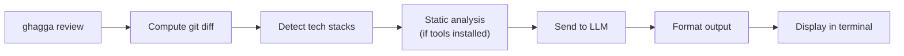

# CLI Guide

Review local code changes from your terminal with AI-powered analysis. The CLI is the fastest way to get feedback before you push — no server, no CI pipeline, no Docker required.

> **Not looking for the CLI?** If you want zero-config SaaS, try the [GitHub App](saas-getting-started.md). For automated PR reviews, see the [GitHub Action](github-action.md). For full self-hosted control, see the [Self-Hosted Guide](self-hosted.md).

---

## When to Choose the CLI

The CLI is best for:

- **Local development** — review changes before committing or pushing
- **Pre-push checks** — catch issues before they hit CI
- **CI/CD pipelines** — integrate reviews into any pipeline with exit codes
- **Reviewing specific files** — target a directory or subdirectory with `ghagga review ./src`

---

## Prerequisites

- **Node.js >= 20.0.0** (check: `node --version`)
- **Git** (required for computing diffs)
- **A GitHub account** (required for `ghagga login` and free GitHub Models access)

---

## Cost

| Component | Cost |
|-----------|------|
| **GHAGGA CLI** | Free and open source (MIT license) |
| **GitHub Models** (`gpt-4o-mini`) | **Free** — default provider, no API key needed |
| **Ollama** | **Free** — runs locally, 100% offline, no API key |
| **Other LLM providers** (Anthropic, OpenAI, Google, Qwen) | BYOK — you pay those providers directly at their standard rates |
| **Static analysis** (Semgrep, Trivy, CPD) | Free — runs locally if installed |

> 💡 **TL;DR**: 100% free with `ghagga login` (GitHub Models) or `--provider ollama` (local). No credit card, no signup beyond GitHub.

---

## Step 1: Install

Install globally or use `npx` (no install required):

```bash
# Option A: Global install
npm install -g ghagga

# Option B: Run directly with npx (no install)
npx ghagga --version
```

> ✅ **Verification**: Run `ghagga --version` (or `npx ghagga --version`). You should see the version number (e.g., `2.0.1`).

---

## Step 2: Login

Authenticate with GitHub to get free access to AI models via [GitHub Models](https://github.com/marketplace/models):

```bash
ghagga login
```

The login process uses **GitHub Device Flow**:

1. The CLI displays a one-time code and opens your browser to `https://github.com/login/device`
2. Enter the code in the browser and click **"Authorize"**
3. The CLI detects authorization and saves your token

Your credentials are stored at `~/.config/ghagga/config.json` (following the [XDG Base Directory](https://specifications.freedesktop.org/basedir-spec/latest/) specification).

> ✅ **Verification**: Run `ghagga status`. You should see `Auth: Logged in` with your GitHub username.

---

## Step 3: Review Your Code

Make some code changes (staged or uncommitted), then:

```bash
ghagga review
```

The CLI computes a `git diff`, sends it to the AI, and prints the review to your terminal.

> 💡 **Tip**: If you see "No changes detected", stage some changes with `git add` or make uncommitted edits.

> ✅ **Verification**: You should see the GHAGGA review output with status, summary, and findings.

---

## Step 4: Explore Options

```bash
# Thorough review with 5 specialist agents
ghagga review --mode workflow

# JSON output for CI integration
ghagga review --format json | jq '.status'

# See real-time progress of each pipeline step
ghagga review --mode workflow --verbose

# Review a specific directory
ghagga review ./src

# Use a local Ollama model (100% offline, free)
ghagga review --provider ollama --model qwen2.5-coder:7b
```

> ✅ **Verification**: Try `ghagga review --verbose` to see each step of the pipeline in real time.

---

## How It Works



1. The CLI runs `git diff` (staged changes first, then falls back to uncommitted changes)
2. The diff is parsed and the tech stack is auto-detected from file extensions
3. If Semgrep, Trivy, or CPD are installed locally, static analysis runs first (zero LLM tokens)
4. The diff + static findings are sent to the configured LLM provider (default: GitHub Models `gpt-4o-mini`)
5. The LLM returns a structured review with findings, severity, and suggestions
6. The result is formatted as markdown (default) or JSON and printed to stdout

> ⚠️ **Note**: Memory is not available in CLI mode (no PostgreSQL connection). The review pipeline gracefully degrades — you still get static analysis + LLM review, just without project memory context.

---

## Commands

The CLI has 4 commands:

### `ghagga login`

Authenticate with GitHub using Device Flow. Stores your token at `~/.config/ghagga/config.json` and sets the default provider to `github` with model `gpt-4o-mini` (free).

```bash
ghagga login
```

If you're already logged in, the CLI shows your username and suggests `ghagga logout` to switch accounts.

### `ghagga logout`

Clear stored credentials from `~/.config/ghagga/config.json`.

```bash
ghagga logout
```

### `ghagga status`

Show current authentication and configuration:

```bash
ghagga status
```

Example output:

```
🤖 GHAGGA Status

   Config: /home/user/.config/ghagga/config.json
   Auth:   Logged in as octocat
   Provider: github
   Model:    gpt-4o-mini
   Session: Valid (octocat)
```

### `ghagga review [path]`

Run an AI code review on local changes. This is the main command.

```bash
# Review changes in current directory (default)
ghagga review

# Review changes in a specific directory
ghagga review ./src

# Review with all options
ghagga review --mode workflow --provider openai --api-key sk-xxx --verbose
```

---

## Review Command Options

| Option | Short | Default | Description |
|--------|-------|---------|-------------|
| `[path]` | — | `.` | Optional path to repository or subdirectory |
| `--mode <mode>` | `-m` | `simple` | Review mode: `simple`, `workflow`, `consensus` |
| `--provider <provider>` | `-p` | `github` | LLM provider: `github`, `anthropic`, `openai`, `google`, `ollama`, `qwen` |
| `--model <model>` | — | Auto | Model identifier (auto-selects best model per provider) |
| `--api-key <key>` | — | — | LLM provider API key (or use env vars) |
| `--format <format>` | `-f` | `markdown` | Output format: `markdown`, `json` |
| `--no-semgrep` | — | — | Disable Semgrep security analysis |
| `--no-trivy` | — | — | Disable Trivy vulnerability scanning |
| `--no-cpd` | — | — | Disable CPD duplicate detection |
| `--config <path>` | `-c` | `.ghagga.json` | Path to config file (must be a file path, not inline JSON) |
| `--verbose` | `-v` | — | Show real-time progress of each pipeline step |

---

## Environment Variables

The CLI supports environment variables as an alternative to CLI flags:

```bash
GHAGGA_API_KEY=<key>       # API key for the LLM provider
GHAGGA_PROVIDER=<provider> # LLM provider override
GHAGGA_MODEL=<model>       # Model identifier override
GITHUB_TOKEN=<token>       # GitHub token (fallback for github provider)
```

### Resolution Priority

The CLI resolves configuration in this order (highest to lowest priority):

1. **CLI flags** (`--provider`, `--model`, `--api-key`)
2. **Environment variables** (`GHAGGA_PROVIDER`, `GHAGGA_MODEL`, `GHAGGA_API_KEY`)
3. **Stored config** (from `ghagga login` — saved at `~/.config/ghagga/config.json`)
4. **Defaults** (`provider: github`, `model: gpt-4o-mini`)

### `GITHUB_TOKEN` Fallback

If the provider is `github` and no `--api-key` is provided, the CLI automatically falls back to the `GITHUB_TOKEN` environment variable, then to the stored token from `ghagga login`. This means you can skip `ghagga login` in CI environments where `GITHUB_TOKEN` is already set:

```bash
export GITHUB_TOKEN=ghp_xxxxxxxxxxxx
ghagga review  # Uses GITHUB_TOKEN for GitHub Models
```

---

## Config File

Place a `.ghagga.json` in your project root for project-level defaults:

```json
{
  "mode": "workflow",
  "provider": "github",
  "enableSemgrep": true,
  "enableTrivy": true,
  "enableCpd": false,
  "customRules": [".semgrep/custom-rules.yml"],
  "ignorePatterns": ["*.test.ts", "*.spec.ts", "docs/**"],
  "reviewLevel": "strict"
}
```

Use `--config` to point to a specific config file:

```bash
ghagga review --config ./config/strict.ghagga.json
```

> ⚠️ **Important**: `--config` expects a **file path**, not inline JSON. The CLI reads the file with `readFileSync`.

**Priority**: CLI flags > config file > environment variables > defaults.

---

## Config Storage

Auth credentials and preferences are stored at:

```
~/.config/ghagga/config.json
```

Or, if `$XDG_CONFIG_HOME` is set:

```
$XDG_CONFIG_HOME/ghagga/config.json
```

This file is created by `ghagga login` and contains your GitHub token, username, default provider, and default model. Run `ghagga logout` to clear it.

---

## Provider Examples

### GitHub Models (default — free)

No API key needed after `ghagga login`:

```bash
ghagga review
```

### OpenAI

```bash
ghagga review --provider openai --api-key sk-xxx
```

### Anthropic

```bash
ghagga review --provider anthropic --api-key sk-ant-xxx
```

### Google

```bash
ghagga review --provider google --api-key AIzaXXX
```

### Qwen (Alibaba Cloud)

```bash
ghagga review --provider qwen --api-key sk-xxx
```

### Ollama (local, free, 100% offline)

Requires [Ollama](https://ollama.com/) installed locally. No API key or internet needed:

```bash
# Pull a model first
ollama pull qwen2.5-coder:7b

# Review with local AI
ghagga review --provider ollama
ghagga review --provider ollama --model codellama:13b
```

---

## Static Analysis

The CLI uses three static analysis tools **before** the LLM review — zero tokens consumed for known issues:

| Tool | What It Finds | Install |
|------|--------------|---------|
| **Semgrep** | Security vulnerabilities, dangerous patterns | `brew install semgrep` |
| **Trivy** | Known CVEs in dependencies | `brew install trivy` |
| **CPD** | Duplicated code blocks | `brew install pmd` |

Tools are **optional**. If a tool isn't installed, it's silently skipped. The review continues with whatever tools are available.

Disable any tool with its flag:

```bash
ghagga review --no-semgrep --no-trivy
```

---

## Expected Output

### Markdown Format (default)

```
---
🤖 GHAGGA Code Review  |  ✅ PASSED
Mode: simple | Model: gpt-4o-mini | Time: 8.2s | Tokens: 1,847
---

## Summary
Clean implementation of the auth middleware. Good separation of concerns.

## Findings (2)

### 🤖 AI Review (2)

🟡 [MEDIUM] error-handling
   src/middleware/auth.ts:42
   Missing error boundary for token validation. If jwt.verify throws, the
   middleware will crash without sending a response.
   💡 Wrap in try/catch and return 401 on verification failure.

🟢 [LOW] naming
   src/middleware/auth.ts:15
   Variable name `t` is not descriptive.
   💡 Rename to `token` or `bearerToken` for clarity.

---
Powered by GHAGGA — AI Code Review
```

### JSON Format

```bash
ghagga review --format json | jq '.status'
# "PASSED"
```

The JSON output contains the full `ReviewResult` object with `status`, `summary`, `findings[]`, and `metadata`.

---

## Exit Codes

| Code | Meaning |
|------|---------|
| `0` | Review passed (`PASSED`) or was skipped (`SKIPPED`) |
| `1` | Review failed (`FAILED`) or needs human review (`NEEDS_HUMAN_REVIEW`) |

Use exit codes in CI/CD to fail pipelines on review failures:

```bash
ghagga review || echo "Review found issues!"
```

---

## Troubleshooting

### "command not found: ghagga"

**Symptom**: Running `ghagga` in the terminal shows "command not found".

**Cause**: npm global bin directory is not in your PATH, or GHAGGA isn't installed globally.

**Fix**: Use `npx ghagga` instead (no global install required), or check your PATH:

```bash
# Check where npm installs global packages
npm config get prefix

# Add to PATH (add to your shell profile)
export PATH="$(npm config get prefix)/bin:$PATH"
```

### "No API key available"

**Symptom**: `❌ No API key available.`

**Cause**: Not logged in and no API key provided via flag or environment variable.

**Fix**: Run `ghagga login` to authenticate with GitHub (free), or pass `--api-key` directly:

```bash
ghagga login                              # Free GitHub Models
ghagga review --provider openai --api-key sk-xxx  # BYOK
```

### "No changes detected"

**Symptom**: `ℹ️ No changes detected. Stage some changes or make commits to review.`

**Cause**: No staged or uncommitted changes in the working tree.

**Fix**: Make some code changes, or stage existing changes:

```bash
git add .
ghagga review
```

### "Could not get git diff"

**Symptom**: `❌ Review failed: Could not get git diff from "..."`

**Cause**: Running `ghagga review` outside a git repository, or the directory has no git history.

**Fix**: Navigate to a git repository root and ensure it has at least one commit:

```bash
cd /path/to/your/repo
ghagga review
```

### Static analysis tools silently skipped

**Symptom**: No static analysis findings in the review, even for code with known vulnerabilities.

**Cause**: Semgrep, Trivy, or CPD are not installed locally.

**Expected behavior**: Tools are silently skipped — the review still works (LLM-only).

**Fix**: Install the tools:

```bash
# macOS
brew install semgrep trivy pmd

# Linux (example for Semgrep)
pip install semgrep
```

### Login fails / device flow timeout

**Symptom**: `❌ Login failed: ...` or the CLI times out waiting for authorization.

**Cause**: Browser didn't open automatically, or the authorization code expired before you completed the flow.

**Fix**: Manually navigate to `https://github.com/login/device`, enter the code shown in the terminal, and authorize. If the code expired, run `ghagga login` again to get a new one.

---

## Next Steps

- **[GitHub Action Guide](github-action.md)** — Automated PR reviews in CI
- **[Configuration](configuration.md)** — Environment variables and config file options
- **[Review Modes](review-modes.md)** — Learn about Simple, Workflow, and Consensus modes
- **[Static Analysis](static-analysis.md)** — Semgrep rules, Trivy scanning, CPD detection
- **[SaaS Guide](saas-getting-started.md)** — Zero-config GitHub App with Dashboard
- **[Self-Hosted Guide](self-hosted.md)** — Full deployment with memory and dashboard
