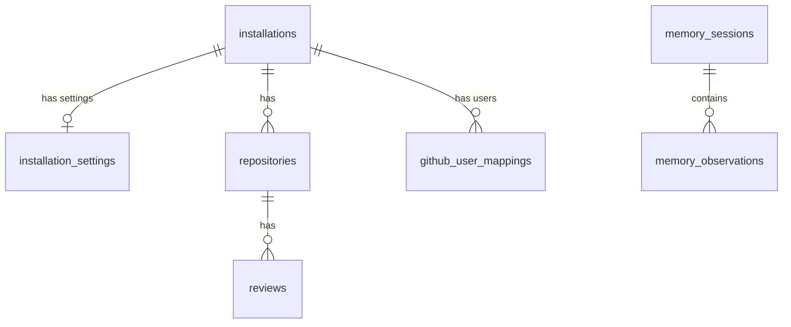

# Database Schema

GHAGGA uses PostgreSQL with Drizzle ORM. The schema is defined in `packages/db/src/schema.ts`.

## Tables

### installations

GitHub App installations.

| Column | Type | Description |
|--------|------|-------------|
| `id` | serial PK | Internal ID |
| `github_installation_id` | integer UNIQUE | GitHub's installation ID |
| `account_login` | varchar(255) | GitHub username or org name |
| `account_type` | varchar(20) | `User` or `Organization` |
| `is_active` | boolean | Whether the installation is active (default `true`) |
| `created_at` | timestamp | When the app was installed |
| `updated_at` | timestamp | Last update timestamp |

### installation_settings

Global settings for an installation (1:1 with `installations`). Each installation has at most one settings row that acts as the default configuration inherited by all repositories under it.

| Column | Type | Description |
|--------|------|-------------|
| `id` | serial PK | Internal ID |
| `installation_id` | integer FK UNIQUE | References `installations.id` (one-to-one, ON DELETE CASCADE) |
| `provider_chain` | jsonb | Array of `DbProviderChainEntry` — ordered provider/model chain (default `[]`) |
| `ai_review_enabled` | boolean | Whether AI review is enabled globally (default `true`) |
| `review_mode` | varchar(20) | `simple`, `workflow`, or `consensus` (default `simple`) |
| `settings` | jsonb | `RepoSettings` — tool toggles, ignore patterns, review level |
| `created_at` | timestamp | Creation timestamp |
| `updated_at` | timestamp | Last update timestamp |

### repositories

Repository configurations.

| Column | Type | Description |
|--------|------|-------------|
| `id` | serial PK | Internal ID |
| `github_repo_id` | integer UNIQUE | GitHub's repository ID |
| `installation_id` | integer FK | References `installations.id` (ON DELETE CASCADE) |
| `full_name` | varchar(255) | `owner/repo` format |
| `is_active` | boolean | Whether reviews are enabled (default `true`) |
| `settings` | jsonb | `RepoSettings` — tool toggles, ignore patterns, review level |
| `review_mode` | varchar(20) | `simple`, `workflow`, or `consensus` (default `simple`) |
| `use_global_settings` | boolean | Inherit `installation_settings` (default `true`) |
| `provider_chain` | jsonb | Array of `DbProviderChainEntry` — per-repo override (default `[]`) |
| `ai_review_enabled` | boolean | Whether AI review is enabled for this repo (default `true`) |
| `encrypted_api_key` | text | **Deprecated.** AES-256-GCM encrypted LLM API key (kept for rollback safety) |
| `llm_provider` | varchar(50) | **Deprecated.** `anthropic`, `openai`, `google`, etc. (default `github`) |
| `llm_model` | varchar(100) | **Deprecated.** Model identifier |
| `created_at` | timestamp | Creation timestamp |
| `updated_at` | timestamp | Last update timestamp |

**Indexes**:
- `idx_repositories_installation` on `installation_id`
- `idx_repositories_full_name` on `full_name`

> **Migration note:** `encrypted_api_key`, `llm_provider`, and `llm_model` are superseded by `provider_chain`. They remain in the schema for rollback safety and will be dropped in a future migration.

### reviews

Review history.

| Column | Type | Description |
|--------|------|-------------|
| `id` | serial PK | Internal ID |
| `repository_id` | integer FK | References `repositories.id` (ON DELETE CASCADE) |
| `pr_number` | integer | Pull request number |
| `status` | varchar(30) | `PASSED`, `FAILED`, `NEEDS_HUMAN_REVIEW`, `SKIPPED` |
| `mode` | varchar(20) | Review mode used |
| `summary` | text | Review summary |
| `findings` | jsonb | Array of `ReviewFinding` objects |
| `tokens_used` | integer | Total tokens consumed (default `0`) |
| `execution_time_ms` | integer | Pipeline execution time |
| `metadata` | jsonb | Additional metadata (provider, model, tools run) |
| `created_at` | timestamp | When the review was executed |

**Indexes**:
- `idx_reviews_repository` on `repository_id`
- `idx_reviews_created_at` on `created_at`

### memory_sessions

Memory sessions (one per review).

| Column | Type | Description |
|--------|------|-------------|
| `id` | serial PK | Internal ID |
| `project` | varchar(255) | `owner/repo` format |
| `pr_number` | integer | Associated PR number |
| `summary` | text | Session summary |
| `started_at` | timestamp | Session start |
| `ended_at` | timestamp | Session end |

**Indexes**: `idx_memory_sessions_project` on `project`

### memory_observations

Individual observations extracted from reviews.

| Column | Type | Description |
|--------|------|-------------|
| `id` | serial PK | Internal ID |
| `session_id` | integer FK | References `memory_sessions.id` (ON DELETE CASCADE) |
| `project` | varchar(255) | `owner/repo` format |
| `type` | varchar(30) | Observation type (see below) |
| `title` | varchar(500) | Short description |
| `content` | text | Full observation content |
| `topic_key` | varchar(255) | For upsert deduplication |
| `file_paths` | jsonb | Related file paths (default `[]`) |
| `severity` | varchar(10) | Severity level of the finding (`critical`, `high`, `medium`, or null for legacy observations) |
| `content_hash` | varchar(64) | SHA-256 hash of content for deduplication |
| `revision_count` | integer | How many times this topic was updated (default `1`) |
| `created_at` | timestamp | Creation timestamp |
| `updated_at` | timestamp | Last update timestamp |

**Indexes**:
- `idx_observations_project` on `project`
- `idx_observations_topic_key` on `topic_key`
- `idx_observations_type` on `type`
- `idx_observations_content_hash` on `content_hash`

A `tsvector` column and GIN index are added via raw SQL migration (`migrations/0001_add_tsvector.sql`) for full-text search.

> **Idempotent migrations**: All custom SQL migrations use `IF NOT EXISTS` / `DROP ... IF EXISTS` guards, making them safe to re-execute without errors.

### github_user_mappings

Maps GitHub users to installations. Used by auth middleware to auto-discover which installation a user belongs to.

| Column | Type | Description |
|--------|------|-------------|
| `id` | serial PK | Internal ID |
| `github_user_id` | integer UNIQUE | GitHub user ID |
| `github_login` | varchar(255) | GitHub username |
| `installation_id` | integer FK | References `installations.id` (ON DELETE CASCADE) |
| `created_at` | timestamp | Creation timestamp |

**Indexes**: `idx_user_mappings_github_user` on `github_user_id`

## Shared Types

### DbProviderChainEntry

Each entry in a `provider_chain` JSONB column. Encrypted API keys are stored per entry.

```typescript
interface DbProviderChainEntry {
  provider: 'anthropic' | 'openai' | 'google' | 'github' | 'qwen';
  model: string;
  encryptedApiKey: string | null; // null for GitHub Models (uses session token)
}
```

### RepoSettings

Default configuration stored in `installation_settings.settings` and `repositories.settings`.

```typescript
interface RepoSettings {
  enableSemgrep: boolean;
  enableTrivy: boolean;
  enableCpd: boolean;
  enableMemory: boolean;
  enabledTools?: string[];
  disabledTools?: string[];
  customRules: string[];
  ignorePatterns: string[];
  reviewLevel: 'soft' | 'normal' | 'strict';
}
```

Default values:

```json
{
  "enableSemgrep": true,
  "enableTrivy": true,
  "enableCpd": true,
  "enableMemory": true,
  "customRules": [],
  "ignorePatterns": ["*.md", "*.txt", ".gitignore", "LICENSE", "*.lock"],
  "reviewLevel": "normal"
}
```

## Observation Types

| Type | Description |
|------|-------------|
| `decision` | Architecture and design choices |
| `pattern` | Code patterns and conventions |
| `bugfix` | Common errors and their fixes |
| `learning` | General project knowledge |
| `architecture` | System design decisions |
| `config` | Configuration patterns |
| `discovery` | Codebase discoveries |

## Entity Relationships



Repositories are scoped by installation. Reviews and memory are scoped by repository. This provides natural multi-tenancy — each GitHub installation only sees its own data.

`installation_settings` provides a single row of global defaults per installation. When `repositories.use_global_settings` is `true`, the repo inherits the installation's `provider_chain`, `ai_review_enabled`, `review_mode`, and `settings` values. Per-repo overrides take effect when `use_global_settings` is `false`.

`github_user_mappings` allows the auth middleware to resolve a GitHub user ID to an installation without requiring the user to provide the installation ID explicitly.
