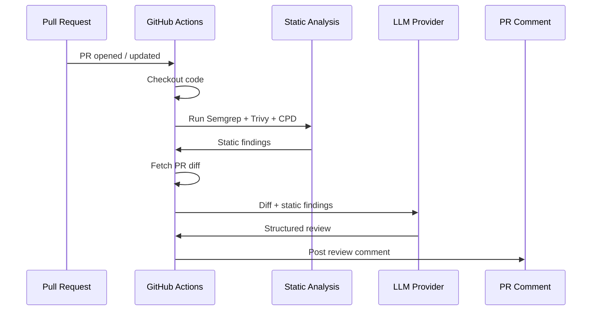

# GitHub Action Guide

Add AI-powered code reviews to any repository in under 5 minutes. GHAGGA runs directly on GitHub's infrastructure — no server, no Docker, no external services. Just a workflow file and a PR.

> **Not looking for the GitHub Action?** If you want zero-config SaaS, try the [GitHub App](saas-getting-started.md). For local terminal reviews, see the [CLI](cli.md). For full self-hosted control, see the [Self-Hosted Guide](self-hosted.md).

---

## Prerequisites

- A **GitHub repository** (public or private)
- **Write access** to the repository (to create `.github/workflows/` files)
- Familiarity with the **pull request workflow** (the Action triggers on PR events)

---

## Cost

| Component | Cost |
|-----------|------|
| **GHAGGA** | Free and open source (MIT license) |
| **GitHub Actions minutes** | **Free unlimited** for public repos. Private repos: 2,000 free minutes/month (then [paid by GitHub](https://docs.github.com/en/billing/managing-billing-for-github-actions/about-billing-for-github-actions)) |
| **GitHub Models** (`gpt-4o-mini`) | **Free** — default provider, no API key needed |
| **Other LLM providers** (Anthropic, OpenAI, Google, Qwen) | BYOK — you pay those providers directly at their standard rates |
| **Ollama** | Free — runs on a self-hosted runner with Ollama installed |
| **Static analysis** (Semgrep, Trivy, CPD) | Free — runs on the GitHub Actions runner |

> 💡 **TL;DR**: 100% free for public repos with the default GitHub Models provider. No credit card, no API key, no signup.

---

## Step 1: Create the Workflow File

Create a file at `.github/workflows/ghagga.yml` in your repository with the following content:

```yaml
# .github/workflows/ghagga.yml
name: Code Review

on:
  pull_request:
    types: [opened, synchronize, reopened]

permissions:
  pull-requests: write

jobs:
  review:
    runs-on: ubuntu-latest
    steps:
      - uses: actions/checkout@v4
      - uses: JNZader/ghagga-action@v1
```

### What each section does

| Section | Purpose |
|---------|---------|
| `on: pull_request` | Triggers the review when a PR is opened, updated, or reopened |
| `permissions: pull-requests: write` | Allows the Action to post comments on the PR |
| `actions/checkout@v4` | Checks out the repository code for static analysis |
| `JNZader/ghagga-action@v1` | Runs the GHAGGA review (defaults: GitHub Models `gpt-4o-mini`, all static analysis enabled) |

> ✅ **Verification**: You should now have a file at `.github/workflows/ghagga.yml` in your repository.

---

## Step 2: Commit and Push

```bash
git add .github/workflows/ghagga.yml
git commit -m "ci: add GHAGGA code review action"
git push
```

> ✅ **Verification**: In your GitHub repository, navigate to the **Actions** tab — you should see the "Code Review" workflow listed.

---

## Step 3: Open a Pull Request

Create a new Pull Request (or push a commit to an existing one). The Action triggers on `pull_request` events with types `opened`, `synchronize`, and `reopened`.

> 💡 **First-time setup**: If you created the workflow file on a feature branch, the Action will run on that same PR. If you merged it to your default branch first, you'll need to open a new PR to trigger it.

> ✅ **Verification**: The **Actions** tab should show a running workflow for your PR.

---

## Step 4: See the Review

Wait **~3-5 minutes** for the first run (static analysis tools are installed and cached). Subsequent runs take **~1-2 minutes** (tools are loaded from cache).

GHAGGA posts a **review comment** on your PR with:

- **Status**: ✅ `PASSED`, ❌ `FAILED`, ⚠️ `NEEDS_HUMAN_REVIEW`, or ⏭️ `SKIPPED`
- **Summary**: A brief overview of the changes
- **Findings**: Individual issues grouped by source, with severity, file location, and description
- **Static analysis results**: Tools run and tools skipped

> ✅ **Verification**: A new comment from `github-actions[bot]` should appear on your Pull Request.

---

## How It Works



1. A **pull request event** triggers the GitHub Actions workflow
2. The Action **checks out the code** and runs **static analysis** (Semgrep, Trivy, CPD) directly on the runner
3. The PR **diff is fetched** via the GitHub API
4. The diff + static findings are sent to the configured **LLM provider** (default: GitHub Models `gpt-4o-mini`)
5. The LLM returns a structured review, which is **posted as a PR comment**

> ⚠️ **Note**: Memory is not available in Action mode (no PostgreSQL connection). The review pipeline gracefully degrades — you still get static analysis + LLM review, just without project memory context.

---

## Inputs

All configuration is done via Action inputs in the workflow YAML. The Action does **not** read `.ghagga.json` config files.

| Input | Required | Default | Description |
|-------|----------|---------|-------------|
| `provider` | No | `github` | LLM provider: `github`, `anthropic`, `openai`, `google`, `ollama`, `qwen` |
| `model` | No | Auto | Model identifier (auto-selects best model per provider, e.g. `gpt-4o-mini` for GitHub) |
| `mode` | No | `simple` | Review mode: `simple` (1 LLM call), `workflow` (5 specialists), `consensus` (multi-model voting) |
| `api-key` | No | — | LLM provider API key. **Not required** for `github` provider (uses `GITHUB_TOKEN` automatically) |
| `github-token` | No | `${{ github.token }}` | GitHub token for fetching PR diffs and posting comments. Automatic. |
| `enable-semgrep` | No | `true` | Enable Semgrep security analysis (auto-installed and cached) |
| `enable-trivy` | No | `true` | Enable Trivy vulnerability scanning (auto-installed and cached) |
| `enable-cpd` | No | `true` | Enable PMD/CPD copy-paste detection (auto-installed and cached) |

---

## Outputs

| Output | Description |
|--------|-------------|
| `status` | Review result: `PASSED`, `FAILED`, `NEEDS_HUMAN_REVIEW`, or `SKIPPED` |
| `findings-count` | Number of findings detected |

---

## Review Status and CI

When the review pipeline returns `status: FAILED`, the Action calls `core.setFailed()` — this causes the GitHub Actions check to show as **failed** (red ❌). If you have branch protection rules requiring passing checks, this will **block merging**.

This is intentional: `FAILED` means the review found critical issues that should be addressed.

### Blocking mode (default)

Review failures block merging. For teams that want strict enforcement:

```yaml
- uses: JNZader/ghagga-action@v1
  id: review
  with:
    mode: workflow
```

### Advisory mode (non-blocking)

Add `continue-on-error: true` to make reviews informational — findings are posted as comments but the CI check always passes:

```yaml
- uses: JNZader/ghagga-action@v1
  id: review
  continue-on-error: true  # Don't fail CI on review findings
```

### Use review status in subsequent steps

```yaml
- uses: JNZader/ghagga-action@v1
  id: review

- name: Check review result
  if: steps.review.outputs.status == 'FAILED'
  run: echo "Review found issues! Findings: ${{ steps.review.outputs.findings-count }}"
```

---

## Variants

### Node.js (Default)

Uses `node20` runtime. Static analysis tools (Semgrep, Trivy, CPD) are **auto-installed and cached** on the GitHub Actions runner. First run takes ~3-5 minutes for tool installation; subsequent runs use `@actions/cache` (~1-2 minutes).

```yaml
- uses: JNZader/ghagga-action@v1
```

### Docker

Uses the `apps/action/Dockerfile` which includes Semgrep, Trivy, and PMD/CPD pre-installed. No first-run delay.

```yaml
- uses: docker://ghcr.io/jnzader/ghagga-action:latest
```

---

## Provider Examples

### GitHub Models (default — free)

No API key needed. Uses `GITHUB_TOKEN` automatically:

```yaml
- uses: JNZader/ghagga-action@v1
```

### OpenAI

```yaml
- uses: JNZader/ghagga-action@v1
  with:
    provider: openai
    api-key: ${{ secrets.OPENAI_API_KEY }}
    mode: workflow
```

### Anthropic

```yaml
- uses: JNZader/ghagga-action@v1
  with:
    provider: anthropic
    api-key: ${{ secrets.ANTHROPIC_API_KEY }}
    mode: consensus
```

### Google

```yaml
- uses: JNZader/ghagga-action@v1
  with:
    provider: google
    api-key: ${{ secrets.GOOGLE_API_KEY }}
```

### Qwen (Alibaba Cloud)

```yaml
- uses: JNZader/ghagga-action@v1
  with:
    provider: qwen
    api-key: ${{ secrets.DASHSCOPE_API_KEY }}
```

### Ollama (self-hosted runner)

Requires a self-hosted runner with [Ollama](https://ollama.com/) installed:

```yaml
jobs:
  review:
    runs-on: self-hosted
    steps:
      - uses: actions/checkout@v4
      - uses: JNZader/ghagga-action@v1
        with:
          provider: ollama
          model: qwen2.5-coder:7b
```

---

## Static Analysis Tools

GHAGGA runs three static analysis tools **before** the LLM review. Zero LLM tokens consumed for known issues — the AI focuses on logic, architecture, and things static analysis can't detect.

| Tool | What It Finds | Enabled By Default |
|------|--------------|-------------------|
| **Semgrep** | Security vulnerabilities, dangerous patterns (eval, SQL injection, XSS, hardcoded secrets) | ✅ Yes |
| **Trivy** | Known CVEs in dependencies (npm, pip, Maven, Go modules, etc.) | ✅ Yes |
| **CPD** | Duplicated code blocks (copy-paste detection) | ✅ Yes |

Disable any tool with its boolean input:

```yaml
- uses: JNZader/ghagga-action@v1
  with:
    enable-semgrep: 'false'
    enable-trivy: 'false'
    enable-cpd: 'true'
```

---

## Only Review on Specific Paths

```yaml
on:
  pull_request:
    paths:
      - 'src/**'
      - '!src/**/*.test.ts'
      - '!docs/**'
```

---

## What to Expect

The PR comment posted by `github-actions[bot]` follows this structure:

```
## 🤖 GHAGGA Code Review

**Status:** ✅ PASSED
**Mode:** simple | **Model:** gpt-4o-mini | **Time:** 12.3s

### Summary
Brief overview of the changes...

### Findings (N)

**🔍 Semgrep (2)**
| Severity | Category | File | Message |
|----------|----------|------|---------|
| 🟡 medium | security | src/auth.ts:42 | Possible SQL injection... |

**🛡️ Trivy (1)**
| Severity | Category | File | Message |
|----------|----------|------|---------|
| 🟠 high | vulnerability | package-lock.json | CVE-2024-XXXX in lodash... |

**📋 CPD (1)**
| Severity | Category | File | Message |
|----------|----------|------|---------|
| 🟢 low | duplication | src/utils.ts:10 | 15 lines duplicated... |

**🤖 AI Review (3)**
| Severity | Category | File | Message |
|----------|----------|------|---------|
| 🟡 medium | error-handling | src/api.ts:55 | Missing error boundary... |

### Static Analysis
✅ Tools run: semgrep, trivy, cpd
```

---

## Troubleshooting

### "Resource not accessible by integration"

**Symptom**: The Action runs but fails with a permissions error when posting the comment.

**Cause**: `GITHUB_TOKEN` lacks write permission for pull request comments.

**Fix**: Add `permissions: pull-requests: write` to the workflow job:

```yaml
jobs:
  review:
    runs-on: ubuntu-latest
    permissions:
      pull-requests: write
    steps:
      - uses: actions/checkout@v4
      - uses: JNZader/ghagga-action@v1
```

Or check repo **Settings** → **Actions** → **General** → **Workflow permissions** → select "Read and write permissions".

### No review comment posted

**Symptom**: The Action completes successfully but no comment appears on the PR.

**Cause**: The PR has no file changes (empty diff), or the review was skipped.

**Fix**: Ensure the PR has at least one file change. Check the Action logs and the `status` output — if `SKIPPED`, the diff was empty.

### First run takes 3-5 minutes

**Symptom**: The Action is much slower than expected on first run.

**Cause**: Static analysis tools (Semgrep, Trivy, CPD) are being installed for the first time.

**Expected behavior**: Subsequent runs use `@actions/cache` and take ~1-2 minutes. This is a one-time cost.

### Action doesn't trigger

**Symptom**: You opened a PR but the workflow doesn't run.

**Cause**: Wrong trigger event, or workflow file not on the correct branch.

**Fix**: Ensure the workflow uses `on: pull_request` with the correct types:

```yaml
on:
  pull_request:
    types: [opened, synchronize, reopened]
```

Also ensure the workflow file is committed to the branch that the PR targets (usually `main`), or is present in the PR's head branch.

### CI check fails with FAILED status

**Symptom**: Your PR check shows as "failed" after the GHAGGA review.

**Cause**: The Action calls `core.setFailed()` when the review status is `FAILED`. This is intentional — it means the review found critical issues.

**Fix**: If you want advisory-only reviews (non-blocking), add `continue-on-error: true`:

```yaml
- uses: JNZader/ghagga-action@v1
  continue-on-error: true
```

### "API key is required for provider X"

**Symptom**: Action fails with `API key is required for provider "anthropic"`.

**Cause**: You set a non-GitHub provider but didn't provide the `api-key` input.

**Fix**: Add the API key as a repository secret and reference it:

```yaml
- uses: JNZader/ghagga-action@v1
  with:
    provider: anthropic
    api-key: ${{ secrets.ANTHROPIC_API_KEY }}
```

---

## Next Steps

- **[CLI Guide](cli.md)** — Review local changes from your terminal
- **[Configuration](configuration.md)** — Environment variables and config file options
- **[Review Modes](review-modes.md)** — Learn about Simple, Workflow, and Consensus modes
- **[Static Analysis](static-analysis.md)** — Semgrep rules, Trivy scanning, CPD detection
- **[Self-Hosted Guide](self-hosted.md)** — Full deployment with memory and dashboard
- **[SaaS Guide](saas-getting-started.md)** — Zero-config GitHub App with Dashboard
