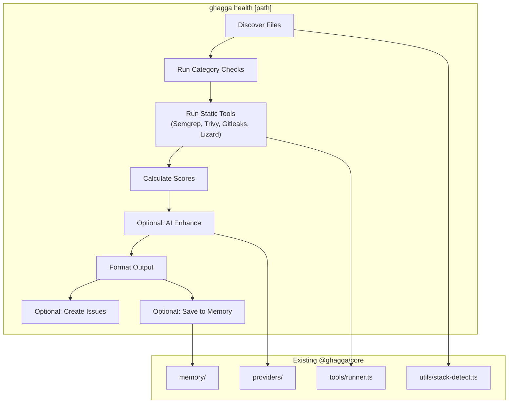

# GHAGGA Product Strategy v2.5 — Should GHAGGA Become a Repo Health Checker?

**Author**: Product Strategy Analysis  
**Date**: 2026-03-08  
**Version**: 2.5  
**Status**: Proposal  
**Current Version**: 2.3.0  

---

## Executive Summary

GHAGGA has built a defensible moat in **PR-level AI code review** with a distribution trifecta (SaaS + Action + CLI), 15 static analysis tools, multi-agent review modes, and project memory. RepoCheckAI occupies a fundamentally different niche: **repo-level health assessment** — a one-time or periodic scan rather than a continuous review loop.

**Recommendation: Option B (Selective Feature Absorption)** — Add `ghagga health` as a secondary CLI command while keeping code review as the core identity. Cherry-pick the 4 highest-ROI features from RepoCheckAI (health score, export, issue publishing, improved TUI), reject the rest, and ship it in 3 phases over ~10 weeks.

This is not a pivot. It's a natural expansion of the inspection surface from "what changed" (diffs) to "what exists" (repo state). The core engine, providers, memory, and static analysis infrastructure remain the review backbone.

---

## 1. Market Positioning Analysis

### 1.1 Competitive Landscape Map

| Tool | Primary Surface | Trigger | Price | Distribution | Static Analysis | AI | Memory |
|------|----------------|---------|-------|-------------|----------------|-----|--------|
| **GHAGGA** | PR diff | Push/manual | Free | SaaS + Action + CLI | 15 tools | 6 providers, 3 modes | Yes (FTS) |
| **CodeRabbit** | PR diff | Push | $15-24/seat/mo | SaaS | Limited | GPT-4 | Learning |
| **Sourcery** | PR diff + IDE | Push/IDE | Free-$30/seat/mo | SaaS + IDE | Rules | Proprietary | No |
| **Greptile** | PR diff + codebase Q&A | Push | $99+/mo | SaaS | None | GPT-4 | Codebase index |
| **SonarQube** | Full codebase | CI pipeline | Free-$$$$ | Self-hosted + Cloud | 5000+ rules | Limited | Project quality history |
| **GitHub Adv. Security** | PR diff + repo | Push | $49/committer/mo | SaaS | CodeQL + Dependabot | Copilot Autofix | No |
| **RepoCheckAI** | Full repo | Manual | Free* (needs Copilot) | CLI only | None (LLM-only) | 1 provider (Copilot) | History file |
| **CodeClimate** | Full codebase | CI | Free-$$$$ | SaaS | Duplication + complexity | No | Quality trends |

_*RepoCheckAI requires GitHub Copilot subscription ($10-39/mo)_

### 1.2 GHAGGA's Current Positioning

```
                    Repo-Level Analysis
                          ^
                          |
           SonarQube ---- | ---- CodeClimate
                          |
        RepoCheckAI ---   |
                      \   |
                       \  |
    One-Time/Periodic ----+---> Continuous (per-PR)
                          |
                          |   --- GHAGGA (here)
                          |  /
           Greptile ------|----- CodeRabbit
                          |
                          |
                    PR-Level Analysis
```

**GHAGGA's current niche**: Free, multi-agent, multi-tool PR review with memory. Unique position as the only tool offering all of: free + 15 static tools + 3 AI modes + project memory + 3 distribution modes.

### 1.3 Positioning Gap

GHAGGA currently has **zero repo-level analysis** capability. This is fine for its core mission but leaves an opportunity gap:

- New contributors/maintainers want a "first impression" of repo health before investing in a project
- CI pipelines want periodic quality gates beyond PR-level checks
- The CLI is installed but only activated on `git diff` — dead time between reviews

RepoCheckAI fills this gap poorly: it requires GitHub Copilot, has no static analysis, no memory, and no CI integration. There's room for a **better repo-level health check** built on GHAGGA's existing infrastructure.

---

## 2. Scope Expansion Options — Deep Analysis

### 2.1 Option A: Stay Focused (Code Review Only)

**Strategy**: GHAGGA = PR review tool. Period. Invest in CLI polish, better TUI, more tools, deeper analysis.

#### Technical Feasibility
- No new core modules needed
- TUI improvements are isolated to `apps/cli/src/ui/`
- Can add features like `--watch` mode, REPL for iterative review, better output formatting

#### Development Effort
- TUI overhaul: 2-3 weeks
- Additional static tools: 1-2 weeks per tool
- REPL mode: 1-2 weeks
- **Total: 4-7 weeks**

#### User Value
- Existing users get a polished, faster review experience
- No learning curve — same tool, better UX
- Deep focus enables best-in-class PR review quality

#### Differentiation
- "The best free PR reviewer" — double down on quality
- Risk: SonarQube, CodeRabbit, and GitHub Advanced Security will eventually absorb all of GHAGGA's features

#### Revenue Potential
- Limited. PR review is becoming commoditized (GitHub Copilot code review, CodeRabbit free tier)
- Hard to monetize "better markdown output"

#### Risk Assessment
| Risk | Severity | Probability |
|------|----------|-------------|
| Feature commoditization by GitHub Copilot | High | High |
| Stagnation narrative (no new capabilities) | Medium | Medium |
| CLI remains niche vs. SaaS competitors | Medium | High |

**Verdict**: Safe but risks long-term irrelevance. GHAGGA becomes a "good enough" tool that GitHub absorbs.

---

### 2.2 Option B: Add Health Checking as a Feature (Recommended)

**Strategy**: `ghagga health [path]` as a new CLI command. Repo-level health analysis using existing infrastructure. Code review remains primary identity.

#### What `ghagga health` Would Do

```
$ ghagga health .

  GHAGGA Repo Health Report

  Overall Score: 73/100                    [========------] 73%

  Category Scores:
   Documentation    65%  README exists, no CONTRIBUTING.md, no CHANGELOG
   Developer DX     82%  .editorconfig, biome.json, TypeScript strict
   CI/CD            90%  GitHub Actions, typecheck + build + test
   Testing          78%  Vitest config found, no coverage badge
   Governance       45%  MIT license, no CODEOWNERS, no issue templates
   Security         71%  .gitignore OK, no .env committed, no SECURITY.md

  Top Findings (P0):
   Missing CONTRIBUTING.md          governance   fix: create file
   No CODEOWNERS file               governance   fix: create file

  Top Findings (P1):
   No coverage badge in README      testing      fix: add badge
   Missing SECURITY.md              security     fix: create file

  15 findings total. Run with --detail for full report.
  Run with --issue to create GitHub Issues for findings.
```

#### Technical Feasibility — What Can Be Reused

| Existing Component | Reuse for Health? | How |
|-------------------|-------------------|-----|
| `@ghagga/core` providers | **Yes** | Same LLM calls for AI-powered analysis |
| `@ghagga/core` stack-detect | **Yes** | Detect repo tech stack from all files (not just diff) |
| `@ghagga/core` static tools | **Partial** | Run tools on full repo, not just diff (Semgrep, Trivy, Gitleaks, Lizard work on repos) |
| `@ghagga/core` memory | **Yes** | Remember past health scores, track improvements |
| `apps/cli/src/ui/*` TUI | **Yes** | Same @clack/prompts facade, themes, formatters |
| `apps/cli/src/lib/config.ts` | **Yes** | Same auth and config resolution |
| `apps/cli/src/lib/git.ts` | **Partial** | Need new functions: list all files, get repo metadata |

**New code required**:

```
packages/core/src/health/
  categories.ts      — 6 category check definitions
  score.ts           — Weighted scoring engine
  checks/
    documentation.ts — README, CONTRIBUTING, CHANGELOG, API docs
    dx.ts            — EditorConfig, linters, formatters, TypeScript config
    cicd.ts          — CI workflows, Dockerfile, docker-compose
    testing.ts       — Test config, coverage, test patterns
    governance.ts    — LICENSE, CODEOWNERS, issue templates, SECURITY.md
    security.ts      — .gitignore, .env handling, dependency audit
  prompts.ts         — LLM prompt for AI-enhanced analysis
  types.ts           — HealthResult, HealthCategory, HealthFinding

apps/cli/src/commands/health.ts  — CLI command handler
apps/cli/src/ui/health-format.ts — Health-specific TUI formatting
```

#### Development Effort (Solo Dev)

| Phase | Task | Weeks |
|-------|------|-------|
| 1 | Core health engine (6 categories, scoring, file checks) | 2 |
| 2 | CLI command + TUI formatting | 1 |
| 3 | AI-enhanced analysis (LLM reads repo structure for nuanced findings) | 1 |
| 4 | `--issue` flag (publish findings as GitHub Issues) | 1 |
| 5 | `--export` flag (markdown/JSON export) | 0.5 |
| 6 | Tests (~200-300 tests for health module) | 1.5 |
| 7 | Memory integration (track scores over time) | 1 |
| **Total** | | **~8 weeks** |

#### User Value

| User Segment | Value |
|-------------|-------|
| **OSS maintainers** | Quick health audit before releases, track improvements |
| **New contributors** | Assess repo quality before contributing |
| **Tech leads** | Periodic quality gates in CI (`ghagga health --exit-on-score 70`) |
| **Solo devs** | "What am I forgetting?" checklist for side projects |

#### Differentiation vs. RepoCheckAI

| Dimension | RepoCheckAI | GHAGGA Health |
|-----------|-------------|---------------|
| **Static analysis** | None (LLM only) | 15 tools on full repo |
| **Cost** | Requires Copilot ($10-39/mo) | Free (GitHub Models) |
| **Memory** | Local history file | FTS-indexed project memory |
| **Multi-provider** | Copilot only | 6 providers |
| **CI integration** | None | GitHub Action + exit codes |
| **Distribution** | CLI only | CLI + Action (+ future SaaS) |
| **PR review** | No | Yes — combined tool |
| **Offline** | No | Ollama for local LLM |

**GHAGGA's health check would be strictly better than RepoCheckAI's in every dimension except REPL interactivity** (which is low-ROI, discussed below).

#### Revenue Potential

Even though GHAGGA is free, health checking opens monetization paths for the future:

- **Team health dashboards** (SaaS) — aggregate scores across repos for organizations
- **Trend badges** — "Repo health improving" badges for READMEs (social proof)
- **Scheduled health reports** — weekly email/Slack digests (SaaS feature)
- **Compliance checks** — enterprise customers need governance audits

#### Risk Assessment

| Risk | Severity | Probability | Mitigation |
|------|----------|-------------|------------|
| Scope creep (health becomes bigger than review) | Medium | Medium | Hard cap: health module must be <1500 LOC |
| Identity confusion ("is GHAGGA a reviewer or health checker?") | Low | Medium | Messaging: "GHAGGA reviews your code — on every PR and across your repo" |
| Maintenance burden (2 engines to maintain) | Medium | Low | Health reuses core providers, memory, and static tools |
| Delayed delivery (solo dev, 8 weeks is optimistic) | Medium | High | Ship Phase 1-2 (static checks + CLI) as v2.5, iterate |

**Verdict**: High-value, moderate-effort. Natural extension of existing capabilities. Ship as v2.5.

---

### 2.3 Option C: Full Platform Pivot ("Code Quality Platform")

**Strategy**: GHAGGA becomes a "code quality platform" — review + health + metrics + trends + dashboards + reports. Think SonarQube but AI-native.

#### What This Means

- `ghagga review` — PR review (existing)
- `ghagga health` — repo health (new)
- `ghagga metrics` — code metrics dashboard (new)
- `ghagga trends` — quality trends over time (new)
- `ghagga report` — generate PDF/HTML quality reports (new)
- Dashboard becomes a full quality platform (not just review history)

#### Technical Feasibility
- Massive scope expansion
- Requires new DB tables for metrics timeseries
- Dashboard needs charts, tables, comparison views
- Reporting engine (PDF generation) adds heavy dependencies

#### Development Effort
- **40-60+ weeks** as a solo developer
- Essentially a new product built on top of the existing one

#### User Value
- Very high for teams that adopt fully
- But competes directly with SonarQube, CodeClimate, and GitHub Advanced Security
- These competitors have teams of 50-200 engineers

#### Differentiation
- "AI-native SonarQube" — but SonarQube already has AI features and 20 years of rules
- Hard to compete on rule depth with 1 developer

#### Revenue Potential
- Highest of all options — platforms command higher prices
- But requires PMF (product-market fit) that's unproven
- Enterprise sales cycle is 6-12 months minimum

#### Risk Assessment

| Risk | Severity | Probability |
|------|----------|-------------|
| Scope explosion (solo dev building a platform) | Critical | Very High |
| Losing focus on what makes GHAGGA good | Critical | High |
| Never shipping (perfectionism spiral) | High | High |
| Competing with SonarQube (20y headstart) | High | High |

**Verdict**: Reject. This is a different company, not a feature. A solo developer cannot build and maintain a code quality platform while keeping the review engine competitive.

---

## 3. Decision Matrix

| Criterion (Weight) | Option A: Stay Focused | Option B: Health Feature | Option C: Full Platform |
|--------------------|-----------------------|-------------------------|------------------------|
| **Technical Feasibility** (15%) | 10/10 | 8/10 | 4/10 |
| **Development Effort** (20%) | 9/10 (4-7 wks) | 7/10 (8-10 wks) | 2/10 (40-60+ wks) |
| **User Value** (20%) | 6/10 | 9/10 | 10/10 |
| **Differentiation** (15%) | 5/10 | 9/10 | 6/10 |
| **Revenue Potential** (10%) | 3/10 | 6/10 | 9/10 |
| **Risk (inverse)** (10%) | 8/10 | 7/10 | 2/10 |
| **Identity Coherence** (10%) | 10/10 | 8/10 | 4/10 |
| | | | |
| **Weighted Score** | **7.15** | **7.90** | **5.15** |

**Winner: Option B with a weighted score of 7.90.**

---

## 4. TUI Enhancement Analysis

### 4.1 Current TUI State (Honest Assessment)

GHAGGA's TUI is **functional but minimal**:
- `@clack/prompts` facade with styled/plain modes
- Emoji-based severity/status indicators
- Plain text tables (manual padding, no box-drawing)
- Spinner for async operations
- No color (beyond what @clack provides)
- No progress bars, no ASCII art, no rich formatting

This is actually a **strength for CI/Action use** (clean logs) but a **weakness for interactive CLI use** (feels bare-bones compared to modern CLI tools).

### 4.2 High-ROI TUI Improvements (Ranked)

| # | Improvement | Effort | Impact | ROI | Notes |
|---|------------|--------|--------|-----|-------|
| 1 | **Colored severity levels** | 2h | High | Very High | `chalk.red('CRITICAL')`, `chalk.yellow('MEDIUM')` — biggest visual impact for least effort |
| 2 | **Summary box** | 4h | High | High | Box-drawing around the final status summary (boxen or manual) |
| 3 | **Progress bar for multi-step** | 4h | Medium | High | Show `[3/7] Running static analysis...` with a bar |
| 4 | **Section headers** | 2h | Medium | High | `=== Static Analysis ===` with color, not just markdown |
| 5 | **Score visualization** | 3h | High | High | `[========------] 73%` for health scores |
| 6 | **Table with borders** | 4h | Medium | Medium | Box-drawing tables for findings (cli-table3 or manual) |
| 7 | **Copy to clipboard** | 2h | Low | Medium | `clipboardy` — useful but niche |
| 8 | **Export to file** | 3h | Medium | Medium | `--output report.md` — straightforward |
| 9 | **Interactive REPL** | 2-3w | Low | Low | Over-engineered for this use case (see 4.3) |
| 10 | **ASCII logo** | 1h | Vanity | Low | Nice but adds no functional value |

**Recommendation**: Items 1-5 for v2.5. Items 6-8 for v2.6. Skip 9-10.

### 4.3 Can Rich TUI Replace Web UI?

**No, but it doesn't need to.**

| Use Case | TUI Wins | Web UI Wins |
|----------|----------|-------------|
| Quick single review | Yes | No (overhead) |
| Health check | Yes | No |
| Browse review history | No | Yes |
| Configure settings | No | Yes |
| Memory exploration | Maybe | Yes |
| Team dashboards | No | Yes |
| Trend charts | No | Yes |

The TUI and Web UI serve different workflows. The CLI serves **individual developers on their machine**. The dashboard serves **team visibility and configuration**. They complement each other.

### 4.4 RepoCheckAI UI Patterns — Steal vs. Skip

| Pattern | Steal? | Reasoning |
|---------|--------|-----------|
| **Colored output with chalk** | Steal | GHAGGA's plain text is a gap. Add `chalk` for TTY. |
| **Box-drawing for sections** | Steal (simplified) | Use for summary and health score boxes only. Not for every output. |
| **Score visualization bar** | Steal | Essential for health feature. `[========------] 73%` |
| **ASCII logo in intro** | Skip | Vanity. Wastes terminal space. GHAGGA's @clack intro is cleaner. |
| **Model selector UI** | Skip | GHAGGA uses `--provider`/`--model` flags — simpler and scriptable. Interactive model selection is annoying in a CLI tool. |
| **Interactive REPL with slash commands** | Skip | Over-engineered for a tool that runs once and exits. REPL makes sense for databases (psql) and REPLs (node), not for code review. The interaction model is "run, read, done." |
| **Status bars with spinners** | Already have | GHAGGA has @clack spinners. They're sufficient. |
| **Rich terminal web UI (Express + HTML)** | Skip | Solving the wrong problem. If users want a web UI, use the dashboard. A local Express server for a CLI tool is an anti-pattern. |

---

## 5. Features to Steal from RepoCheckAI — Ranked by Value/Effort

### 5.1 Feature Ranking Matrix

| # | Feature | Value (1-10) | Effort (1-10, 10=easy) | Value/Effort | Steal? | Priority |
|---|---------|-------------|----------------------|--------------|--------|----------|
| 1 | **Health Score (0-100)** | 9 | 5 | 1.80 | Yes | P0 |
| 2 | **Export to file** (`--output`) | 7 | 9 | 0.78 | Yes | P1 |
| 3 | **Issue publishing** (`--issue`) | 8 | 6 | 1.33 | Yes | P1 |
| 4 | **Rich terminal output** (chalk colors) | 6 | 8 | 0.75 | Yes | P1 |
| 5 | **Prioritized findings** (P0/P1/P2) | 8 | 7 | 1.14 | Yes | P0 |
| 6 | **Agent guardrails** (loop detection) | 5 | 6 | 0.83 | Partial | P2 |
| 7 | **Copy to clipboard** | 3 | 9 | 0.33 | Maybe | P3 |
| 8 | **Analysis Skills** (.SKILL.md) | 4 | 4 | 1.00 | No | — |
| 9 | **Interactive REPL** | 3 | 3 | 1.00 | No | — |
| 10 | **Web UI (local Express)** | 2 | 3 | 0.67 | No | — |

### 5.2 Feature Details

#### Steal: Health Score (0-100)

GHAGGA's version is **superior because it's backed by actual static analysis**. RepoCheckAI asks an LLM to guess the score. GHAGGA can calculate deterministic scores from file existence checks, tool results, and config analysis, then optionally enhance with AI.

```typescript
// packages/core/src/health/score.ts
interface HealthScore {
  overall: number;           // 0-100 weighted average
  categories: {
    documentation: number;   // weight: 15%
    dx: number;              // weight: 15%
    cicd: number;            // weight: 20%
    testing: number;         // weight: 20%
    governance: number;      // weight: 15%
    security: number;        // weight: 15%
  };
  findings: HealthFinding[];
}
```

#### Steal: Issue Publishing (`--issue`)

High-value for automation. `ghagga health --issue` creates structured GitHub Issues for each P0/P1 finding with:
- Title: `[Health] Missing CONTRIBUTING.md`
- Body: Category, impact, fix instructions, evidence
- Labels: `ghagga-health`, priority label
- Deduplication: Check if issue already exists before creating

Uses existing GitHub OAuth token from `ghagga login`.

#### Steal: Export to File (`--output`)

Trivial to implement. `ghagga health --output report.md` or `ghagga review --output review.json`.

```typescript
// In the command handler, after formatting:
if (options.output) {
  writeFileSync(options.output, formatted, 'utf-8');
  tui.log.success(`Report saved to ${options.output}`);
}
```

#### Skip: Interactive REPL

RepoCheckAI's REPL (`/analyze`, `/deep`, `/copy`, `/export`, `/history`) is solving a problem that doesn't exist in GHAGGA's interaction model:

- GHAGGA runs, produces output, exits. This is the Unix way.
- REPL adds state management, command parsing, error recovery — significant complexity for minimal value
- Everything the REPL does can be done with flags: `--deep`, `--export`, `--copy`
- A REPL traps the user in the tool. CLI flags let you pipe output to other tools.

If an interactive mode is ever needed, it should be an ncurses-style TUI (like lazygit), not a slash-command REPL. But that's a v3.0+ consideration.

#### Skip: Analysis Skills (.SKILL.md)

RepoCheckAI loads runtime `.SKILL.md` files based on detected stack. GHAGGA already does this better:
- Stack detection → prompt injection via `buildStackHints(stacks)`
- Custom Semgrep rules via config
- Per-stack tool activation (auto-detect tier)

Runtime skill files are brittle (file I/O at analysis time, parsing markdown as instructions, no validation). GHAGGA's compiled prompt system is more reliable.

#### Partial Steal: Agent Guardrails

RepoCheckAI has loop detection, step limits, and progressive abort. GHAGGA partially has this:
- Circuit breaker for GitHub API calls (existing)
- `AbortSignal.timeout()` on all fetch calls (existing)
- But no explicit step limit or loop detection in the AI agent pipeline

**Recommendation**: Add a simple step counter and timeout to the consensus/workflow agent modes. Not a full guardrail system.

```typescript
// In workflow.ts / consensus.ts:
const MAX_AGENT_STEPS = 10;
const AGENT_TIMEOUT_MS = 120_000; // 2 minutes
```

---

## 6. Phased Roadmap

### Phase 1: v2.4.0 — TUI Polish + Export (Weeks 1-2)

**Goal**: Make the CLI output beautiful and exportable.

| Task | Effort | Description |
|------|--------|-------------|
| Add `chalk` dependency | 1h | Color support for TTY mode |
| Colored severity levels in TUI | 3h | Red/orange/yellow/green/purple for critical/high/medium/low/info |
| Summary box with box-drawing | 4h | Final review summary in a bordered box |
| Progress indicator `[3/7]` | 4h | Step counter in verbose mode |
| `--output <file>` flag | 3h | Write review result to file (md/json) |
| `--copy` flag | 2h | Copy result to clipboard (clipboardy) |
| Section headers with styling | 2h | Colored section dividers |
| Agent step limits + timeout | 4h | MAX_STEPS=10, 2min timeout per agent mode |
| Tests for new TUI features | 6h | ~50 new tests |
| **Total** | **~30h / 1 week effective** | |

**Version**: 2.4.0  
**Changelog tag**: TUI Enhancement  

### Phase 2: v2.5.0 — Health Engine (Weeks 3-6)

**Goal**: Ship `ghagga health` with deterministic scoring.

| Task | Effort | Description |
|------|--------|-------------|
| `packages/core/src/health/types.ts` | 4h | HealthResult, HealthCategory, HealthFinding, HealthScore types |
| `packages/core/src/health/categories.ts` | 8h | 6 category definitions with check functions |
| `packages/core/src/health/checks/documentation.ts` | 6h | README, CONTRIBUTING, CHANGELOG, API docs, inline docs sampling |
| `packages/core/src/health/checks/dx.ts` | 6h | EditorConfig, linter config, formatter, TypeScript strict, package.json scripts |
| `packages/core/src/health/checks/cicd.ts` | 6h | CI workflows, Dockerfile, docker-compose, deploy config |
| `packages/core/src/health/checks/testing.ts` | 6h | Test config, test file patterns, coverage config, test scripts |
| `packages/core/src/health/checks/governance.ts` | 6h | LICENSE, CODEOWNERS, issue templates, PR templates, SECURITY.md, CoC |
| `packages/core/src/health/checks/security.ts` | 6h | .gitignore patterns, .env handling, dependency audit, secrets scanning |
| `packages/core/src/health/score.ts` | 4h | Weighted scoring engine |
| `packages/core/src/health/index.ts` | 2h | Public API exports |
| `apps/cli/src/commands/health.ts` | 8h | CLI command: `ghagga health [path]` with all flags |
| `apps/cli/src/ui/health-format.ts` | 6h | Health-specific formatting (score bar, category breakdown, findings) |
| Wire health into `apps/cli/src/index.ts` | 2h | Register command in Commander |
| Static analysis integration | 6h | Run Semgrep, Trivy, Gitleaks, Lizard on full repo for security/complexity scores |
| Tests for health engine | 16h | ~200-250 tests across all check modules |
| **Total** | **~90h / 3-4 weeks effective** | |

**Version**: 2.5.0  
**Changelog tag**: Repository Health Analysis  

**Scope cap**: The health module must remain under 1,500 lines of implementation code (tests excluded). If a check requires more than 30 lines, it's too complex.

### Phase 3: v2.5.1 — AI Enhancement + Issue Publishing (Weeks 7-9)

**Goal**: Add AI-powered nuanced analysis and GitHub Issue creation.

| Task | Effort | Description |
|------|--------|-------------|
| `packages/core/src/health/prompts.ts` | 6h | LLM prompt for AI-enhanced health analysis (reads file tree + category scores, suggests nuanced improvements) |
| `packages/core/src/health/ai-enhance.ts` | 8h | Call LLM to produce enhanced findings beyond what static checks detect |
| `--ai` flag for health command | 2h | Opt-in AI analysis (static-only by default — fast and free) |
| `--issue` flag implementation | 8h | Create GitHub Issues from P0/P1 findings with deduplication |
| Issue templates | 4h | Structured issue body with category, impact, fix, evidence |
| `--issue-label` flag | 2h | Custom label for created issues (default: `ghagga-health`) |
| Memory integration for health scores | 8h | Store health scores in memory, show trends on subsequent runs |
| `--compare` flag | 6h | Compare current score with last stored score (delta display) |
| Tests | 10h | ~100 tests for AI enhance, issue publishing, memory |
| **Total** | **~55h / 2-3 weeks effective** | |

**Version**: 2.5.1  
**Changelog tag**: AI Health Analysis + Issue Publishing

### Phase 4: v2.6.0 — Action Integration (Weeks 10-12, Optional)

**Goal**: Enable `ghagga health` in GitHub Actions for periodic CI quality gates.

| Task | Effort | Description |
|------|--------|-------------|
| Health mode in GitHub Action | 8h | New `mode: health` input alongside `mode: review` |
| `--exit-on-score <min>` flag | 4h | Exit code 1 if score below threshold |
| Scheduled workflow examples | 4h | Cron-triggered health checks in docs |
| PR comment for health | 6h | Post health summary as PR comment (e.g., on first PR of the week) |
| Dashboard health section | 16h | Health score history, trends chart, category breakdown |
| Tests | 8h | ~80 tests |
| **Total** | **~46h / 2-3 weeks effective** | |

**Version**: 2.6.0  
**Changelog tag**: Health in CI + Dashboard

---

## 7. Technical Architecture for Health Engine

### 7.1 Core Health Module Structure

```
packages/core/src/health/
  index.ts              — Public API: runHealthCheck()
  types.ts              — HealthInput, HealthResult, HealthFinding, HealthCategory
  score.ts              — Weighted scoring: category scores → overall score
  categories.ts         — Category definitions, weights, check orchestration
  prompts.ts            — LLM prompt for AI-enhanced analysis
  ai-enhance.ts         — AI enhancement pipeline (optional)
  checks/
    documentation.ts    — File existence + content quality checks
    dx.ts               — Developer experience tooling checks
    cicd.ts             — CI/CD configuration checks
    testing.ts          — Test infrastructure checks
    governance.ts       — Project governance checks
    security.ts         — Security posture checks
```

### 7.2 Health Check Design Principles

1. **Deterministic first**: All checks produce a score without LLM. AI is optional enhancement.
2. **File-based**: Checks look for file existence and content patterns. No network calls (except AI).
3. **Reuse existing tools**: Semgrep, Trivy, Gitleaks, Lizard run on the full repo for security/complexity.
4. **Scoring is transparent**: Every point deducted has a stated reason and evidence.
5. **Findings are actionable**: Every finding includes a fix instruction (not just "this is bad").

### 7.3 Scoring Model

```
Overall Score = weighted average of category scores

Category Weights:
  CI/CD:          20%   — the most impactful for project reliability
  Testing:        20%   — directly correlates with code quality
  Documentation:  15%   — essential for adoption and contribution
  DX:             15%   — developer productivity
  Governance:     15%   — project sustainability  
  Security:       15%   — vulnerability surface

Each category: 0-100 based on checks passed.
Each check: binary (pass/fail) or scored (0-100) with evidence.
```

### 7.4 Example Check Implementation

```typescript
// packages/core/src/health/checks/documentation.ts
import { existsSync, readFileSync } from 'node:fs';
import { join } from 'node:path';
import type { HealthCheck } from '../types.js';

export const documentationChecks: HealthCheck[] = [
  {
    id: 'readme-exists',
    name: 'README.md exists',
    priority: 'P0',
    weight: 30,
    check: (repoPath: string) => {
      const exists = existsSync(join(repoPath, 'README.md'));
      return {
        passed: exists,
        score: exists ? 100 : 0,
        evidence: exists ? 'README.md found' : 'No README.md in repository root',
        fix: exists ? undefined : 'Create a README.md with project description, installation, and usage instructions',
      };
    },
  },
  {
    id: 'readme-length',
    name: 'README.md has substance',
    priority: 'P1',
    weight: 20,
    check: (repoPath: string) => {
      const path = join(repoPath, 'README.md');
      if (!existsSync(path)) return { passed: false, score: 0, evidence: 'README.md not found' };
      const content = readFileSync(path, 'utf-8');
      const lines = content.split('\n').length;
      const score = Math.min(100, (lines / 50) * 100); // 50+ lines = 100%
      return {
        passed: lines >= 20,
        score: Math.round(score),
        evidence: `README.md has ${lines} lines`,
        fix: lines < 20 ? 'Expand README with installation, usage, and contribution sections' : undefined,
      };
    },
  },
  // ... more checks
];
```

### 7.5 Integration with Existing Infrastructure



---

## 8. What NOT to Build

Equally important as what to build is what to explicitly reject:

| Feature | Reason to Skip |
|---------|---------------|
| **REPL / interactive mode** | Wrong interaction model. CLI tools run-and-exit. REPLs add state management complexity for minimal value. |
| **Local web UI (Express)** | GHAGGA already has a deployed dashboard. A local web server is an anti-pattern for a CLI tool. |
| **Analysis Skills (.SKILL.md files)** | Runtime markdown parsing is fragile. GHAGGA's compiled prompts + stack detection are more reliable. |
| **ASCII art logo** | Wastes terminal space. @clack's intro is cleaner. |
| **Model selector TUI** | Flags (`--provider`, `--model`) are more scriptable and faster. Interactive selection is annoying in automation. |
| **Metrics timeseries database** | This is a platform feature (Option C territory). Out of scope for a solo dev. |
| **PDF report generation** | Heavy dependency (puppeteer/wkhtmltopdf). Markdown export is sufficient. |
| **Code coverage integration** | Requires running tests (not GHAGGA's job). Just check if coverage config exists. |

---

## 9. Success Metrics

### 9.1 North Star Metric

**Weekly active CLI users running either `review` or `health`** — measures adoption of GHAGGA as a daily dev tool, not just a CI commodity.

### 9.2 Launch Metrics for v2.5.0

| Metric | Target | Measurement |
|--------|--------|-------------|
| npm weekly downloads | +20% over v2.3 baseline | npm stats |
| GitHub stars | +100 in first month post-launch | GitHub |
| `ghagga health` adoption | 30% of CLI users try health within 30 days | Opt-in telemetry (if implemented) or survey |
| GitHub Issues created via `--issue` | 50+ across all users in first month | Self-reported / community |
| Test count | 3,000+ (up from ~3,400 current) | CI |
| Health module LOC | <1,500 lines | `wc -l` |

### 9.3 Long-term KPIs (6 months)

| KPI | Target |
|-----|--------|
| npm weekly downloads | 500+ |
| GitHub stars | 500+ |
| Active SaaS installations | 50+ |
| Community PRs | 10+ |
| Blog/conference mentions | 3+ |

---

## 10. Messaging and Positioning Update

### 10.1 Current Tagline
> "Multi-agent code reviewer that posts intelligent comments on your Pull Requests"

### 10.2 Proposed Tagline (v2.5+)
> "AI-powered code review and repo health — free, multi-agent, with memory"

### 10.3 One-liner for npm
> "Review your PRs and audit your repos with 15 static analysis tools, 6 AI providers, and project memory"

### 10.4 README Update (Hero Section)

```markdown
# GHAGGA — AI Code Review + Repo Health

**Review your PRs. Audit your repos. Free.**

- `ghagga review` — AI-powered code review on local changes or PRs
- `ghagga health` — Repository health score (0-100) with prioritized findings
- 15 static analysis tools, 6 LLM providers, project memory that learns
```

---

## 11. Risk Mitigation Plan

| Risk | Trigger | Response |
|------|---------|----------|
| Health feature exceeds 1,500 LOC | PR review before merge | Cut checks or simplify scoring |
| Solo dev burnout at week 5 | Feeling overwhelmed | Ship v2.5.0 with static-only health (no AI), defer Phase 3 |
| Users confused about review vs. health | GitHub issue "what does this tool do?" | Add clear section in README, separate docs pages |
| Health scores are inaccurate | User reports "my repo scored 90 but it's terrible" | Add `--explain` flag showing how each check scored |
| Feature creep (user requests REPL, PDF, etc.) | GitHub issues requesting scope expansion | Point to this document's "What NOT to Build" section |
| GitHub Copilot adds repo health | GitHub announcement | Ship faster. GHAGGA's 15-tool advantage takes years to replicate |

---

## 12. Final Recommendation

### Do This:
1. **v2.4.0** (2 weeks): TUI polish, `--output`, `--copy`, agent guardrails
2. **v2.5.0** (4 weeks): `ghagga health` with deterministic scoring, 6 categories, P0/P1/P2 findings
3. **v2.5.1** (3 weeks): AI enhancement, `--issue`, memory integration, `--compare`

### Don't Do This:
- Don't build a REPL
- Don't build a local web UI
- Don't build a platform
- Don't compete with SonarQube
- Don't let health become bigger than review

### Remember:
GHAGGA is a **code review tool** that also checks repo health. Not the other way around. The health feature is a wedge to get users to try the review, and the review is the sticky feature that keeps them.

---

_This document should be revisited after v2.5.0 ships and user feedback is collected. If health adoption exceeds 50% of CLI users, consider elevating it to co-primary status. If below 10%, consider deprecating._
