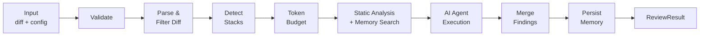
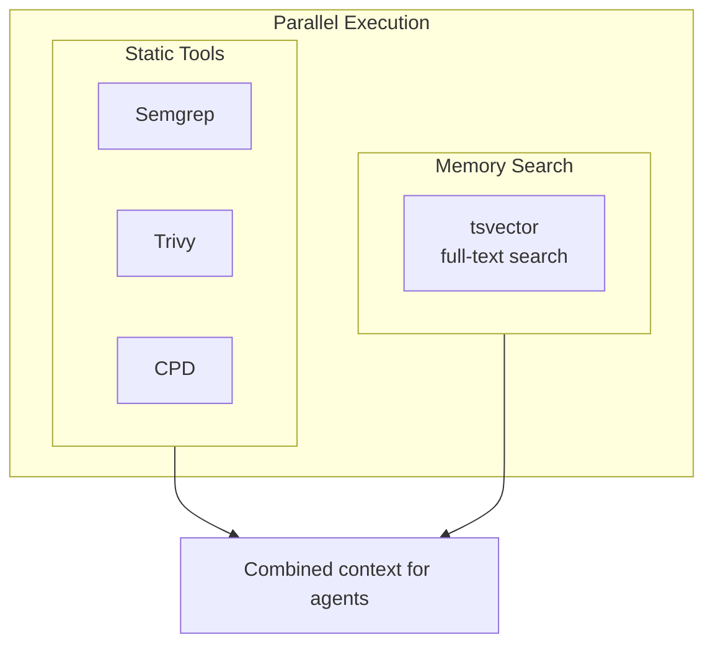

# Review Pipeline

Every review follows the same pipeline regardless of distribution mode. Each step degrades gracefully — if static analysis fails, or memory is unavailable, the pipeline continues with what it has.

## Pipeline Steps



## Step Details

### Step 1: Input Validation

The pipeline validates that all required fields are present:
- Non-empty diff
- Valid API key for the specified provider
- Known provider and model combination

If validation fails, the pipeline returns a `SKIPPED` status with the reason.

### Step 2: Diff Parsing & Filtering

The raw diff is parsed into per-file hunks. Files matching ignore patterns are removed:
- `*.lock` (lock files)
- `*.md` (documentation)
- `*.map` (source maps)
- Custom patterns from `.ghagga.json`

### Step 3: Tech Stack Detection

File extensions are mapped to tech stacks (e.g., `.ts` → TypeScript, `.py` → Python). Detected stacks are injected into agent prompts as hints so the LLM provides language-specific feedback.

### Step 4: Token Budget

The diff is truncated to fit the model's context window. The budget is split 70/30:
- **70%** for the diff content itself
- **30%** for system prompt, static analysis context, memory context, and stack hints

Files are prioritized by modification size — larger changes get reviewed first.

### Step 5: Parallel Analysis

Static analysis and memory search run **in parallel**:



### Step 6: Agent Execution

The combined context (diff + static findings + memory) is sent to the selected review mode:

- **Simple**: 1 LLM call — fast and cheap
- **Workflow**: 5 specialist agents in parallel + 1 synthesis — thorough
- **Consensus**: 3 stanced reviews + weighted vote — high confidence

See [Review Modes](review-modes.md) for details.

### Step 7: Finding Merge

Static analysis findings are merged into the agent's response. Deduplication ensures the same issue isn't reported twice (once by static analysis and once by the AI).

### Step 8: Memory Persistence

Observations are extracted from the review and stored to PostgreSQL (fire-and-forget). This step never blocks the response — if it fails, the review is still returned successfully.

## SaaS Mode (Inngest)

In server mode, the pipeline runs inside an Inngest durable function with step-based checkpointing:

```typescript
// Each step is checkpointed — retries resume from the last successful step
Step 1: Fetch PR diff from GitHub API
Step 2: Static Analysis (Layer 0)
Step 3: Memory Search (Layer 1)
Step 4: AI Review (Layer 2)
Step 5: Save Memory (Layer 3)
Step 6: Post PR Comment
```

If an LLM call fails and retries, static analysis doesn't re-run. If memory search fails, the pipeline continues without it.

## Graceful Degradation

| Component | If Missing/Failed | Pipeline Behavior |
|-----------|-------------------|-------------------|
| Semgrep | Not installed | Skipped, review continues |
| Trivy | Not installed | Skipped, review continues |
| CPD | Not installed | Skipped, review continues |
| Memory (PostgreSQL) | No database connection | Skipped, no memory context |
| LLM Provider | API error | Fallback chain attempts next provider |
| Inngest | Not configured | Sync execution (no checkpointing) |
