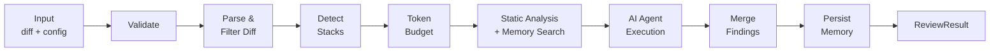
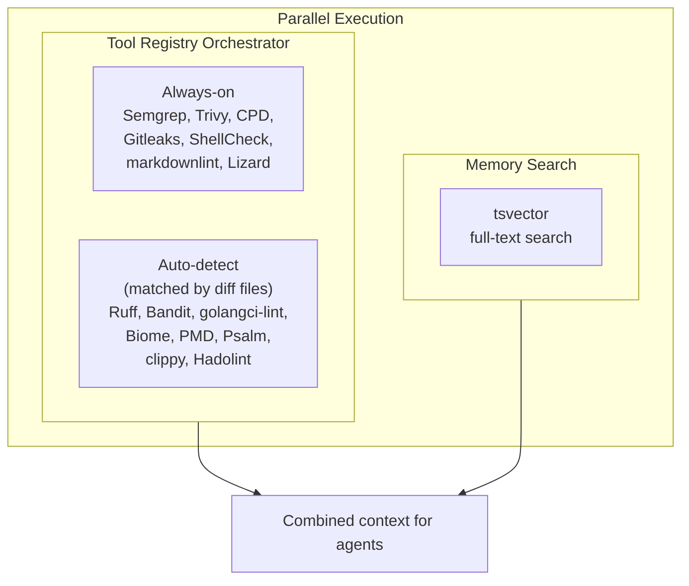

# Review Pipeline

Every review follows the same pipeline regardless of distribution mode. Each step degrades gracefully — if static analysis fails, or memory is unavailable, the pipeline continues with what it has.

## Pipeline Steps



## Step Details

### Step 1: Input Validation

The pipeline validates that all required fields are present:
- Non-empty diff
- Valid API key for the specified provider
- Known provider and model combination

If validation fails, the pipeline returns a `SKIPPED` status with the reason.

### Step 2: Diff Parsing & Filtering

The raw diff is parsed into per-file hunks. Files matching ignore patterns are removed:
- `*.lock` (lock files)
- `*.md` (documentation)
- `*.map` (source maps)
- Custom patterns from `.ghagga.json`

### Step 3: Tech Stack Detection

File extensions are mapped to tech stacks (e.g., `.ts` → TypeScript, `.py` → Python). Detected stacks are injected into agent prompts as hints so the LLM provides language-specific feedback.

### Step 4: Token Budget

The diff is truncated to fit the model's context window. The budget is split 70/30:
- **70%** for the diff content itself
- **30%** for system prompt, static analysis context, memory context, and stack hints

Files are prioritized by modification size — larger changes get reviewed first.

### Step 5: Parallel Analysis

Static analysis and memory search run **in parallel**. The tool registry resolves which tools to run based on tiers (always-on vs auto-detect), file patterns in the diff, and any `enabledTools`/`disabledTools` overrides:



### Step 5.5: AI Enhance (Optional)

When `--enhance` is enabled, an AI post-analysis step runs on the static analysis findings before agent execution:

1. **Groups findings by pattern** — clusters related findings across files
2. **Assigns AI priorities** — re-ranks findings based on actual impact, not just tool severity
3. **Suggests fixes** — generates actionable fix suggestions for each finding group
4. **Filters noise** — removes low-signal findings that are likely false positives

This step reduces noise from raw static analysis output and provides more actionable context to the AI agents. It is skipped when `--enhance` is not set.

### Step 6: Agent Execution

The combined context (diff + static findings + memory) is sent to the selected review mode:

- **Simple**: 1 LLM call — fast and cheap
- **Workflow**: 5 specialist agents in parallel + 1 synthesis — thorough
- **Consensus**: 3 stanced reviews + weighted vote — high confidence

See [Review Modes](review-modes.md) for details.

### Step 7: Finding Merge

Static analysis findings are merged into the agent's response. Deduplication ensures the same issue isn't reported twice (once by static analysis and once by the AI).

### Step 8: Memory Persistence

Observations are extracted from the review and stored to the memory database — PostgreSQL in Server mode, SQLite in CLI and Action modes (fire-and-forget). This step never blocks the response — if it fails, the review is still returned successfully.

## Trigger Modes

> **Static analysis in SaaS mode**: When a runner repo exists, static analysis runs on the delegated runner. Without a runner, the review proceeds with AI only. See [Runner Architecture](runner-architecture.md).

Reviews can be triggered in two ways in SaaS mode:

| Trigger | Event | When |
|---------|-------|------|
| **Automatic** | `pull_request` webhook | PR opened, updated (push), or reopened |
| **On-demand** | `issue_comment` webhook | Someone comments `ghagga review` on a PR |

The on-demand trigger uses the same pipeline and settings as automatic reviews. It adds reaction feedback: 👀 when the trigger is received, 🚀 when the review is posted.

**Who can trigger?** Anyone with a contribution relationship to the repository: owners, members, collaborators, contributors, and first-time contributors. Users with no association (`NONE`) or placeholder accounts (`MANNEQUIN`) are rejected.

## SaaS Mode (Inngest)

In server mode, the pipeline runs inside an Inngest durable function with step-based checkpointing. Each review generates a **correlation ID** (`reviewId`) that is propagated through all steps and included in the PR comment for end-to-end tracing.

```typescript
// Each step is checkpointed — retries resume from the last successful step
// All steps carry the reviewId for correlation
Step 1: Fetch PR diff from GitHub API
Step 2: Discover runner repo ({owner}/ghagga-runner)
Step 3: Dispatch to runner + wait for callback (or skip if no runner)
Step 4: Memory Search (Layer 1)
Step 5: AI Review (Layer 2)
Step 6: Save Memory (Layer 3)
Step 7: Post PR Comment + React to trigger
```

All GitHub API calls use **HTTP timeouts** (`AbortSignal.timeout()`) to prevent resource exhaustion: 10s for standard API calls, 15s for diff fetching, 5s for keepalive pings.

If an LLM call fails and retries, static analysis doesn't re-run. If memory search fails, the pipeline continues without it.

## Graceful Degradation

| Component | If Missing/Failed | Pipeline Behavior |
|-----------|-------------------|-------------------|
| Static analysis tools | Not installed | Skipped individually, review continues with available tools |
| Memory (PostgreSQL or SQLite) | No database connection | Skipped, no memory context |
| LLM Provider | API error | Fallback chain attempts next provider |
| Runner repo | Not configured | LLM-only review (no static analysis) |
| Inngest | Not configured | Sync execution (no checkpointing) |
