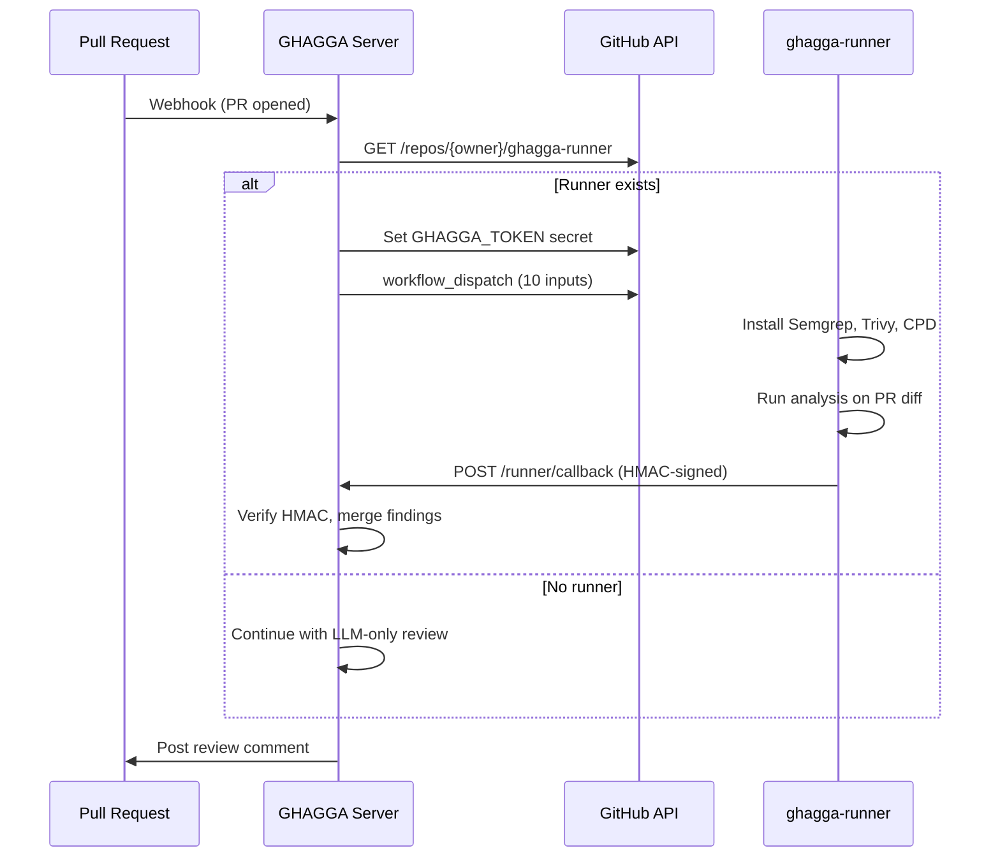

# Runner Architecture

> SaaS mode only. GitHub Action and CLI run static analysis tools directly.

## The Problem

The Render free tier (512MB RAM) can't run Semgrep (Python ~400MB) + PMD/CPD (JVM ~300MB) simultaneously. Running all three tools requires ~800MB+ RAM.

## The Solution

GHAGGA delegates static analysis to **user-owned GitHub Actions runners** on public repos:

- **Unlimited free minutes** for public repos
- **7GB RAM** and 2 CPUs per runner
- **No cost** — uses GitHub's free compute

## How It Works

### Setup

1. User creates a public repo from [`JNZader/ghagga-runner-template`](https://github.com/JNZader/ghagga-runner-template)
2. The repo must be named `ghagga-runner` (convention-based discovery)
3. That's it — the server auto-discovers and uses it

### Flow

### Dispatch Inputs

The `workflow_dispatch` event carries exactly 10 string inputs (GitHub's maximum):

| Input | Description |
|-------|-------------|
| `callbackId` | Unique ID for this dispatch (UUID) |
| `repoFullName` | Repository being reviewed (`owner/repo`) |
| `prNumber` | Pull request number |
| `headSha` | Head commit SHA of the PR |
| `baseBranch` | Base branch (e.g., `main`) |
| `callbackUrl` | Server URL for results delivery |
| `callbackSecret` | Per-dispatch HMAC secret |
| `enableSemgrep` | `"true"` or `"false"` |
| `enableTrivy` | `"true"` or `"false"` |
| `enableCpd` | `"true"` or `"false"` |

### Callback

The runner POSTs results to `POST /runner/callback` with:

- **Body**: JSON with `callbackId`, findings array, tool versions, timing
- **Header**: `X-Runner-Signature` — HMAC-SHA256 of the body using the per-dispatch secret
- **Verification**: Server checks the signature against the stored secret (in-memory Map, 11-min TTL)

## Security Model

Private repo code analyzed via a public runner is protected by **4 security layers**:

| Layer | Protection | How |
|-------|-----------|-----|
| **Output suppression** | Tool output hidden | All stdout/stderr redirected to `/dev/null` |
| **Log masking** | Values masked in logs | `::add-mask::` applied to all sensitive values |
| **Log deletion** | Logs removed after use | Workflow run logs deleted via GitHub API |
| **Retention policy** | Short-lived logs | Runner repo configured with 1-day log retention |

### HMAC Per-Dispatch Secret

Each dispatch generates a unique `callbackSecret`:

1. Server generates a random secret
2. Secret is set as a GitHub repository secret (`GHAGGA_TOKEN`) on the runner repo
3. Secret is stored in an in-memory Map with 11-minute TTL
4. Runner signs the callback body with HMAC-SHA256 using this secret
5. Server verifies the signature and deletes the secret from the Map

This ensures only the legitimate runner can deliver results, and secrets auto-expire if the callback never arrives.

## Graceful Fallback

If the runner repo doesn't exist or the dispatch fails, the server falls back to **LLM-only review**:

- Static analysis is skipped entirely (no Semgrep, Trivy, or CPD findings)
- The AI review still runs with diff + memory context
- The review comment notes that static analysis was unavailable

## Server Implementation

| File | Purpose |
|------|---------|
| `apps/server/src/github/runner.ts` | Runner discovery, secret setup, workflow dispatch |
| `apps/server/src/routes/runner-callback.ts` | Callback endpoint, HMAC verification |
| `apps/server/src/inngest/review.ts` | 7-step Inngest function with runner dispatch/wait |
| `templates/ghagga-analysis.yml` | The workflow that runs on the runner |

## Template Repository

The [`ghagga-runner-template`](https://github.com/JNZader/ghagga-runner-template) contains:

- `.github/workflows/ghagga-analysis.yml` — The analysis workflow (348 lines)
- `README.md` — Setup instructions for users
- Workflow auto-installs and caches tools using `@actions/cache`
- First run: ~3-5 minutes (tool installation)
- Subsequent runs: ~18 seconds (cached)
