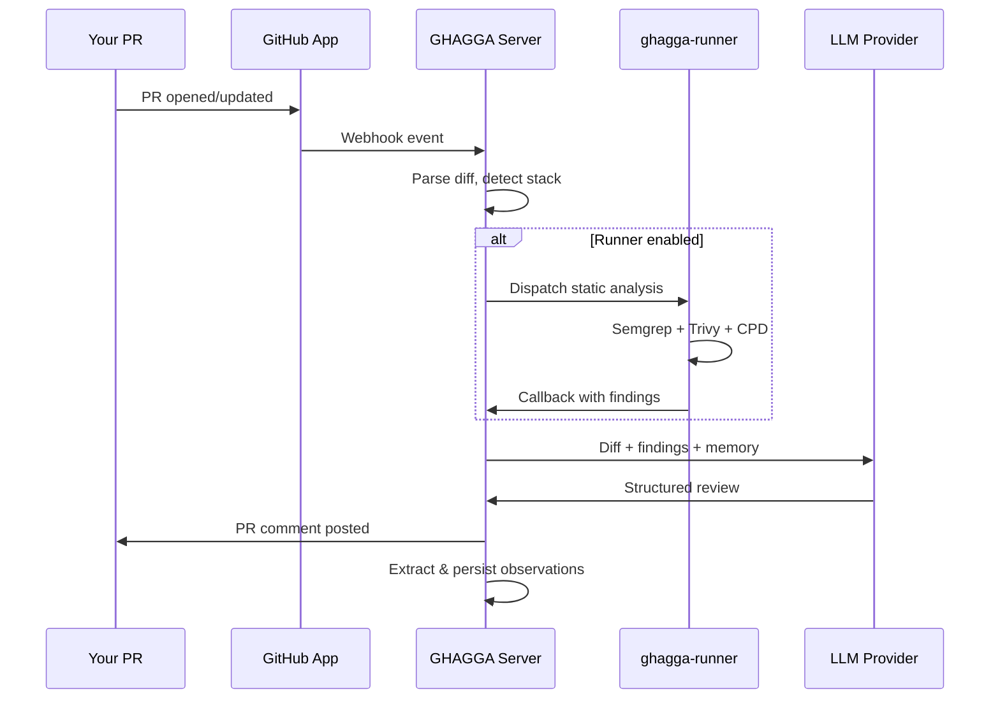

# Getting Started with GHAGGA (SaaS / GitHub App)

Go from zero to your first AI code review in under 5 minutes. This guide walks you through installing the GHAGGA GitHub App, configuring your LLM provider in the [Dashboard](https://jnzader.github.io/ghagga/app/), and getting your first review on a Pull Request.

## Prerequisites

- A **GitHub account**
- A repository (public or private) with at least one open Pull Request — or the ability to create one
- A modern web browser (for the Dashboard)

> **Not looking for SaaS?** If you need CI/CD integration, try the [GitHub Action](github-action.md). For local terminal reviews, see the [CLI](cli.md). For full self-hosted control, see the [Self-Hosted Guide](self-hosted.md).

---

## Step 1: Install the GitHub App

**[Install the GHAGGA GitHub App](https://github.com/apps/ghagga-review/installations/new)**

1. Click the link above — it opens the GitHub App installation page
2. Choose which repositories GHAGGA should have access to:
   - **All repositories** — GHAGGA reviews PRs on every repo in your account
   - **Only select repositories** — pick specific repos
3. Click **"Install"**

### What permissions does the App request?

| Permission | Access | Why |
|-----------|--------|-----|
| **Pull requests** | Read and write | Fetch PR diffs and post review comments |
| **Actions** | Write | Dispatch and manage runner workflows for static analysis |
| **Secrets** | Read and write | Store and retrieve encrypted LLM API keys per installation |
| **Metadata** | Read-only | List repositories (auto-selected by GitHub) |

> **Important**: After installing the App, reviews will **NOT** work until you configure at least one LLM provider in the [Dashboard](https://jnzader.github.io/ghagga/app/). Continue to Step 2.

---

## Step 2: Open the Dashboard

**[Open the GHAGGA Dashboard](https://jnzader.github.io/ghagga/app/)**

1. Click **"Login"** on the Dashboard
2. You'll see a **GitHub OAuth Device Flow** screen with a code
3. Click the link to go to GitHub, enter the code, and click **"Authorize"**
4. You'll be redirected back to the Dashboard, logged in

> **Tip**: The Dashboard uses GitHub Pages — no backend authentication is stored. Your GitHub token is kept in your browser's local storage and never sent to third parties.

**Verification**: You should see the Dashboard home page with stats cards (they'll show zeros until your first review).

---

## Step 3: Configure Your LLM Provider

Navigate to **Dashboard** > **Settings** (or **Global Settings** for installation-wide defaults).

### Choose a provider

| Provider | Model | Cost | API Key Needed? | Notes |
|----------|-------|------|-----------------|-------|
| **GitHub Models** | `gpt-4o-mini` | **Free** | No | Default — uses your GitHub OAuth token |
| Anthropic | `claude-sonnet-4-20250514` | BYOK | Yes | Highest quality reviews |
| OpenAI | `gpt-4o` | BYOK | Yes | Fast and capable |
| Google | `gemini-2.5-flash` | BYOK | Yes | Low cost per token |
| Ollama | `qwen2.5-coder:7b` | **Free** (local) | No | Requires local Ollama server |
| Qwen | `qwen-coder-plus` | BYOK | Yes | Alibaba Cloud |

### Free setup (GitHub Models — recommended for getting started)

1. In **Settings**, select **"GitHub"** as the provider
2. That's it — no API key needed. GitHub Models uses your OAuth login automatically
3. The default model is `gpt-4o-mini`

### BYOK setup (Bring Your Own Key)

1. In **Settings**, select your preferred provider (e.g., "Anthropic")
2. Paste your API key in the **"API Key"** field
3. Click **"Save"**

> **Security**: API keys are encrypted with **AES-256-GCM** at rest. GHAGGA never stores or logs your keys in plaintext. You can rotate or delete keys at any time from Settings.

**Verification**: The Settings page should show your selected provider with a green status indicator.

---

## Step 4: Enable the Runner (Optional)

The Runner enables **static analysis** (Semgrep for security, Trivy for vulnerabilities, CPD for code duplication) alongside the AI review. Without it, reviews are LLM-only — still useful, but without Layer 0 static findings.

1. Go to **Dashboard** > **Global Settings**
2. Click **"Enable Runner"** in the Static Analysis Runner card
3. A public repository named `ghagga-runner` will be created in your GitHub account from the [official template](https://github.com/JNZader/ghagga-runner-template)

> **Note**: If your GitHub OAuth token was created before the `public_repo` scope was added, you'll be prompted to re-authenticate. This is a **one-time** step.

**What the runner provides**:

| Component | Without Runner | With Runner |
|-----------|---------------|-------------|
| AI review (LLM analysis) | Yes | Yes |
| Semgrep (security) | No | Yes |
| Trivy (vulnerabilities) | No | Yes |
| CPD (code duplication) | No | Yes |

The runner uses **GitHub Actions free minutes** (unlimited for public repos, 7GB RAM per run). First run takes ~3-5 minutes (tool installation); subsequent runs take ~18 seconds (cached).

**Verification**: Check your GitHub account — you should see a new public repo named `ghagga-runner`.

---

## Step 5: Open a PR and Get Your First Review

1. Create a new Pull Request (or push a commit to an existing one) on a repository where you installed the App
2. Wait **~1-2 minutes** for the review to arrive

### What to expect

GHAGGA posts a **review comment** on your PR with:

- **Status**: `PASSED`, `FAILED`, `NEEDS_HUMAN_REVIEW`, or `SKIPPED`
- **Summary**: A brief overview of the changes
- **Findings**: Individual issues with severity (Critical, High, Medium, Low, Info), description, file location, and suggested fix
- **Static analysis results** (if runner is enabled): Security vulnerabilities, known CVEs, duplicated code

> **Tip**: You can re-trigger a review at any time by commenting `ghagga review` on the PR.

**Verification**: You should see a comment from the GHAGGA bot on your Pull Request.

---

## What Just Happened?

Here's what GHAGGA did when you opened that PR:

1. GitHub sends a **webhook** to the GHAGGA server when your PR is opened or updated
2. The server **parses the diff**, detects the tech stack, and checks your token budget
3. If the runner is enabled, it **dispatches static analysis** to your `ghagga-runner` repo (Semgrep, Trivy, CPD)
4. The server sends the diff + static findings + project memory to your configured **LLM provider**
5. The LLM returns a structured review, which is **posted as a PR comment**
6. Observations from the review are **extracted and stored** in project memory for future reviews

---

## What Happens Without Configuration

| State | What you get |
|-------|-------------|
| App installed, **no LLM provider configured** | No review comment posted — the server has no AI provider to analyze the diff |
| App installed, **LLM configured, no runner** | AI-only review — findings from the LLM but no static analysis (no Semgrep/Trivy/CPD) |
| App installed, **LLM configured, runner enabled** | Full review — static analysis findings + AI review + project memory |

---

## Troubleshooting

### No review comment posted

1. **Check your LLM provider**: Go to [Dashboard](https://jnzader.github.io/ghagga/app/) > Settings and verify a provider is configured with a valid API key (or "GitHub" selected for the free default)
2. **Check the App is installed on that repo**: Go to your GitHub Settings > Applications > GHAGGA > Configure — make sure the repo is in the list
3. **Check the PR is on the right event type**: GHAGGA triggers on `opened`, `synchronize`, and `reopened` events. Draft PRs may not trigger reviews depending on your config.

### Review comment is empty or minimal

- **Enable the runner** for static analysis findings — without it, the review relies entirely on the LLM
- **Check your review mode**: Try `workflow` mode (5 specialist agents) in Settings for more thorough reviews
- **Small diffs may produce minimal reviews** — this is expected for trivial changes

### Runner not discovered

- The runner repo **must be named exactly `ghagga-runner`** in your GitHub account
- The runner repo **must be public** (GitHub Actions free minutes require public repos)
- If you created the runner manually, ensure it was created from the [official template](https://github.com/JNZader/ghagga-runner-template)

### OAuth re-authentication prompt

If clicking "Enable Runner" triggers a re-authentication prompt, this means your GitHub token needs the `public_repo` scope to create the runner repository. This is a **one-time** step — authorize the additional scope and the runner will be created. See the [security documentation](security.md) for details on OAuth scopes and token handling.

---

## Cost Summary

| Component | Cost |
|-----------|------|
| **GHAGGA** | Free and open source (MIT license) |
| **Hosted SaaS** | Free to use |
| **GitHub Models** (`gpt-4o-mini`) | Free — no API key needed |
| **Other LLM providers** (Anthropic, OpenAI, Google, Qwen) | BYOK — you pay those providers directly at their standard rates |
| **Ollama** | Free — runs on your own machine |
| **Static analysis** (Semgrep, Trivy, CPD) | Free — runs on GitHub Actions runners (unlimited free minutes for public repos) |

---

## Next Steps

- **[Review Modes](review-modes.md)** — Learn about Simple, Workflow, and Consensus modes
- **[Memory System](memory-system.md)** — How GHAGGA learns from past reviews
- **[Configuration](configuration.md)** — Environment variables and config file options
- **[Runner Architecture](runner-architecture.md)** — Deep dive into delegated static analysis
- **[Static Analysis](static-analysis.md)** — Semgrep rules, Trivy scanning, CPD detection
