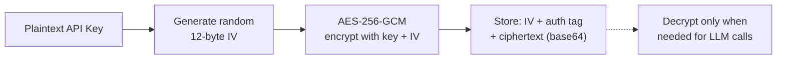

# Security

## Security Measures

| Measure | Implementation |
|---------|---------------|
| **API key encryption** | AES-256-GCM with per-installation encryption keys. Keys are never stored in plaintext. |
| **Webhook verification** | HMAC-SHA256 signature verification with `crypto.timingSafeEqual` (constant-time comparison to prevent timing attacks) |
| **JWT generation** | RS256 manual JWT construction for GitHub App installation tokens |
| **Privacy stripping** | 16 regex patterns remove secrets before storing to memory |
| **No secret logging** | Console outputs and error messages never contain sensitive data |
| **BYOK model** | Users provide their own LLM API keys. GHAGGA never pays for or sees your LLM usage in plaintext. |
| **Installation scoping** | API routes are scoped by GitHub installation ID — users can only access their own repos |
| **OAuth Device Flow** | GitHub OAuth Device Flow for dashboard and CLI authentication. No client secret stored — uses public client ID with device code verification. |

## AES-256-GCM Encryption

API keys provided by users are encrypted at rest using AES-256-GCM:

- **256-bit key** derived from the `ENCRYPTION_KEY` environment variable (64 hex characters)
- **Unique IV** generated for each encryption operation (12 bytes)
- **Authentication tag** prevents tampering — decryption fails if ciphertext is modified
- **No external dependencies** — uses Node.js built-in `crypto` module

## Webhook Verification

GitHub webhook signatures are verified using HMAC-SHA256:

1. Compute `HMAC-SHA256(webhook_secret, request_body)`
2. Compare with the `X-Hub-Signature-256` header
3. Use `crypto.timingSafeEqual` for constant-time comparison (prevents timing attacks)

Invalid signatures are rejected with HTTP 401.

## Privacy Stripping

See [Memory System — Privacy Stripping](memory-system.md) for the full list of 16 patterns that are stripped before storing observations.

## Automated Security Tests

The test suite includes 14 dedicated security audit tests that verify:

- No `console.log` calls with sensitive variable names across the entire codebase
- No hardcoded API keys, tokens, or passwords in source files
- No use of `eval()` or `Function()` constructors
- AES-256-GCM encryption roundtrip correctness
- Tampered ciphertext detection
- `timingSafeEqual` usage for webhook signature comparison
- Privacy stripping covers all 16 secret patterns

## Security Best Practices

1. **Never commit API keys** — Use environment variables or GitHub secrets
2. **Generate a strong ENCRYPTION_KEY** — Use `openssl rand -hex 32` to generate 64 hex characters
3. **Rotate webhook secrets** — If compromised, regenerate in GitHub App settings
4. **Use HTTPS** — All webhook endpoints should be served over HTTPS
5. **Limit GitHub App permissions** — Only request `pull_requests: write` and `contents: read`
6. **Use Device Flow for auth** — Dashboard and CLI use GitHub OAuth Device Flow (no client secret needed). Never store GitHub tokens in config files — use `ghagga login` which stores tokens securely.
