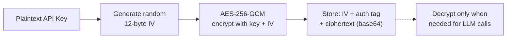

# Security

## Security Measures

| Measure | Implementation |
|---------|---------------|
| **API key encryption** | AES-256-GCM with per-installation encryption keys. Keys are never stored in plaintext. |
| **Webhook verification** | HMAC-SHA256 signature verification with `crypto.timingSafeEqual` (constant-time comparison to prevent timing attacks) |
| **JWT generation** | RS256 manual JWT construction for GitHub App installation tokens |
| **Privacy stripping** | 16 regex patterns remove secrets before storing to memory |
| **No secret logging** | Console outputs and error messages never contain sensitive data |
| **BYOK model** | Users provide their own LLM API keys. GHAGGA never pays for or sees your LLM usage in plaintext. |
| **Installation scoping** | API routes are scoped by GitHub installation ID — users can only access their own repos |
| **Runner HMAC** | Per-dispatch HMAC-SHA256 verification for runner callbacks. Unique secret per dispatch with 11-minute TTL. |
| **OAuth Device Flow** | GitHub OAuth Device Flow for dashboard and CLI authentication. No client secret stored — uses public client ID with device code verification. |

## AES-256-GCM Encryption

API keys provided by users are encrypted at rest using AES-256-GCM:

- **256-bit key** derived from the `ENCRYPTION_KEY` environment variable (64 hex characters)
- **Unique IV** generated for each encryption operation (12 bytes)
- **Authentication tag** prevents tampering — decryption fails if ciphertext is modified
- **No external dependencies** — uses Node.js built-in `crypto` module

## Webhook Verification

GitHub webhook signatures are verified using HMAC-SHA256:

1. Compute `HMAC-SHA256(webhook_secret, request_body)`
2. Compare with the `X-Hub-Signature-256` header
3. Use `crypto.timingSafeEqual` for constant-time comparison (prevents timing attacks)

Invalid signatures are rejected with HTTP 401.

## Privacy Stripping

See [Memory System — Privacy Stripping](memory-system.md) for the full list of 16 patterns that are stripped before storing observations.

## Automated Security Tests

The test suite includes 14 dedicated security audit tests that verify:

- No `console.log` calls with sensitive variable names across the entire codebase
- No hardcoded API keys, tokens, or passwords in source files
- No use of `eval()` or `Function()` constructors
- AES-256-GCM encryption roundtrip correctness
- Tampered ciphertext detection
- `timingSafeEqual` usage for webhook signature comparison
- Privacy stripping covers all 16 secret patterns

## Runner Security Model

When the GHAGGA server delegates static analysis to a user-owned GitHub Actions runner, private repository code is exposed on a public runner. Four security layers protect against code leakage:

### Layer 1: Output Suppression

All static analysis tool output is redirected to `/dev/null` in the runner workflow. No code snippets, file paths, or analysis results appear in the GitHub Actions workflow logs.

### Layer 2: Log Masking

Sensitive values are masked using GitHub Actions' `::add-mask::` command. Even if a value accidentally appears in a log line, it's replaced with `***`.

### Layer 3: Log Deletion

After the analysis completes and results are delivered via callback, the runner workflow deletes its own run logs using the GitHub API. This removes any residual data from GitHub's log storage.

### Layer 4: Retention Policy

The runner repository is configured with a 1-day log retention policy. Even if log deletion fails, logs are automatically purged within 24 hours.

### Per-Dispatch HMAC Verification

Each `workflow_dispatch` generates a unique callback secret:

1. Server generates a random secret and stores it in an in-memory Map (11-minute TTL)
2. Secret is set as a GitHub repository secret (`GHAGGA_TOKEN`) on the runner repo
3. Runner signs the callback body with `HMAC-SHA256(secret, body)`
4. Server verifies the `X-Runner-Signature` header against the stored secret
5. Secret is deleted from the Map after successful verification

This prevents:
- **Replay attacks**: Each secret is single-use and expires in 11 minutes
- **Spoofed callbacks**: Only the runner with access to `GHAGGA_TOKEN` can generate valid signatures
- **Stale secrets**: In-memory Map entries auto-expire, preventing memory leaks

## Security Best Practices

1. **Never commit API keys** — Use environment variables or GitHub secrets
2. **Generate a strong ENCRYPTION_KEY** — Use `openssl rand -hex 32` to generate 64 hex characters
3. **Rotate webhook secrets** — If compromised, regenerate in GitHub App settings
4. **Use HTTPS** — All webhook endpoints should be served over HTTPS
5. **Limit GitHub App permissions** — Only request `pull_requests: write`, `actions: write`, `secrets: read-write`, and `metadata: read` (auto). The `administration` and `contents` permissions are no longer needed — runner repo creation is handled via the user's OAuth token.
6. **Use Device Flow for auth** — Dashboard and CLI use GitHub OAuth Device Flow (no client secret needed). Never store GitHub tokens in config files — use `ghagga login` which stores tokens securely. The OAuth scope `public_repo` is requested to enable runner repo creation.
7. **Configure runner repo as public** — The `ghagga-runner` repo must be public for free GitHub Actions minutes. Never put sensitive code in this repo — it only contains the analysis workflow.
8. **Review runner workflow changes** — The `ghagga-analysis.yml` workflow is the trust boundary. Only accept changes from the template repository.

## OAuth Scope: `public_repo`

The Dashboard requests the `public_repo` OAuth scope during login. This is required to create the `ghagga-runner` repository in the user's GitHub account via the Template Repository API.

**Why `public_repo`?** GitHub's OAuth scopes are coarse-grained. There is no scope that only allows creating a single repository. `public_repo` grants read/write access to all public repositories. This is a known limitation.

**Mitigations**:
- The token is only used **server-side** — it's sent in the `Authorization` header to the GHAGGA server, which uses it transiently for GitHub API calls. The server never persists the token.
- The Dashboard warns users about the scope before they click "Enable Runner".
- The token is stored in `localStorage` (existing behavior for all auth) and cleared on logout.
