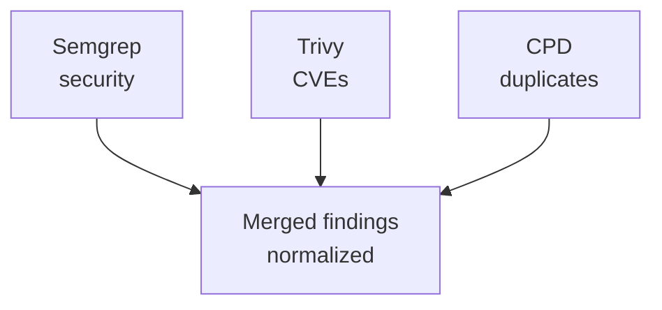

# Static Analysis Trident

Layer 0 analysis runs **before** any LLM call. Zero tokens consumed. Known issues are injected into agent prompts so the AI focuses on logic, architecture, and things static analysis can't detect.

## Tools

| Tool | What It Finds | Languages |
|------|--------------|-----------|
| **Semgrep** | Security vulnerabilities, dangerous patterns (eval, SQL injection, XSS, hardcoded secrets) | 20 custom rules across JavaScript, TypeScript, Python, Java, Go, Ruby, PHP, C# |
| **Trivy** | Known CVEs in dependencies (npm, pip, Maven, Go modules, Cargo, etc.) | All ecosystems with lockfiles |
| **CPD** | Duplicated code blocks (copy-paste detection) | 15+ languages via PMD |

## How It Works

All three tools execute as child processes in parallel:



> **Where do tools run?** In SaaS mode, tools run on a [delegated runner](runner-architecture.md). In Action mode, tools auto-install on the GitHub Actions runner. In CLI mode, tools run locally if installed. In Docker, tools are pre-installed.

Each tool's output (JSON for Semgrep/Trivy, XML for CPD) is parsed into a common `ReviewFinding` format with severity, file, line, and message.

## Graceful Degradation

Tools are optional. If a binary isn't installed or fails to run, it's silently skipped. The review continues with whatever tools are available. Check your deployment's tool status at `/health/tools`.

| Distribution | Semgrep | Trivy | CPD | How |
|-------------|---------|-------|-----|-----|
| **SaaS (with runner)** | Yes | Yes | Yes | Delegated to `ghagga-runner` via workflow_dispatch |
| **SaaS (no runner)** | No | No | No | Falls back to LLM-only review |
| **GitHub Action (node20)** | Yes | Yes | Yes | Auto-installed + cached on runner |
| **Docker (action/server)** | Yes | Yes | Yes | Pre-installed in Docker image |
| **CLI** | If installed | If installed | If installed | Uses locally installed binaries |

> SaaS mode delegates static analysis to the user's [`ghagga-runner`](runner-architecture.md) repository. If no runner is configured, the review continues with AI only (no static analysis findings). See [Runner Architecture](runner-architecture.md) for details.

> The GitHub Action auto-installs tools directly on the `ubuntu-latest` runner and caches binaries with `@actions/cache`. First run takes ~3-5 minutes (installation); subsequent runs use cache (~1-2 minutes).

## Semgrep

### Built-in Rules

GHAGGA ships with 20 custom security rules in `packages/core/src/tools/semgrep-rules.yml` covering:

- **Injection**: SQL injection, command injection, SSRF
- **XSS**: Unescaped output, dangerous innerHTML
- **Secrets**: Hardcoded API keys, passwords, tokens
- **Dangerous APIs**: `eval()`, `Function()`, `child_process.exec()`
- **Auth**: Missing authentication checks, broken access control

### Custom Rules

Add your own Semgrep rules:

```json
{
  "customRules": [".semgrep/my-rules.yml"]
}
```

Rules are loaded relative to the repository root.

## Trivy

Scans lockfiles for known CVEs:
- `package-lock.json` / `yarn.lock` / `pnpm-lock.yaml` (Node.js)
- `requirements.txt` / `Pipfile.lock` / `poetry.lock` (Python)
- `go.sum` (Go)
- `Cargo.lock` (Rust)
- `pom.xml` / `build.gradle` (Java)
- `Gemfile.lock` (Ruby)

Findings include CVE ID, severity, affected package, and fixed version.

## CPD (Copy-Paste Detector)

PMD's CPD detects duplicated code blocks. Findings include:
- File paths of both copies
- Line numbers
- Number of duplicated tokens
- The duplicated code snippet

Useful for catching copy-pasted logic that should be extracted into a shared function.
