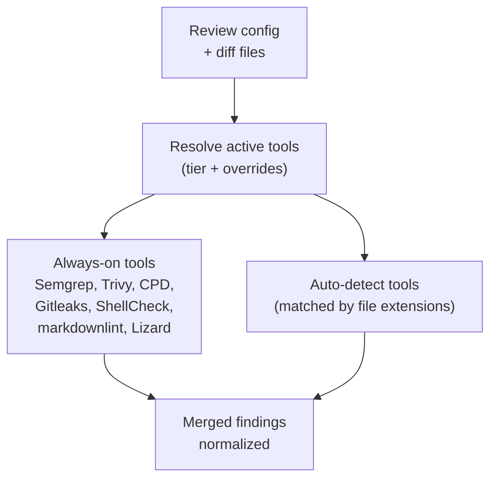

# Static Analysis

Layer 0 analysis runs **before** any LLM call. Zero tokens consumed. Known issues are injected into agent prompts so the AI focuses on logic, architecture, and things static analysis can't detect.

## Tools

GHAGGA supports 15 static analysis tools across 5 categories, organized into two tiers:

| Tool | Category | Tier | Languages |
|------|----------|------|-----------|
| **Semgrep** | security | always-on | 20+ languages (custom rules) |
| **Trivy** | sca | always-on | All ecosystems with lockfiles + license scanning |
| **CPD** | duplication | always-on | 15+ languages via PMD |
| **Gitleaks** | security | always-on | All (secret detection in git history) |
| **ShellCheck** | lint | always-on | Bash/Shell |
| **markdownlint** | lint | always-on | Markdown |
| **Lizard** | complexity | always-on | 20+ languages (cyclomatic complexity) |
| **Ruff** | lint | auto-detect | Python (`*.py`) |
| **Bandit** | security | auto-detect | Python (`*.py`) |
| **golangci-lint** | lint | auto-detect | Go (`*.go`) |
| **Biome** | lint | auto-detect | JS/TS (`*.js`, `*.ts`, `*.jsx`, `*.tsx`) |
| **PMD** | lint | auto-detect | Java (`*.java`) |
| **Psalm** | security | auto-detect | PHP (`*.php`) |
| **clippy** | lint | auto-detect | Rust (`*.rs`) |
| **Hadolint** | lint | auto-detect | Docker (`Dockerfile*`) |

> **Feature flag**: Set `GHAGGA_TOOL_REGISTRY=true` to enable the 15-tool registry. When unset or `false`, the original 3-tool path (Semgrep, Trivy, CPD) runs unchanged.

## Tool Tiers

### always-on

These 7 tools run on **every review** regardless of what languages are in the diff. They cover universal concerns — security, vulnerabilities, duplication, secrets, shell scripts, docs, and code complexity.

### auto-detect

These 8 tools activate **only when matching files are detected** in the diff. For example, Ruff and Bandit only run when the diff contains `*.py` files. This keeps reviews fast — no time wasted on tools that have nothing to scan.

### Tool Resolution Order

The final set of tools for each review is determined by this resolution order:

1. **always-on** — all 7 always-on tools are included
2. **auto-detect(files)** — tools whose file patterns match files in the diff are added
3. **+enabledTools** — tools listed in `enabledTools` (settings, config, or CLI flag) are force-added
4. **-disabledTools** — tools listed in `disabledTools` (settings, config, or CLI flag) are removed

This means you can force-enable an auto-detect tool even when no matching files are present, or disable an always-on tool you don't need.

## How It Works

The tool registry orchestrator resolves active tools, then executes them in parallel:



> **Where do tools run?** In SaaS mode, tools run on a [delegated runner](runner-architecture.md). In Action mode, tools auto-install on the GitHub Actions runner. In CLI mode, tools run locally if installed. In Docker, tools are pre-installed.

Each tool's output is parsed into a common `ReviewFinding` format with severity, file, line, and message.

## Controlling Tools

### CLI

```bash
# Force-enable a tool
ghagga review --enable-tool ruff --enable-tool bandit

# Force-disable a tool
ghagga review --disable-tool markdownlint

# List all tools and their status
ghagga review --list-tools
```

> The legacy flags `--no-semgrep`, `--no-trivy`, `--no-cpd` still work but show deprecation warnings. Use `--disable-tool <name>` instead.

### GitHub Action

```yaml
- uses: JNZader/ghagga-action@v1
  with:
    enabled-tools: 'ruff,bandit'
    disabled-tools: 'markdownlint'
```

> The legacy inputs `enable-semgrep`, `enable-trivy`, `enable-cpd` still work but are deprecated. Use `enabled-tools`/`disabled-tools` instead.

### Config File (`.ghagga.json`)

```json
{
  "enabledTools": ["ruff", "bandit"],
  "disabledTools": ["markdownlint"]
}
```

> The legacy fields `enableSemgrep`, `enableTrivy`, `enableCpd` still work but are deprecated.

### Dashboard

The Settings page includes a **ToolGrid** component with category grouping. Toggle tools on/off per repository.

## Graceful Degradation

Tools are optional. If a binary isn't installed or fails to run, it's silently skipped. The review continues with whatever tools are available. Check your deployment's tool status at `/health/tools`.

| Distribution | Always-on tools | Auto-detect tools | How |
|-------------|-----------------|-------------------|-----|
| **SaaS (with runner)** | Yes | Yes | Delegated to `ghagga-runner` via workflow_dispatch |
| **SaaS (no runner)** | No | No | Falls back to LLM-only review |
| **GitHub Action (node20)** | Yes | Yes | Auto-installed + cached on runner |
| **Docker (action/server)** | Yes | Yes | Pre-installed in Docker image |
| **CLI** | If installed | If installed | Uses locally installed binaries |

> SaaS mode delegates static analysis to the user's [`ghagga-runner`](runner-architecture.md) repository. If no runner is configured, the review continues with AI only (no static analysis findings). See [Runner Architecture](runner-architecture.md) for details.

> The GitHub Action auto-installs tools directly on the `ubuntu-latest` runner and caches binaries with `@actions/cache`. First run takes ~3-5 minutes (installation); subsequent runs use cache (~1-2 minutes).

## Semgrep

### Built-in Rules

GHAGGA ships with 20 custom security rules in `packages/core/src/tools/semgrep-rules.yml` covering:

- **Injection**: SQL injection, command injection, SSRF
- **XSS**: Unescaped output, dangerous innerHTML
- **Secrets**: Hardcoded API keys, passwords, tokens
- **Dangerous APIs**: `eval()`, `Function()`, `child_process.exec()`
- **Auth**: Missing authentication checks, broken access control

### Custom Rules

Add your own Semgrep rules:

```json
{
  "customRules": [".semgrep/my-rules.yml"]
}
```

Rules are loaded relative to the repository root.

## Trivy

Scans lockfiles for known CVEs and license violations:
- `package-lock.json` / `yarn.lock` / `pnpm-lock.yaml` (Node.js)
- `requirements.txt` / `Pipfile.lock` / `poetry.lock` (Python)
- `go.sum` (Go)
- `Cargo.lock` (Rust)
- `pom.xml` / `build.gradle` (Java)
- `Gemfile.lock` (Ruby)

Findings include CVE ID, severity, affected package, and fixed version.

## CPD (Copy-Paste Detector)

PMD's CPD detects duplicated code blocks. Findings include:
- File paths of both copies
- Line numbers
- Number of duplicated tokens
- The duplicated code snippet

Useful for catching copy-pasted logic that should be extracted into a shared function.

## Gitleaks

Scans git history for leaked secrets — API keys, tokens, passwords, and credentials committed to the repository. Detects secrets even if they were removed in later commits.

## ShellCheck

Lints Bash and Shell scripts for common errors, quoting issues, and potential pitfalls. Catches problems like unquoted variables, unused variables, and incorrect test syntax.

## markdownlint

Checks Markdown files for formatting consistency — heading levels, list indentation, line length, and structural issues.

## Lizard

Measures cyclomatic complexity across 20+ languages. Flags functions that exceed complexity thresholds, helping identify code that's hard to test and maintain.

## Ruff (auto-detect: Python)

Extremely fast Python linter and formatter. Replaces Flake8, isort, and dozens of other Python lint tools. Activates when `*.py` files are in the diff.

## Bandit (auto-detect: Python)

Python security linter. Detects common security issues like SQL injection, hardcoded passwords, and use of insecure functions. Activates when `*.py` files are in the diff.

## golangci-lint (auto-detect: Go)

Meta-linter for Go that runs 50+ linters in parallel. Catches bugs, style issues, and performance problems. Activates when `*.go` files are in the diff.

## Biome (auto-detect: JS/TS)

Fast linter and formatter for JavaScript and TypeScript. Activates when `*.js`, `*.ts`, `*.jsx`, or `*.tsx` files are in the diff.

## PMD (auto-detect: Java)

Source code analyzer for Java. Finds common programming flaws — unused variables, empty catch blocks, unnecessary object creation. Activates when `*.java` files are in the diff.

## Psalm (auto-detect: PHP)

Static analysis tool for PHP focused on finding type errors and security vulnerabilities. Activates when `*.php` files are in the diff.

## clippy (auto-detect: Rust)

Official Rust linter. Catches common mistakes and suggests idiomatic improvements. Activates when `*.rs` files are in the diff.

## Hadolint (auto-detect: Docker)

Dockerfile linter that validates best practices — pinned versions, minimal layers, security settings. Activates when `Dockerfile*` files are in the diff.
