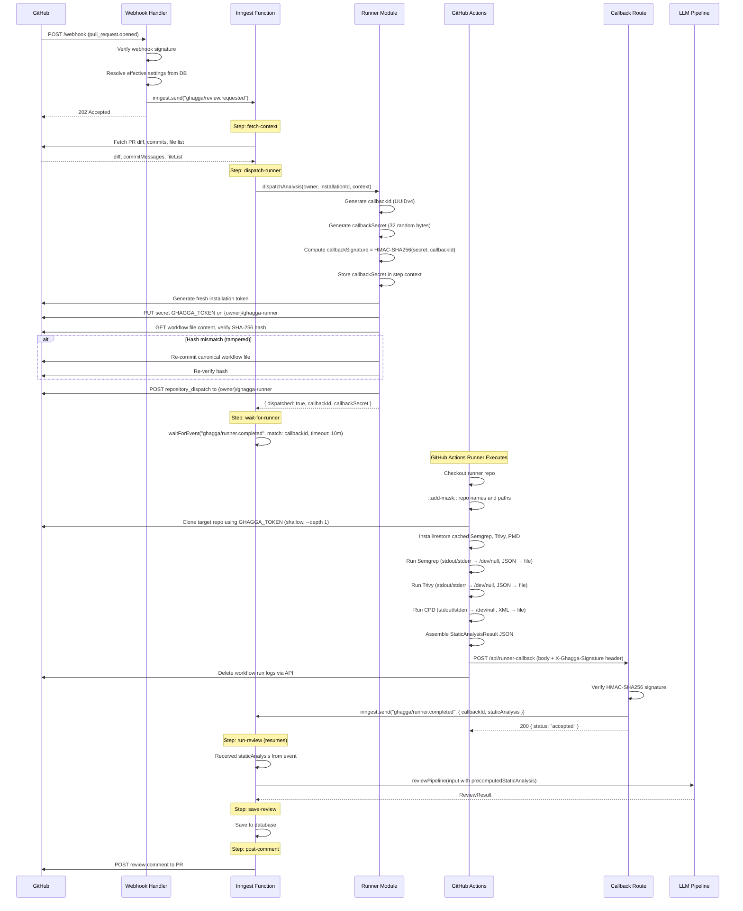
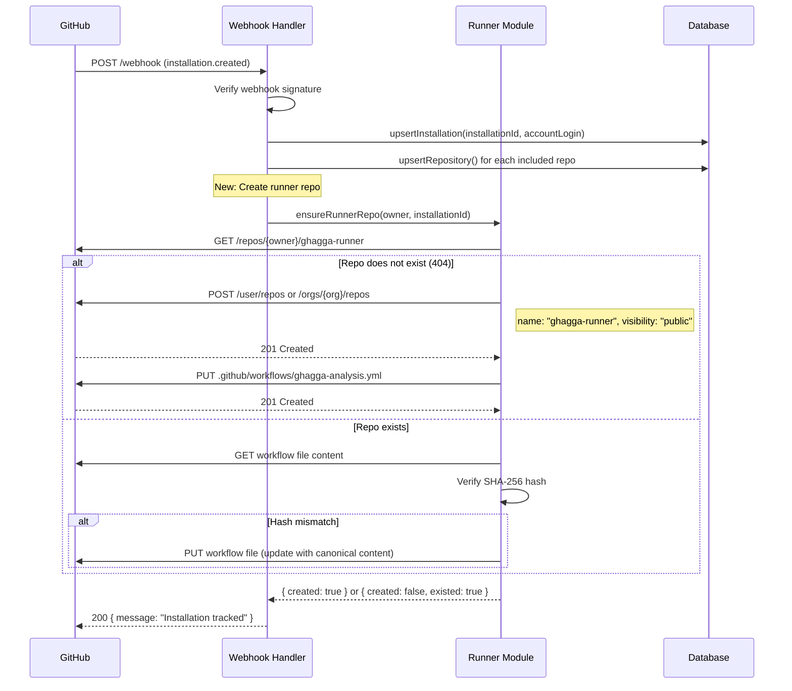
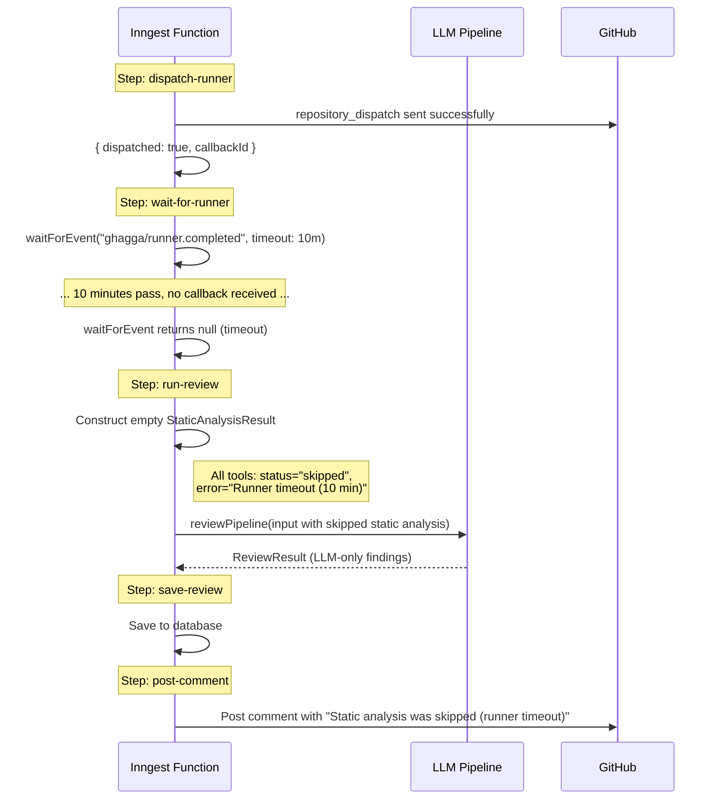

# Design: Migrate Static Analysis to GitHub Actions Runner Architecture

## 1. Architecture Overview

### Component Diagram

```
                          RENDER SERVER (512MB)                              GITHUB ACTIONS (7GB)
                    ┌──────────────────────────────┐                   ┌─────────────────────────────┐
                    │                              │                   │   {owner}/ghagga-runner      │
  GitHub ──webhook──│  Hono Server                 │                   │   (public repo)              │
  (PR opened)       │  ├── routes/webhook.ts       │                   │                              │
                    │  │   ├── verify signature     │   repository     │   .github/workflows/         │
                    │  │   ├── resolve settings     │   _dispatch      │     ghagga-analysis.yml      │
                    │  │   └── inngest.send()       │ ─────────────►   │                              │
                    │  │                            │                   │   Steps:                     │
                    │  ├── inngest/review.ts        │                   │   1. Clone target repo       │
                    │  │   ├── fetch-context        │                   │   2. Install/cache tools     │
                    │  │   ├── dispatch-runner ─────┼───────────────►   │   3. Run Semgrep >/dev/null  │
                    │  │   ├── wait-for-runner      │                   │   4. Run Trivy >/dev/null    │
                    │  │   │   (waitForEvent 10m)   │   POST callback  │   5. Run CPD >/dev/null      │
                    │  │   ├── run-review ◄─────────┼───────────────◄  │   6. POST JSON results       │
                    │  │   ├── save-review          │                   │   7. Delete workflow logs    │
                    │  │   └── post-comment ────────┼──► GitHub PR     │                              │
                    │  │                            │                   └─────────────────────────────┘
                    │  ├── routes/runner-callback.ts│
                    │  │   ├── verify HMAC          │
                    │  │   └── inngest.send(event)  │
                    │  │                            │
                    │  ├── github/runner.ts         │
                    │  │   ├── createRunnerRepo     │
                    │  │   ├── commitWorkflowFile   │
                    │  │   ├── verifyWorkflowHash   │
                    │  │   ├── setRepoSecret        │
                    │  │   ├── dispatchAnalysis     │
                    │  │   └── deleteWorkflowLogs   │
                    │  │                            │
                    │  └── DB / LLM / Inngest       │
                    └──────────────────────────────┘

  What runs WHERE:
  ─────────────────────────────────────────────────────────────────
  Render Server:  Webhooks, DB, LLM orchestration, comment posting,
                  runner repo management, callback verification
  GitHub Actions: Semgrep (~400MB), Trivy (~100MB), PMD/CPD (~300MB)
                  — the 3 tools that don't fit in 512MB
```

### Separation of Concerns

| Responsibility | Where | Why |
|---|---|---|
| Webhook reception & verification | Render | Already handles webhooks |
| Settings resolution, DB queries | Render | Has DATABASE_URL |
| LLM API calls (Anthropic, OpenAI, etc.) | Render | Has API keys |
| Semgrep, Trivy, CPD execution | GitHub Actions | Needs 7GB RAM, free on public repos |
| Review comment posting | Render | Has installation token |
| Runner repo lifecycle | Render | Has GitHub App credentials |

---

## 2. Sequence Diagrams

### 2.1 Happy Path: Full Review Flow



### 2.2 First-Time Install: App Installed → Runner Repo Created



### 2.3 Fallback: Runner Times Out → LLM-Only Review



---

## 3. API Contracts

### 3.1 repository_dispatch Payload

Sent from server to `POST https://api.github.com/repos/{owner}/ghagga-runner/dispatches`:

```json
{
  "event_type": "ghagga-analysis",
  "client_payload": {
    "callbackId": "550e8400-e29b-41d4-a716-446655440000",
    "repoFullName": "alice/my-project",
    "prNumber": 42,
    "headSha": "abc123def456",
    "baseBranch": "main",
    "toolSettings": {
      "enableSemgrep": true,
      "enableTrivy": true,
      "enableCpd": true
    },
    "callbackUrl": "https://ghagga.onrender.com/api/runner-callback",
    "callbackSignature": "sha256=a1b2c3d4e5f6..."
  }
}
```

**Field descriptions:**

| Field | Type | Description |
|---|---|---|
| `callbackId` | string (UUID v4) | Unique correlation ID linking dispatch to callback |
| `repoFullName` | string | Target repository to clone and scan (e.g., `alice/my-project`) |
| `prNumber` | number | PR number (used for context in error messages only) |
| `headSha` | string | HEAD commit SHA to checkout after cloning |
| `baseBranch` | string | Base branch name (for shallow clone reference) |
| `toolSettings` | object | Which tools to run (mirrors `ReviewSettings` subset) |
| `callbackUrl` | string | Server URL to POST results to |
| `callbackSignature` | string | Pre-computed HMAC-SHA256 for the runner to include in callback header |

**What is NOT in the payload:**
- No API keys or tokens (token is a repo secret)
- No source code or file contents
- No LLM configuration

### 3.2 Callback POST Payload

Sent from GitHub Actions to `POST {callbackUrl}` with header `X-Ghagga-Signature: {callbackSignature}`:

```json
{
  "callbackId": "550e8400-e29b-41d4-a716-446655440000",
  "staticAnalysis": {
    "semgrep": {
      "status": "success",
      "findings": [
        {
          "severity": "high",
          "category": "security",
          "file": "src/api/handler.ts",
          "line": 42,
          "message": "Detected SQL injection via string concatenation",
          "suggestion": "Use parameterized queries instead",
          "source": "semgrep"
        }
      ],
      "executionTimeMs": 12340
    },
    "trivy": {
      "status": "success",
      "findings": [
        {
          "severity": "critical",
          "category": "dependency-vulnerability",
          "file": "package-lock.json",
          "message": "CVE-2024-1234: lodash@4.17.20 - Prototype pollution (fix: upgrade to 4.17.21)",
          "suggestion": "Upgrade lodash to 4.17.21",
          "source": "trivy"
        }
      ],
      "executionTimeMs": 8500
    },
    "cpd": {
      "status": "success",
      "findings": [
        {
          "severity": "medium",
          "category": "duplication",
          "file": "src/utils/validate.ts",
          "line": 15,
          "message": "Duplicated code block (45 lines, 120 tokens) found in: src/utils/validate.ts:15, src/utils/check.ts:30",
          "suggestion": "Extract the duplicated code into a shared function or module.",
          "source": "cpd"
        }
      ],
      "executionTimeMs": 5200
    }
  }
}
```

**How tool outputs are transformed in the runner workflow:**

| Tool | Native Output | Transformation | Target Type |
|---|---|---|---|
| Semgrep | JSON (`--json` flag): `{ results: [...], errors: [...] }` | Map `results[].check_id`, `.path`, `.start.line`, `.extra.message`, `.extra.severity` → `ReviewFinding` | `ToolResult` |
| Trivy | JSON (`--format json`): `{ Results: [{ Target, Vulnerabilities: [...] }] }` | Map `VulnerabilityID`, `PkgName`, `InstalledVersion`, `Severity`, `Title` → `ReviewFinding` | `ToolResult` |
| CPD | XML (`--format xml`): `<pmd-cpd><duplication>...</duplication></pmd-cpd>` | Parse XML regex, extract `<file path="" line="">`, `<duplication lines="" tokens="">` → `ReviewFinding` | `ToolResult` |

**Severity mapping (reuses existing logic from `packages/core/src/tools/`):**

| Semgrep Severity | → FindingSeverity | Trivy Severity | → FindingSeverity |
|---|---|---|---|
| ERROR | high | CRITICAL | critical |
| WARNING | medium | HIGH | high |
| INFO | info | MEDIUM | medium |
| (other) | low | LOW | low |
| | | (other) | info |

The `staticAnalysis` field conforms exactly to the `StaticAnalysisResult` type from `packages/core/src/types.ts`:

```typescript
interface StaticAnalysisResult {
  semgrep: ToolResult;  // { status, findings, error?, executionTimeMs }
  trivy: ToolResult;
  cpd: ToolResult;
}
```

### 3.3 Runner Workflow YAML

Complete workflow template committed to `{owner}/ghagga-runner/.github/workflows/ghagga-analysis.yml`:

```yaml
name: GHAGGA Static Analysis
on:
  repository_dispatch:
    types: [ghagga-analysis]

# Cancel in-progress runs for the same callback (shouldn't happen, but safety)
concurrency:
  group: ghagga-${{ github.event.client_payload.callbackId }}
  cancel-in-progress: true

permissions:
  contents: read

jobs:
  analyze:
    runs-on: ubuntu-latest
    timeout-minutes: 15
    env:
      CALLBACK_ID: ${{ github.event.client_payload.callbackId }}
      REPO_FULL_NAME: ${{ github.event.client_payload.repoFullName }}
      PR_NUMBER: ${{ github.event.client_payload.prNumber }}
      HEAD_SHA: ${{ github.event.client_payload.headSha }}
      BASE_BRANCH: ${{ github.event.client_payload.baseBranch }}
      CALLBACK_URL: ${{ github.event.client_payload.callbackUrl }}
      CALLBACK_SIGNATURE: ${{ github.event.client_payload.callbackSignature }}
      ENABLE_SEMGREP: ${{ github.event.client_payload.toolSettings.enableSemgrep }}
      ENABLE_TRIVY: ${{ github.event.client_payload.toolSettings.enableTrivy }}
      ENABLE_CPD: ${{ github.event.client_payload.toolSettings.enableCpd }}

    steps:
      # ── Mask sensitive values ─────────────────────────────────
      - name: Mask sensitive values
        run: |
          echo "::add-mask::${{ env.REPO_FULL_NAME }}"
          echo "::add-mask::${{ secrets.GHAGGA_TOKEN }}"
          REPO_NAME=$(echo "$REPO_FULL_NAME" | cut -d'/' -f2)
          echo "::add-mask::${REPO_NAME}"
          echo "::add-mask::$(pwd)/target-repo"

      # ── Clone target repository ───────────────────────────────
      - name: Clone target repository
        id: clone
        run: |
          set +e
          git clone --depth 1 --branch "$BASE_BRANCH" \
            "https://x-access-token:${{ secrets.GHAGGA_TOKEN }}@github.com/${REPO_FULL_NAME}.git" \
            target-repo 2>/dev/null
          CLONE_EXIT=$?
          if [ $CLONE_EXIT -ne 0 ]; then
            echo "clone_failed=true" >> "$GITHUB_OUTPUT"
            exit 0
          fi
          cd target-repo
          git checkout "$HEAD_SHA" 2>/dev/null || true
          echo "clone_failed=false" >> "$GITHUB_OUTPUT"

      # ── Handle clone failure ──────────────────────────────────
      - name: Report clone failure
        if: steps.clone.outputs.clone_failed == 'true'
        run: |
          RESULT='{"callbackId":"'"$CALLBACK_ID"'","staticAnalysis":{"semgrep":{"status":"error","findings":[],"error":"Clone failed (token may have expired)","executionTimeMs":0},"trivy":{"status":"error","findings":[],"error":"Clone failed","executionTimeMs":0},"cpd":{"status":"error","findings":[],"error":"Clone failed","executionTimeMs":0}}}'
          curl -sf -X POST "$CALLBACK_URL" \
            -H "Content-Type: application/json" \
            -H "X-Ghagga-Signature: $CALLBACK_SIGNATURE" \
            -d "$RESULT" 2>/dev/null || true
          exit 0

      # ── Cache: Semgrep ────────────────────────────────────────
      - name: Cache Semgrep
        if: env.ENABLE_SEMGREP == 'true' && steps.clone.outputs.clone_failed != 'true'
        uses: actions/cache@v4
        with:
          path: ~/.cache/semgrep
          key: semgrep-${{ runner.os }}-v1

      # ── Cache: Trivy DB ──────────────────────────────────────
      - name: Cache Trivy DB
        if: env.ENABLE_TRIVY == 'true' && steps.clone.outputs.clone_failed != 'true'
        uses: actions/cache@v4
        with:
          path: ~/.cache/trivy
          key: trivy-db-${{ runner.os }}-${{ hashFiles('target-repo/**/package-lock.json', 'target-repo/**/go.sum', 'target-repo/**/requirements.txt') }}
          restore-keys: |
            trivy-db-${{ runner.os }}-

      # ── Cache: PMD ───────────────────────────────────────────
      - name: Cache PMD
        if: env.ENABLE_CPD == 'true' && steps.clone.outputs.clone_failed != 'true'
        uses: actions/cache@v4
        with:
          path: /opt/pmd
          key: pmd-7.8.0-${{ runner.os }}

      # ── Install Semgrep ──────────────────────────────────────
      - name: Install Semgrep
        if: env.ENABLE_SEMGREP == 'true' && steps.clone.outputs.clone_failed != 'true'
        run: |
          if ! command -v semgrep &>/dev/null; then
            pip install --quiet semgrep 2>/dev/null
          fi

      # ── Install Trivy ───────────────────────────────────────
      - name: Install Trivy
        if: env.ENABLE_TRIVY == 'true' && steps.clone.outputs.clone_failed != 'true'
        run: |
          if ! command -v trivy &>/dev/null; then
            curl -sfL https://raw.githubusercontent.com/aquasecurity/trivy/main/contrib/install.sh | sh -s -- -b /usr/local/bin 2>/dev/null
          fi

      # ── Install PMD ─────────────────────────────────────────
      - name: Install PMD
        if: env.ENABLE_CPD == 'true' && steps.clone.outputs.clone_failed != 'true'
        run: |
          if [ ! -f /opt/pmd/bin/pmd ]; then
            curl -sL "https://github.com/pmd/pmd/releases/download/pmd_releases%2F7.8.0/pmd-dist-7.8.0-bin.zip" \
              -o /tmp/pmd.zip 2>/dev/null
            unzip -q /tmp/pmd.zip -d /opt 2>/dev/null
            mv /opt/pmd-bin-7.8.0 /opt/pmd 2>/dev/null || true
            rm -f /tmp/pmd.zip
          fi

      # ── Run Semgrep ──────────────────────────────────────────
      - name: Run Semgrep
        if: env.ENABLE_SEMGREP == 'true' && steps.clone.outputs.clone_failed != 'true'
        id: semgrep
        run: |
          START_MS=$(($(date +%s%N)/1000000))
          set +e
          semgrep --json --config auto target-repo > /tmp/semgrep-raw.json 2>/dev/null
          SEMGREP_EXIT=$?
          END_MS=$(($(date +%s%N)/1000000))
          ELAPSED=$((END_MS - START_MS))

          if [ $SEMGREP_EXIT -ne 0 ] && [ ! -s /tmp/semgrep-raw.json ]; then
            echo '{"status":"error","findings":[],"error":"semgrep: execution failed","executionTimeMs":'"$ELAPSED"'}' > /tmp/semgrep-result.json
          else
            # Transform Semgrep JSON to ToolResult format using jq
            jq --arg elapsed "$ELAPSED" '{
              status: "success",
              findings: [.results[] | {
                severity: (if .extra.severity == "ERROR" then "high"
                          elif .extra.severity == "WARNING" then "medium"
                          elif .extra.severity == "INFO" then "info"
                          else "low" end),
                category: "security",
                file: (.path | sub("^target-repo/"; "")),
                line: .start.line,
                message: .extra.message,
                source: "semgrep"
              }],
              executionTimeMs: ($elapsed | tonumber)
            }' /tmp/semgrep-raw.json > /tmp/semgrep-result.json 2>/dev/null || \
            echo '{"status":"error","findings":[],"error":"semgrep: parse failed","executionTimeMs":'"$ELAPSED"'}' > /tmp/semgrep-result.json
          fi

      # ── Run Trivy ────────────────────────────────────────────
      - name: Run Trivy
        if: env.ENABLE_TRIVY == 'true' && steps.clone.outputs.clone_failed != 'true'
        id: trivy
        run: |
          START_MS=$(($(date +%s%N)/1000000))
          set +e
          trivy fs --format json --scanners vuln --quiet target-repo > /tmp/trivy-raw.json 2>/dev/null
          TRIVY_EXIT=$?
          END_MS=$(($(date +%s%N)/1000000))
          ELAPSED=$((END_MS - START_MS))

          if [ $TRIVY_EXIT -ne 0 ] && [ ! -s /tmp/trivy-raw.json ]; then
            echo '{"status":"error","findings":[],"error":"trivy: execution failed","executionTimeMs":'"$ELAPSED"'}' > /tmp/trivy-result.json
          else
            jq --arg elapsed "$ELAPSED" '{
              status: "success",
              findings: [(.Results // [])[] | (.Vulnerabilities // [])[] | {
                severity: (if .Severity == "CRITICAL" then "critical"
                          elif .Severity == "HIGH" then "high"
                          elif .Severity == "MEDIUM" then "medium"
                          elif .Severity == "LOW" then "low"
                          else "info" end),
                category: "dependency-vulnerability",
                file: (input_filename // "unknown"),
                message: (.VulnerabilityID + ": " + .PkgName + "@" + .InstalledVersion + " - " + (.Title // .Description // "Known vulnerability") + (if .FixedVersion then " (fix: upgrade to " + .FixedVersion + ")" else " (no fix available)" end)),
                suggestion: (if .FixedVersion then "Upgrade " + .PkgName + " to " + .FixedVersion else null end),
                source: "trivy"
              }],
              executionTimeMs: ($elapsed | tonumber)
            }' /tmp/trivy-raw.json > /tmp/trivy-result.json 2>/dev/null || \
            echo '{"status":"error","findings":[],"error":"trivy: parse failed","executionTimeMs":'"$ELAPSED"'}' > /tmp/trivy-result.json
          fi

      # ── Run CPD ──────────────────────────────────────────────
      - name: Run CPD
        if: env.ENABLE_CPD == 'true' && steps.clone.outputs.clone_failed != 'true'
        id: cpd
        run: |
          START_MS=$(($(date +%s%N)/1000000))
          set +e
          /opt/pmd/bin/pmd cpd --format xml --minimum-tokens 100 \
            --dir target-repo --skip-lexical-errors > /tmp/cpd-raw.xml 2>/dev/null
          CPD_EXIT=$?
          END_MS=$(($(date +%s%N)/1000000))
          ELAPSED=$((END_MS - START_MS))

          # CPD exits 4 when duplications found (not an error)
          if [ $CPD_EXIT -ne 0 ] && [ $CPD_EXIT -ne 4 ] && [ ! -s /tmp/cpd-raw.xml ]; then
            echo '{"status":"error","findings":[],"error":"cpd: execution failed","executionTimeMs":'"$ELAPSED"'}' > /tmp/cpd-result.json
          else
            # Parse CPD XML with python (jq can't handle XML)
            python3 -c "
          import xml.etree.ElementTree as ET, json, sys
          findings = []
          try:
              tree = ET.parse('/tmp/cpd-raw.xml')
              for dup in tree.findall('.//duplication'):
                  lines = dup.get('lines', '0')
                  tokens = dup.get('tokens', '0')
                  files = []
                  for f in dup.findall('file'):
                      path = f.get('path', '').replace('target-repo/', '')
                      line = f.get('line', '0')
                      files.append({'path': path, 'line': int(line)})
                  if len(files) >= 2:
                      locations = ', '.join(f\"{f['path']}:{f['line']}\" for f in files)
                      findings.append({
                          'severity': 'medium',
                          'category': 'duplication',
                          'file': files[0]['path'],
                          'line': files[0]['line'],
                          'message': f'Duplicated code block ({lines} lines, {tokens} tokens) found in: {locations}',
                          'suggestion': 'Extract the duplicated code into a shared function or module.',
                          'source': 'cpd'
                      })
          except Exception:
              pass
          json.dump({'status': 'success', 'findings': findings, 'executionTimeMs': int(sys.argv[1])}, sys.stdout)
          " "$ELAPSED" > /tmp/cpd-result.json 2>/dev/null || \
            echo '{"status":"error","findings":[],"error":"cpd: parse failed","executionTimeMs":'"$ELAPSED"'}' > /tmp/cpd-result.json
          fi

      # ── Assemble and POST results ─────────────────────────────
      - name: Post results to callback
        if: steps.clone.outputs.clone_failed != 'true'
        run: |
          # Build skipped result template
          SKIPPED='{"status":"skipped","findings":[],"error":"Disabled in settings","executionTimeMs":0}'

          SEMGREP_RESULT=$(cat /tmp/semgrep-result.json 2>/dev/null || echo "$SKIPPED")
          TRIVY_RESULT=$(cat /tmp/trivy-result.json 2>/dev/null || echo "$SKIPPED")
          CPD_RESULT=$(cat /tmp/cpd-result.json 2>/dev/null || echo "$SKIPPED")

          PAYLOAD=$(jq -n \
            --arg cid "$CALLBACK_ID" \
            --argjson semgrep "$SEMGREP_RESULT" \
            --argjson trivy "$TRIVY_RESULT" \
            --argjson cpd "$CPD_RESULT" \
            '{
              callbackId: $cid,
              staticAnalysis: {
                semgrep: $semgrep,
                trivy: $trivy,
                cpd: $cpd
              }
            }')

          curl -sf -X POST "$CALLBACK_URL" \
            -H "Content-Type: application/json" \
            -H "X-Ghagga-Signature: $CALLBACK_SIGNATURE" \
            -d "$PAYLOAD" 2>/dev/null || echo "::warning::Callback POST failed"

      # ── Delete workflow logs ──────────────────────────────────
      - name: Delete workflow logs
        if: always()
        run: |
          sleep 5  # Brief delay to ensure logs are finalized
          RUN_ID=${{ github.run_id }}
          REPO=${{ github.repository }}
          # Use the GHAGGA_TOKEN (installation token) to delete logs
          curl -sf -X DELETE \
            "https://api.github.com/repos/${REPO}/actions/runs/${RUN_ID}/logs" \
            -H "Authorization: Bearer ${{ secrets.GHAGGA_TOKEN }}" \
            -H "Accept: application/vnd.github.v3+json" \
            2>/dev/null || echo "::warning::Log deletion failed (will auto-purge in 1 day)"

      # ── Cleanup cloned repo ───────────────────────────────────
      - name: Cleanup
        if: always()
        run: rm -rf target-repo
```

**Caching strategy summary:**

| Tool | Cache Path | Cache Key | Size | Cold → Warm |
|---|---|---|---|---|
| Semgrep | `~/.cache/semgrep` | `semgrep-{os}-v1` | ~400MB | ~90s → ~5s |
| Trivy DB | `~/.cache/trivy` | `trivy-db-{os}-{lockfile-hash}` | ~100MB | ~60s → ~3s |
| PMD | `/opt/pmd` | `pmd-7.8.0-{os}` | ~300MB | ~30s → ~1s |

---

## 4. Server-Side Design

### 4.1 New Module: `apps/server/src/github/runner.ts`

This module manages the runner repo lifecycle and dispatch. It follows the existing fetch-based pattern from `github/client.ts` (native `fetch`, no extra deps).

```typescript
// apps/server/src/github/runner.ts

import { createHash, createHmac, randomBytes } from 'node:crypto';
import { getInstallationToken } from './client.js';

// Canonical workflow file content (embedded as string constant)
const CANONICAL_WORKFLOW = `...`; // The full YAML from section 3.3
const CANONICAL_WORKFLOW_HASH = createHash('sha256')
  .update(CANONICAL_WORKFLOW)
  .digest('hex');

const RUNNER_REPO_NAME = 'ghagga-runner';
const WORKFLOW_PATH = '.github/workflows/ghagga-analysis.yml';
const GITHUB_API = 'https://api.github.com';

// ─── Public API ─────────────────────────────────────────────

/**
 * Ensure the runner repo exists with the correct workflow file.
 * Creates if missing, re-commits workflow if tampered.
 * 
 * Returns { created: boolean, existed: boolean }.
 */
export async function ensureRunnerRepo(
  owner: string,
  installationId: number,
  appId: string,
  privateKey: string,
): Promise<{ created: boolean; existed: boolean }>;

/**
 * Dispatch static analysis to the runner repo.
 * Returns { dispatched, callbackId, callbackSecret } or { dispatched: false }.
 */
export async function dispatchAnalysis(
  owner: string,
  installationId: number,
  appId: string,
  privateKey: string,
  context: {
    repoFullName: string;
    prNumber: number;
    headSha: string;
    baseBranch: string;
    toolSettings: { enableSemgrep: boolean; enableTrivy: boolean; enableCpd: boolean };
    callbackUrl: string;
  },
): Promise<
  | { dispatched: true; callbackId: string; callbackSecret: string }
  | { dispatched: false; reason: string }
>;

/**
 * Attempt to delete the runner repo (best-effort, for uninstall).
 */
export async function deleteRunnerRepo(
  owner: string,
  installationId: number,
  appId: string,
  privateKey: string,
): Promise<void>;

// ─── Internal Helpers ───────────────────────────────────────

/** Check if runner repo exists (GET /repos/{owner}/ghagga-runner). */
async function repoExists(owner: string, token: string): Promise<boolean>;

/** Create public repo via POST /user/repos or /orgs/{org}/repos. */
async function createRepo(owner: string, token: string, isOrg: boolean): Promise<void>;

/** Commit workflow file via PUT /repos/{owner}/ghagga-runner/contents/{path}. */
async function commitWorkflowFile(
  owner: string,
  token: string,
  existingSha?: string,
): Promise<void>;

/**
 * Verify workflow file SHA-256 hash matches canonical.
 * Returns { valid: true } or { valid: false, existingSha: string }.
 */
async function verifyWorkflowIntegrity(
  owner: string,
  token: string,
): Promise<{ valid: boolean; existingSha?: string }>;

/**
 * Set a repository secret using GitHub's Secrets API.
 * Encrypts value with the repo's public key (libsodium sealed box).
 * Uses tweetnacl (already available) for encryption.
 */
async function setRepoSecret(
  owner: string,
  secretName: string,
  secretValue: string,
  token: string,
): Promise<void>;

/**
 * Delete workflow run logs via DELETE /repos/{owner}/{repo}/actions/runs/{runId}/logs.
 * Called from server side as a backup if the runner's self-deletion fails.
 */
async function deleteWorkflowLogs(
  owner: string,
  runId: number,
  token: string,
): Promise<void>;
```

**Key implementation detail — libsodium sealed box for secrets:**

GitHub's Secrets API requires encrypting the secret value with the repo's public key using `crypto_box_seal` (libsodium sealed box). We'll use the `tweetnacl` npm package (already used by `@octokit` ecosystem) for this:

```typescript
import nacl from 'tweetnacl';

async function setRepoSecret(owner: string, secretName: string, value: string, token: string) {
  // 1. GET the repo's public key
  const keyRes = await fetch(
    `${GITHUB_API}/repos/${owner}/${RUNNER_REPO_NAME}/actions/secrets/public-key`,
    { headers: { Authorization: `Bearer ${token}`, Accept: 'application/vnd.github.v3+json' } },
  );
  const { key, key_id } = await keyRes.json();

  // 2. Encrypt with sealed box
  const pubKey = Buffer.from(key, 'base64');
  const messageBytes = Buffer.from(value);
  const encrypted = nacl.box.seal(messageBytes, pubKey); // not available in tweetnacl directly
  // Alternative: use tweetnacl-sealedbox-js or libsodium-wrappers
  const encryptedB64 = Buffer.from(encrypted).toString('base64');

  // 3. PUT the secret
  await fetch(
    `${GITHUB_API}/repos/${owner}/${RUNNER_REPO_NAME}/actions/secrets/${secretName}`,
    {
      method: 'PUT',
      headers: { Authorization: `Bearer ${token}`, Accept: 'application/vnd.github.v3+json', 'Content-Type': 'application/json' },
      body: JSON.stringify({ encrypted_value: encryptedB64, key_id }),
    },
  );
}
```

**Decision: Use `libsodium-wrappers` for sealed box encryption.**

- **Choice**: Add `libsodium-wrappers` as a dependency
- **Alternatives considered**: `tweetnacl` (lacks sealed box), manual crypto
- **Rationale**: `libsodium-wrappers` is the de facto standard for GitHub Secrets API encryption, lightweight (~200KB), and widely used. `tweetnacl` doesn't provide `crypto_box_seal` natively.

### 4.2 New Route: `apps/server/src/routes/runner-callback.ts`

```typescript
// apps/server/src/routes/runner-callback.ts

import { Hono } from 'hono';
import { timingSafeEqual, createHmac } from 'node:crypto';
import { inngest } from '../inngest/client.js';
import type { StaticAnalysisResult } from 'ghagga-core';
import { logger as rootLogger } from '../lib/logger.js';

const logger = rootLogger.child({ module: 'runner-callback' });

interface CallbackBody {
  callbackId: string;
  staticAnalysis: StaticAnalysisResult;
}

export function createRunnerCallbackRouter() {
  const router = new Hono();

  router.post('/api/runner-callback', async (c) => {
    // 1. Extract and validate signature header
    const signature = c.req.header('X-Ghagga-Signature');
    if (!signature) {
      logger.warn({ ip: c.req.header('x-forwarded-for') }, 'Callback rejected: missing signature');
      return c.json({ error: 'Missing signature' }, 401);
    }

    // 2. Parse body
    let body: CallbackBody;
    try {
      body = await c.req.json();
    } catch {
      return c.json({ error: 'Invalid JSON' }, 400);
    }

    if (!body.callbackId || !body.staticAnalysis) {
      return c.json({ error: 'Missing required fields' }, 400);
    }

    // 3. Verify HMAC signature
    // The signature was pre-computed at dispatch time as HMAC-SHA256(secret, callbackId)
    // and sent to the runner in the dispatch payload.
    // The runner sends it back verbatim in the header.
    // We verify by recomputing from the stored secret.
    //
    // NOTE: The callbackSecret is stored in the Inngest step context.
    // Since we can't access step context from the callback route,
    // we use a different approach: the signature IS the pre-computed
    // HMAC, and we verify it by checking that the signature matches
    // what we compute from GITHUB_WEBHOOK_SECRET + callbackId.
    // This uses the existing webhook secret as the HMAC key.
    const webhookSecret = process.env.GITHUB_WEBHOOK_SECRET;
    if (!webhookSecret) {
      logger.error('GITHUB_WEBHOOK_SECRET not set');
      return c.json({ error: 'Server misconfiguration' }, 500);
    }

    const expectedSignature = 'sha256=' + createHmac('sha256', webhookSecret)
      .update(body.callbackId)
      .digest('hex');

    const sigMatch = safeCompare(signature, expectedSignature);
    if (!sigMatch) {
      logger.warn(
        { ip: c.req.header('x-forwarded-for'), callbackId: body.callbackId },
        'Callback rejected: invalid HMAC signature',
      );
      return c.json({ error: 'Invalid signature' }, 401);
    }

    // 4. Emit Inngest event to resume the waiting review function
    await inngest.send({
      name: 'ghagga/runner.completed',
      data: {
        callbackId: body.callbackId,
        staticAnalysis: body.staticAnalysis,
      },
    });

    logger.info({ callbackId: body.callbackId }, 'Runner callback accepted');
    return c.json({ status: 'accepted' }, 200);
  });

  return router;
}

function safeCompare(a: string, b: string): boolean {
  try {
    const bufA = Buffer.from(a);
    const bufB = Buffer.from(b);
    if (bufA.length !== bufB.length) return false;
    return timingSafeEqual(bufA, bufB);
  } catch {
    return false;
  }
}
```

**Architecture Decision: HMAC key source**

- **Choice**: Use `GITHUB_WEBHOOK_SECRET` as the HMAC key for callback verification
- **Alternatives considered**: Generate per-dispatch random secret and store in a TTL cache or database
- **Rationale**: Using the existing webhook secret avoids needing a separate secret store or cache. The signature is `HMAC-SHA256(GITHUB_WEBHOOK_SECRET, callbackId)`. Since `callbackId` is a random UUID, each dispatch produces a unique signature. The webhook secret is already a high-entropy secret available in the server environment. This eliminates the need for Redis/Memcached or a database table to store per-dispatch secrets.

### 4.3 Modified: `apps/server/src/inngest/review.ts`

The review function is refactored from 5 steps to 7 steps:

```
Before: fetch-context → run-review → save-review → post-comment → react-to-trigger
After:  fetch-context → dispatch-runner → wait-for-runner → run-review → save-review → post-comment → react-to-trigger
```

**Key changes:**

```typescript
// Step 2 (NEW): Dispatch to runner
const dispatchResult = await step.run('dispatch-runner', async () => {
  const appId = process.env.GITHUB_APP_ID!;
  const privateKey = process.env.GITHUB_PRIVATE_KEY!;

  try {
    return await dispatchAnalysis(owner, installationId, appId, privateKey, {
      repoFullName,
      prNumber,
      headSha: event.data.headSha ?? context.headSha,
      baseBranch: event.data.baseBranch ?? 'main',
      toolSettings: {
        enableSemgrep: settings.enableSemgrep,
        enableTrivy: settings.enableTrivy,
        enableCpd: settings.enableCpd,
      },
      callbackUrl: `${process.env.SERVER_URL ?? 'https://ghagga.onrender.com'}/api/runner-callback`,
    });
  } catch (error) {
    console.warn('[ghagga] Runner dispatch failed, will proceed with LLM-only:', error);
    return { dispatched: false as const, reason: String(error) };
  }
});

// Step 3 (NEW): Wait for runner callback
let precomputedStaticAnalysis: StaticAnalysisResult | undefined;

if (dispatchResult.dispatched) {
  const runnerEvent = await step.waitForEvent('wait-for-runner', {
    event: 'ghagga/runner.completed',
    match: 'data.callbackId',
    timeout: '10m',
  });

  if (runnerEvent) {
    precomputedStaticAnalysis = runnerEvent.data.staticAnalysis;
  } else {
    // Timeout — construct empty result
    console.warn('[ghagga] Runner timed out after 10 minutes, proceeding with LLM-only');
    precomputedStaticAnalysis = {
      semgrep: { status: 'skipped', findings: [], error: 'Runner timeout (10 min)', executionTimeMs: 0 },
      trivy: { status: 'skipped', findings: [], error: 'Runner timeout (10 min)', executionTimeMs: 0 },
      cpd: { status: 'skipped', findings: [], error: 'Runner timeout (10 min)', executionTimeMs: 0 },
    };
  }
}

// Step 4 (MODIFIED): Run review pipeline
const result = await step.run('run-review', async () => {
  // ... (existing provider chain logic unchanged) ...

  const input: ReviewInput = {
    diff: context.diff,
    mode: reviewMode as ReviewMode,
    providerChain,
    aiReviewEnabled: aiReviewEnabled ?? true,
    provider: legacyProvider,
    model: legacyModel,
    apiKey: legacyApiKey,
    settings: { /* ... unchanged ... */ },
    context: { /* ... unchanged ... */ },
    db,
    precomputedStaticAnalysis, // NEW: inject runner results
  };

  return await reviewPipeline(input);
});
```

**Data needed in the Inngest event for dispatch:**

The `ghagga/review.requested` event data needs two additional fields:

```typescript
// In inngest/client.ts, add to ReviewRequestedData:
headSha?: string;    // From webhook payload: pull_request.head.sha
baseBranch?: string; // From webhook payload: pull_request.base.ref
```

These are already available in the webhook payload (`PullRequestEvent`) and just need to be threaded through to the Inngest event.

### 4.4 Modified: `packages/core/src/pipeline.ts`

Minimal change — check for `precomputedStaticAnalysis` before running local tools:

```typescript
// In reviewPipeline(), replace the static analysis step:

// ── Step 5: Run static analysis (in parallel with memory) ──
emit({ step: 'static-analysis', message: 'Running static analysis & memory search...' });

const [staticResult, memoryContext] = await Promise.all([
  // NEW: Use precomputed results if available, else run locally
  input.precomputedStaticAnalysis
    ? Promise.resolve(input.precomputedStaticAnalysis)
    : runStaticAnalysisSafe(fileList, input),
  aiEnabled ? searchMemorySafe(input, fileList) : Promise.resolve(null),
]);
```

**That's it.** The rest of the pipeline is unchanged because `staticResult` has the same `StaticAnalysisResult` type regardless of source.

### 4.5 Modified: `apps/server/src/routes/webhook.ts`

Add runner repo creation on `installation.created`:

```typescript
// In handleInstallation(), after the existing repo upsert loop:

if (action === 'created') {
  // ... existing upsertInstallation + upsertRepository code ...

  // NEW: Create runner repo (fire-and-forget, non-blocking)
  const appId = process.env.GITHUB_APP_ID;
  const privateKey = process.env.GITHUB_PRIVATE_KEY;
  if (appId && privateKey) {
    ensureRunnerRepo(installation.account.login, installation.id, appId, privateKey)
      .then((result) => {
        console.log(
          `[ghagga] Runner repo ${result.created ? 'created' : 'verified'} for ${installation.account.login}`,
        );
      })
      .catch((error) => {
        // Non-fatal — runner will be created at first dispatch
        console.warn('[ghagga] Runner repo creation failed (will retry at dispatch):', error);
      });
  }

  return c.json({ message: 'Installation tracked' }, 200);
}

if (action === 'deleted') {
  // ... existing deactivateInstallation code ...

  // NEW: Delete runner repo (best-effort)
  const appId = process.env.GITHUB_APP_ID;
  const privateKey = process.env.GITHUB_PRIVATE_KEY;
  if (appId && privateKey) {
    deleteRunnerRepo(installation.account.login, installation.id, appId, privateKey)
      .catch((error) => {
        console.warn('[ghagga] Runner repo deletion failed (non-fatal):', error);
      });
  }

  return c.json({ message: 'Installation deactivated' }, 200);
}
```

Also add `headSha` and `baseBranch` to the Inngest event data in `handlePullRequest()`:

```typescript
await inngest.send({
  name: 'ghagga/review.requested',
  data: {
    // ... existing fields ...
    headSha: payload.pull_request.head.sha,     // NEW
    baseBranch: payload.pull_request.base.ref,   // NEW
  },
});
```

### 4.6 Modified: `packages/core/src/types.ts`

Add one optional field to `ReviewInput`:

```typescript
export interface ReviewInput {
  // ... all existing fields unchanged ...

  /**
   * Pre-computed static analysis results from an external runner
   * (e.g., GitHub Actions). When provided, the pipeline skips
   * local tool execution and uses these results directly.
   *
   * Used in SaaS mode where tools run in a GitHub Actions runner.
   * Undefined in CLI/Action modes (tools run locally).
   */
  precomputedStaticAnalysis?: StaticAnalysisResult;
}
```

### 4.7 Modified: `apps/server/src/inngest/client.ts`

Add the runner callback event to the schema:

```typescript
import type { StaticAnalysisResult } from 'ghagga-core';

type Events = {
  'ghagga/review.requested': {
    data: ReviewRequestedData;
  };
  // NEW
  'ghagga/runner.completed': {
    data: {
      callbackId: string;
      staticAnalysis: StaticAnalysisResult;
    };
  };
};
```

### 4.8 Modified: `apps/server/src/routes/api.ts` (mount point)

No changes to `api.ts` itself. The callback route is mounted separately in the main server setup (likely `apps/server/src/index.ts` or equivalent):

```typescript
import { createRunnerCallbackRouter } from './routes/runner-callback.js';

// Mount BEFORE auth middleware (callback is machine-to-machine, no user session)
app.route('/', createRunnerCallbackRouter());
```

---

## 5. Security Design

### 5.1 Token Flow

```
┌─────────────────────────────────────────────────────────────────────────┐
│ 1. Server generates JWT from GITHUB_APP_ID + GITHUB_PRIVATE_KEY        │
│ 2. Server exchanges JWT → installation access token (1h lifetime)      │
│ 3. Server encrypts token with runner repo's public key (libsodium)     │
│ 4. Server PUTs encrypted token as GHAGGA_TOKEN secret on runner repo   │
│ 5. Server sends repository_dispatch (token NOT in payload)             │
│ 6. Actions runner reads ${{ secrets.GHAGGA_TOKEN }} from encrypted env │
│ 7. Runner uses token to clone target repo                              │
│ 8. Token expires after 1 hour (or sooner if revoked)                   │
└─────────────────────────────────────────────────────────────────────────┘

Exposure window: Token is stored as a GitHub encrypted secret.
GitHub automatically masks secrets in logs (${{ secrets.* }}).
Token is never in event payloads, never in workflow YAML, never logged.
```

### 5.2 HMAC Callback Verification

```
At dispatch time:
  callbackSignature = "sha256=" + HMAC-SHA256(GITHUB_WEBHOOK_SECRET, callbackId)

  → callbackSignature sent in dispatch payload to runner
  → runner stores it and sends it back in X-Ghagga-Signature header

At callback time:
  expected = "sha256=" + HMAC-SHA256(GITHUB_WEBHOOK_SECRET, body.callbackId)
  received = header X-Ghagga-Signature
  → constant-time comparison (timingSafeEqual)
  → reject with 401 if mismatch
```

Why this is secure:
- `GITHUB_WEBHOOK_SECRET` is a high-entropy secret known only to the server
- `callbackId` is a random UUID, so each dispatch produces a unique signature
- The signature is not secret (it travels through GitHub Actions), but it can only be forged by someone who knows the webhook secret
- Replay is harmless: Inngest `waitForEvent` has already resumed, duplicate events are ignored

### 5.3 Workflow Integrity Verification

```
Before every dispatch:
  1. GET /repos/{owner}/ghagga-runner/contents/.github/workflows/ghagga-analysis.yml
  2. Decode base64 content
  3. Compute SHA-256 hash of decoded content
  4. Compare with CANONICAL_WORKFLOW_HASH (compiled into server binary)

If mismatch:
  1. Log security warning
  2. PUT canonical workflow file (overwrite tampered version)
  3. Re-verify hash
  4. If still mismatched → refuse dispatch → fallback to LLM-only
```

### 5.4 Log Suppression Patterns

Every tool command in the workflow uses this pattern:

```bash
# Silent execution — all output to /dev/null
command --json target-repo > /tmp/tool-raw.json 2>/dev/null

# Only the structured JSON result file is read
# If the command fails, only a generic message is emitted
```

Additional suppression:
- `git clone ... 2>/dev/null` — suppresses clone progress/errors
- `curl ... 2>/dev/null` — suppresses HTTP transfer output
- All `set +e` to prevent error output from `set -e` failures

### 5.5 Log Deletion

```bash
# In the workflow (after callback POST):
curl -sf -X DELETE \
  "https://api.github.com/repos/${REPO}/actions/runs/${RUN_ID}/logs" \
  -H "Authorization: Bearer ${{ secrets.GHAGGA_TOKEN }}" \
  2>/dev/null || echo "::warning::Log deletion failed"
```

- **Timing**: Runs in an `if: always()` step, after the callback POST
- **Retry**: Single attempt; if it fails, the 1-day retention policy is the safety net
- **Auth**: Uses the same `GHAGGA_TOKEN` installation token (needs `actions: write` permission)
- **Server-side backup**: The server can also attempt log deletion after receiving the callback, using a fresh installation token

### 5.6 `::add-mask::` Usage

```bash
echo "::add-mask::${{ env.REPO_FULL_NAME }}"        # e.g., "alice/my-private-project"
echo "::add-mask::${{ secrets.GHAGGA_TOKEN }}"       # installation token
REPO_NAME=$(echo "$REPO_FULL_NAME" | cut -d'/' -f2)
echo "::add-mask::${REPO_NAME}"                      # just "my-private-project"
echo "::add-mask::$(pwd)/target-repo"                 # clone directory path
```

Any subsequent output containing these strings will be replaced with `***` by GitHub Actions.

---

## 6. Caching Design

### What Gets Cached

| Item | Cache Action | Path | Key | Approx. Size |
|---|---|---|---|---|
| Semgrep binary + rules | `actions/cache@v4` | `~/.cache/semgrep` | `semgrep-{os}-v1` | ~400MB |
| Trivy vulnerability DB | `actions/cache@v4` | `~/.cache/trivy` | `trivy-db-{os}-{lockfile-hash}` | ~100MB |
| PMD binary distribution | `actions/cache@v4` | `/opt/pmd` | `pmd-7.8.0-{os}` | ~300MB |

### Cache Key and Invalidation Strategy

| Tool | Key Pattern | Invalidation |
|---|---|---|
| Semgrep | `semgrep-Linux-v1` | Manual: bump `v1` → `v2` when upgrading Semgrep version |
| Trivy DB | `trivy-db-Linux-{hash}` | Auto: lockfile hash changes when dependencies update. Restore key `trivy-db-Linux-` ensures partial cache hit even when lockfile changes. |
| PMD | `pmd-7.8.0-Linux` | Manual: change version number when upgrading PMD |

### Expected Run Times

| Scenario | Tool Install | Tool Execution | Total Actions Time |
|---|---|---|---|
| **Cold start** (no cache) | ~3 min (download all tools) | ~2 min (depends on repo size) | ~5-6 min |
| **Warm cache** (all cached) | ~10 sec (restore from cache) | ~2 min | ~2-3 min |
| **Partial cache** (Trivy DB miss) | ~1 min (Trivy re-downloads) | ~2 min | ~3-4 min |

**End-to-end times** (webhook → comment posted):

| Scenario | Actions Overhead | LLM Review | Total |
|---|---|---|---|
| Warm cache | ~2-3 min | ~1-2 min | ~3-5 min |
| Cold start | ~5-6 min | ~1-2 min | ~6-8 min |

---

## 7. Error Handling Matrix

| Failure Mode | Detection | Handling | User Impact |
|---|---|---|---|
| **Runner repo doesn't exist** | 404 from GitHub API | Re-create repo + workflow file, retry dispatch | Slight delay (~10s); review proceeds |
| **Runner repo creation fails** | 403/422 from GitHub API | Log error; skip dispatch; proceed LLM-only | Review delivered without static analysis |
| **Workflow file tampered** | SHA-256 hash mismatch | Re-commit canonical file; if fails → LLM-only | Security warning logged; review proceeds |
| **Installation token expired** | Clone fails in runner | Runner POSTs callback with all tools `status: "error"` | LLM-only review delivered |
| **Secret encryption fails** | `setRepoSecret` throws | Catch error; skip dispatch; proceed LLM-only | Review delivered without static analysis |
| **`repository_dispatch` fails** | 4xx/5xx from GitHub API | Inngest retries up to 3 times; then LLM-only | Up to 3 retries (~30s each); then LLM-only |
| **Semgrep crashes in runner** | Non-zero exit code, no valid JSON | Semgrep marked `status: "error"`; other tools continue | Partial static analysis + LLM review |
| **Trivy crashes in runner** | Non-zero exit code | Trivy marked `status: "error"`; other tools continue | Partial static analysis + LLM review |
| **CPD crashes in runner** | Non-zero exit, no valid XML | CPD marked `status: "error"`; other tools continue | Partial static analysis + LLM review |
| **All tools crash in runner** | All three have `status: "error"` | Callback still sent; server proceeds LLM-only | LLM-only review delivered |
| **Callback POST fails** | `curl` returns non-zero | Runner logs warning; no retry | Inngest times out after 10 min → LLM-only |
| **Callback HMAC invalid** | Signature mismatch | Server returns 401; logs warning | Inngest times out → LLM-only |
| **Callback body malformed** | JSON parse fails | Server returns 400 | Inngest times out → LLM-only |
| **waitForEvent times out** | Inngest returns null after 10m | Construct all-skipped `StaticAnalysisResult` | LLM-only review with "runner timeout" note |
| **Log deletion fails** | DELETE API returns error | Warning logged; 1-day retention auto-purges | Logs visible for up to 24 hours |
| **Concurrent secret overwrite** | Second dispatch overwrites `GHAGGA_TOKEN` | Each workflow run captures secrets at start time | Both reviews complete correctly |
| **GitHub API rate limit** | 403 with rate limit headers | Inngest retry with backoff | Delayed review (retry in ~1 min) |
| **Repo clone timeout (>5 min)** | Git clone exceeds timeout | Runner aborts; POSTs error callback | LLM-only review |
| **Large diff (1000+ files)** | Per-tool 5-min timeout | Tools that time out marked `status: "error"` | Partial or LLM-only results |

---

## 8. Google Cloud Cleanup Plan

### 8.1 GCP Resource Deletion

```bash
# Set project
gcloud config set project ghagga-prod  # (or whatever the project name is)

# 1. Delete Cloud Run service
gcloud run services delete ghagga --region us-central1 --quiet

# 2. Delete Artifact Registry repository (Docker images)
gcloud artifacts repositories delete ghagga-server \
  --location us-central1 --quiet

# 3. Delete Secret Manager secrets
gcloud secrets delete GITHUB_APP_ID --quiet
gcloud secrets delete GITHUB_PRIVATE_KEY --quiet
gcloud secrets delete GITHUB_WEBHOOK_SECRET --quiet
gcloud secrets delete DATABASE_URL --quiet
gcloud secrets delete ENCRYPTION_KEY --quiet
gcloud secrets delete INNGEST_EVENT_KEY --quiet
gcloud secrets delete INNGEST_SIGNING_KEY --quiet

# 4. Delete budget alert (if configured)
# List alerts first to find the ID:
gcloud billing budgets list --billing-account=BILLING_ACCOUNT_ID
# Then delete:
gcloud billing budgets delete BUDGET_ID --billing-account=BILLING_ACCOUNT_ID

# 5. (Optional) Delete the entire GCP project if it was only for GHAGGA
# gcloud projects delete ghagga-prod --quiet
```

### 8.2 Files to Remove from Repository

| File | Type | Why |
|---|---|---|
| `cloudbuild.yaml` | Config | Cloud Build configuration for Cloud Run |
| `scripts/deploy-cloudrun.sh` | Script | Cloud Run deployment script |
| `CLOUD-RUN-MIGRATION.md` | Docs | Migration documentation (no longer relevant) |
| `Dockerfile` (root) | Config | Cloud Run Dockerfile (root-level, not `apps/server/Dockerfile`) |

---

## 9. Migration Strategy

### Phase 1: Build Runner Infrastructure (No Breaking Changes)

1. Add `github/runner.ts` module
2. Add `routes/runner-callback.ts` route
3. Add `precomputedStaticAnalysis` field to `ReviewInput`
4. Modify `pipeline.ts` to check for precomputed results
5. Add `ghagga/runner.completed` event schema to Inngest client
6. **Deploy to Render** — existing behavior unchanged (no dispatch logic yet)

### Phase 2: Enable Dispatch (Feature Flag)

1. Add `RUNNER_MODE_ENABLED=true` environment variable on Render
2. Modify `inngest/review.ts` to check the flag:
   - If `true`: dispatch → wait → resume (new flow)
   - If `false`: run tools locally (existing flow)
3. Modify `webhook.ts` to create runner repos on installation (behind same flag)
4. **Deploy to Render** — enable flag for testing with test accounts

### Phase 3: Remove Local Tools

1. Remove Semgrep/Trivy/PMD from `apps/server/Dockerfile`
2. Remove `RUNNER_MODE_ENABLED` flag check (runner mode is now default)
3. **Deploy to Render** — image shrinks from ~1.2GB to ~200MB

### Phase 4: GCP Cleanup

1. Run the GCP deletion commands from section 8.1
2. Remove the 4 GCP-related files from the repo
3. Commit and deploy

### Backward Compatibility During Transition

| Mode | Phase 1-2 | Phase 3+ |
|---|---|---|
| **SaaS** (flag off) | Tools run locally in Docker (existing) | Runner mode only |
| **SaaS** (flag on) | Tools run in GitHub Actions runner | Runner mode only |
| **CLI** | Tools run locally (unchanged) | Tools run locally (unchanged) |
| **Action** | Tools run locally (unchanged) | Tools run locally (unchanged) |
| **1-click deploy** | Tools run locally (unchanged) | Tools run locally (unchanged) |

---

## 10. File Change Summary

| File | Action | Description |
|---|---|---|
| `apps/server/src/github/runner.ts` | **Create** | Runner repo lifecycle: create, commit workflow, verify integrity, set secrets, dispatch, delete logs |
| `apps/server/src/routes/runner-callback.ts` | **Create** | `POST /api/runner-callback` — HMAC verification, Inngest event emission |
| `templates/runner-workflow.yml` | **Create** | Canonical GitHub Actions workflow template (source of truth for the YAML in section 3.3) |
| `packages/core/src/types.ts` | **Modify** | Add `precomputedStaticAnalysis?: StaticAnalysisResult` to `ReviewInput` |
| `packages/core/src/pipeline.ts` | **Modify** | Use `precomputedStaticAnalysis` when available; skip local `runStaticAnalysis` |
| `apps/server/src/inngest/review.ts` | **Modify** | Add `dispatch-runner` and `wait-for-runner` steps; pass precomputed results to pipeline |
| `apps/server/src/inngest/client.ts` | **Modify** | Add `ghagga/runner.completed` event schema; add `headSha`, `baseBranch` to `ReviewRequestedData` |
| `apps/server/src/routes/webhook.ts` | **Modify** | Create runner repo on `installation.created`; delete on `installation.deleted`; add `headSha`/`baseBranch` to event |
| `apps/server/src/index.ts` (or server entry) | **Modify** | Mount runner callback route (before auth middleware) |
| `apps/server/Dockerfile` | **Modify** | Remove Python, JVM, Semgrep, Trivy, PMD installation (Phase 3) |
| `apps/server/package.json` | **Modify** | Add `libsodium-wrappers` dependency for secret encryption |
| `render.yaml` | **Possibly modify** | May remain Docker or switch to Node runtime once tools are removed |
| `cloudbuild.yaml` | **Delete** | Cloud Run config no longer needed |
| `scripts/deploy-cloudrun.sh` | **Delete** | Cloud Run deploy script no longer needed |
| `CLOUD-RUN-MIGRATION.md` | **Delete** | Cloud Run docs no longer needed |
| `Dockerfile` (root) | **Delete** | Cloud Run Dockerfile no longer needed |

---

## Architecture Decisions Summary

### Decision: Actions = Static Analysis Only (not full review)

**Choice**: Runner executes only Semgrep, Trivy, and CPD; LLM calls stay on the server  
**Alternatives considered**: (A) Everything in Actions, (C) Tools + prompt building in Actions  
**Rationale**: Cleanest separation of concerns. Server keeps all secrets, DB access, LLM keys. Runner is a dumb executor with no access to sensitive config. Minimizes attack surface of the public runner repo.

### Decision: HMAC keyed with GITHUB_WEBHOOK_SECRET

**Choice**: Use existing `GITHUB_WEBHOOK_SECRET` as the HMAC key for callback authentication  
**Alternatives considered**: Per-dispatch random secret stored in Redis/DB TTL cache  
**Rationale**: Eliminates need for a separate secret store. The webhook secret is already high-entropy and available. `HMAC(webhook_secret, random_uuid)` produces unique signatures per dispatch with no storage overhead.

### Decision: `libsodium-wrappers` for secret encryption

**Choice**: Add `libsodium-wrappers` as a new dependency  
**Alternatives considered**: `tweetnacl` (no sealed box), manual crypto, `@octokit/rest` (heavy)  
**Rationale**: GitHub's Secrets API requires `crypto_box_seal` (libsodium sealed box). `libsodium-wrappers` is ~200KB, widely used, and the standard solution. `tweetnacl` doesn't support sealed boxes natively.

### Decision: Workflow integrity via SHA-256 hash comparison

**Choice**: Compute SHA-256 of the canonical workflow content, compare before each dispatch  
**Alternatives considered**: Branch protection rules, CODEOWNERS, signed commits  
**Rationale**: Direct hash comparison is the strongest guarantee — catches any modification, including whitespace changes. Branch protection requires user configuration and can be disabled. The hash is compiled into the server binary, so only server deployments can change it.

### Decision: Fire-and-forget runner repo creation on install

**Choice**: Create runner repo asynchronously during `installation.created` webhook; retry at dispatch time if missing  
**Alternatives considered**: Synchronous creation (block webhook response), lazy creation (only at first dispatch)  
**Rationale**: Async creation avoids slowing the webhook response. Retry-at-dispatch provides resilience if the initial creation fails. The user doesn't need to wait for runner repo creation to complete.

---

## Testing Strategy

| Layer | What to Test | Approach |
|---|---|---|
| Unit | `runner.ts` functions (dispatchAnalysis, verifyWorkflowIntegrity, ensureRunnerRepo) | Mock `fetch` calls; verify correct API URLs, headers, payloads |
| Unit | `runner-callback.ts` HMAC verification | Pass valid/invalid signatures; verify 200/401 responses |
| Unit | `pipeline.ts` precomputed static analysis branch | Provide `precomputedStaticAnalysis`; verify `runStaticAnalysis` is NOT called |
| Unit | Inngest event schema | Verify `ghagga/runner.completed` event shape compiles |
| Integration | Full dispatch → callback → resume flow | Use Inngest dev server; mock GitHub API; verify waitForEvent resumes |
| Integration | Timeout fallback | Dispatch without callback; verify LLM-only review after 10m timeout |
| Integration | Workflow YAML transform | Run the workflow's jq/python transform scripts against sample tool outputs; verify `StaticAnalysisResult` shape |
| E2E | Install app → runner repo created | Install on a test account; verify repo + workflow file exist |
| E2E | PR → runner → callback → comment | Open a PR on a test repo; verify static analysis findings appear in comment |
| Manual | Security audit | Inspect public runner repo logs (before deletion) to verify no source code leaks |

---

## Open Questions

- [x] ~~GitHub App permissions: Does `administration: write` allow creating repos on behalf of users/orgs?~~ Yes — use the installation token with `POST /orgs/{org}/repos` for orgs. For users, the installation token with `POST /user/repos` works if the app has `administration: write` on the user's account.
- [ ] **`tweetnacl-sealedbox-js` vs `libsodium-wrappers`**: Need to benchmark startup time impact. `libsodium-wrappers` uses WASM which may have a cold-start penalty on Render.
- [ ] **Concurrent dispatch race on `GHAGGA_TOKEN` secret**: The spec says "each workflow run captures the secret value at start time." Need to verify this claim with a test — if GitHub Actions re-reads secrets during execution, two concurrent dispatches could conflict.
- [ ] **Runner repo for orgs with strict repo creation policies**: Some orgs may restrict who can create repos. Need to document this as a known limitation and provide a manual setup guide.
