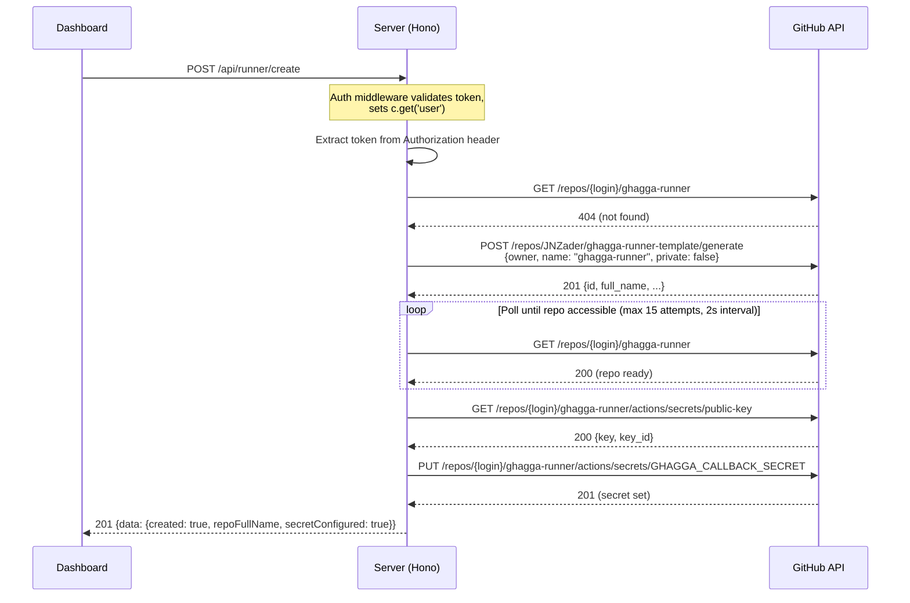
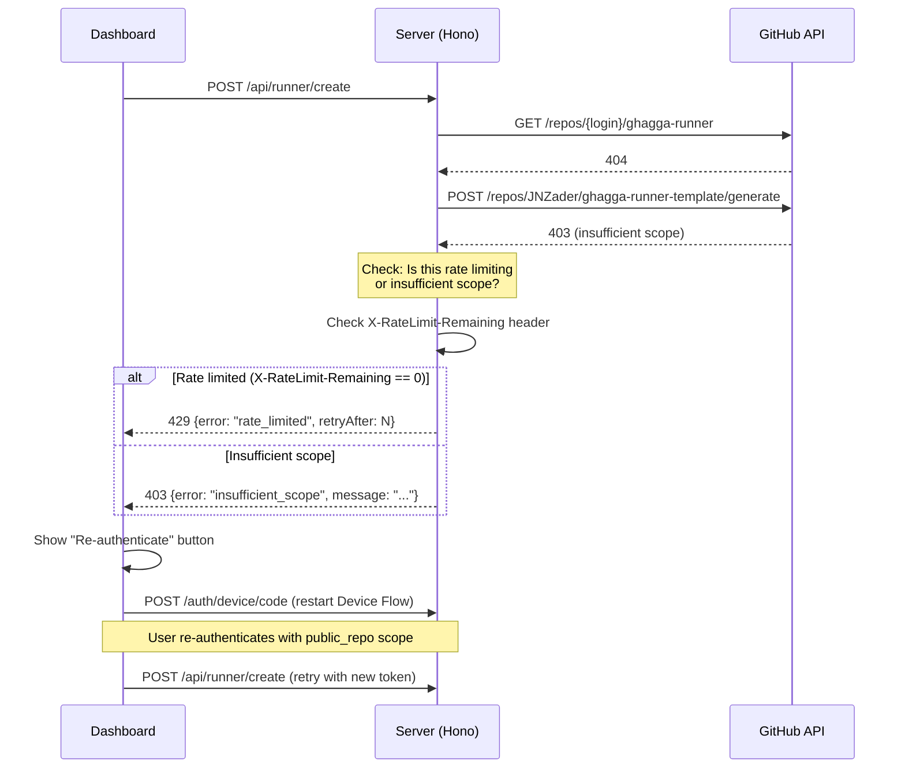

# Design: Automatic Runner Repository Creation

## Technical Approach

Eliminate the manual "create runner repo from template" onboarding step by adding a server-side repo creation flow triggered from the Dashboard. The user's OAuth token (obtained via GitHub Device Flow with `public_repo` scope) is used to call the GitHub Template Repository API, creating `{owner}/ghagga-runner` as a public repo, then auto-configuring the `GHAGGA_CALLBACK_SECRET` via the existing `setRunnerSecret()` function.

This is a **stateless** feature — runner status is always derived from the GitHub API (no DB tables). The server acts as a thin orchestrator: extract token from header → call GitHub APIs → return result.

References: proposal.md, spec.md (REQ-ARC-MOD-01 through REQ-ARC-ADD-05).

---

## Architecture Decisions

### ADR-1: Use User's OAuth Token for Repo Creation (Option C)

**Choice**: Use the user's OAuth token (from GitHub Device Flow) for all runner repo operations — creation, secret management, status checks.

**Alternatives considered**:
- Option A: GitHub App installation token — requires `Administration: R&W` and `Contents: R&W` permissions on the App, which is overly broad. Apps can't create repos outside their installation scope.
- Option B: Server-side service account — introduces a shared credential, requires managing a separate PAT, and creates repos owned by the service account (not the user).

**Rationale**: The user's token naturally scopes ownership to the user. The Dashboard already has the token from the Device Flow. This approach lets us reduce GitHub App permissions (remove Admin/Contents R&W) after deployment. The user sees and approves the `public_repo` scope during OAuth, maintaining transparency.

### ADR-2: Stateless Runner Status (No DB Storage)

**Choice**: Check runner repo existence via GitHub API on every `GET /api/runner/status` call. No database table for runner state.

**Alternatives considered**:
- Store runner status in a `runners` DB table — would require migrations, sync logic, and staleness handling.

**Rationale**: The runner repo is a plain GitHub repository. Its existence is the source of truth. Checking `GET /repos/{owner}/ghagga-runner` is fast (< 200ms), avoids DB schema changes, and is always accurate. The Dashboard caches via React Query with a reasonable stale time.

### ADR-3: OAuth Scope Upgrade from `''` to `'public_repo'`

**Choice**: Change the Device Flow scope from empty string to `public_repo`.

**Alternatives considered**:
- `repo` scope — grants access to private repos too (excessive).
- Keep empty scope and use GitHub App token — see ADR-1 rejection.
- Fine-grained PAT (beta) — not supported by Device Flow, and not GA.

**Rationale**: `public_repo` is the minimum scope that allows creating public repos via the API. It does grant write access to all public repos (GitHub limitation), which is documented in the security docs and shown to the user before they click "Enable Runner".

### ADR-4: Template Repository API for Repo Creation

**Choice**: Use `POST /repos/{template_owner}/{template_repo}/generate` (GitHub Template Repos API) to create `{owner}/ghagga-runner` from `JNZader/ghagga-runner-template`.

**Alternatives considered**:
- Fork API — creates a fork link, doesn't copy branches cleanly, shows as "forked from".
- Create empty repo + push files — complex, fragile, requires managing file contents.
- GitHub Actions workflow to bootstrap — circular dependency (need runner repo to run Actions).

**Rationale**: The Template Repos API is purpose-built for this use case. It creates a clean, independent copy with no fork relationship. GA since 2019, stable. One API call creates the entire repo with all files from the template.

### ADR-5: Runner Endpoints Under `/api/runner/*` Namespace

**Choice**: Mount new endpoints as `GET /api/runner/status`, `POST /api/runner/create`, and `POST /api/runner/configure-secret` within the existing `createApiRouter()` function.

**Alternatives considered**:
- Separate router file (`runner-api.ts`) — adds complexity for just 3 endpoints.
- Mount under `/runner/*` (outside `/api/*`) — would bypass the auth middleware.

**Rationale**: The `/api/*` namespace is already protected by `authMiddleware(db)` (see `index.ts` line 111). Adding routes inside `createApiRouter()` follows the existing pattern and gets auth for free. Three endpoints don't justify a separate file. The `runner` sub-namespace groups them logically.

### ADR-6: Created Repos Must Be Public

**Choice**: Always create runner repos with `private: false`. Warn (but don't block) if the repo ends up private (org policy override).

**Alternatives considered**:
- Allow private repos — would consume user's 2000 min/month GitHub Actions quota, violating the "everything free" principle.
- Block private repos entirely — some orgs force all repos private; blocking would prevent those users from using the feature at all.

**Rationale**: Public repos get unlimited GitHub Actions minutes. The template generate call specifies `private: false`. If an org policy forces private, we warn the user about billing implications but still allow it.

### ADR-7: New `createRunnerRepo()` in `runner.ts` Module

**Choice**: Add the `createRunnerRepo()` function to the existing `apps/server/src/github/runner.ts` module alongside `discoverRunnerRepo()` and `setRunnerSecret()`.

**Alternatives considered**:
- New file `runner-creation.ts` — fragments related logic across files.

**Rationale**: All runner-related GitHub API operations belong in `runner.ts`. The existing module already handles discovery and secret management. Adding creation keeps the module cohesive and makes imports simpler.

---

## Data Flow

### Runner Status Check

```
Dashboard                     Server (Hono)                  GitHub API
   │                              │                              │
   │ GET /api/runner/status       │                              │
   │─────────────────────────────>│                              │
   │                              │ (auth middleware extracts     │
   │                              │  user from Bearer token)     │
   │                              │                              │
   │                              │ GET /repos/{login}/ghagga-runner
   │                              │─────────────────────────────>│
   │                              │                              │
   │                              │    200 {id, full_name, ...}  │
   │                              │<─────────────────────────────│
   │                              │     or 404                   │
   │                              │                              │
   │  200 {data: {exists, ...}}   │                              │
   │<─────────────────────────────│                              │
```

### Runner Creation (Happy Path)



### Scope Mismatch Detection Flow



---

## File Changes

| File | Action | Description |
|------|--------|-------------|
| `apps/server/src/routes/oauth.ts` | Modify | Change `scope: ''` to `scope: 'public_repo'` on line 36 |
| `apps/server/src/github/runner.ts` | Modify | Add `createRunnerRepo()` function and `RunnerCreationResult` type |
| `apps/server/src/routes/api.ts` | Modify | Add 3 new endpoints: `GET /api/runner/status`, `POST /api/runner/create`, `POST /api/runner/configure-secret` |
| `apps/server/src/routes/api.test.ts` | Modify | Add test suites for all 3 new runner endpoints |
| `apps/dashboard/src/lib/types.ts` | Modify | Add `RunnerStatus`, `RunnerCreateResponse`, `RunnerConfigureResponse` types |
| `apps/dashboard/src/lib/api.ts` | Modify | Add `useRunnerStatus()`, `useCreateRunner()`, `useConfigureRunnerSecret()` hooks |
| `apps/dashboard/src/pages/GlobalSettings.tsx` | Modify | Add Runner section with status display and enable/reconfigure actions |
| `apps/dashboard/src/lib/auth.tsx` | Modify | Add `reAuthenticate()` method to AuthContext for scope upgrade flow |
| `docs/security.md` | Modify | Document `public_repo` scope implications |
| `docs/quick-start.md` | Modify | Replace manual repo creation with "Enable Runner" instructions |
| `docs/self-hosted.md` | Modify | Note that auto-creation is SaaS-only |
| `docs/runner-architecture.md` | Modify | Update creation flow diagrams |

---

## Interfaces / Contracts

### Server-Side Types (`apps/server/src/github/runner.ts`)

```typescript
/** Result from the createRunnerRepo() function */
export interface RunnerCreationResult {
  created: boolean;
  repoFullName: string;
  isPrivate: boolean;
  secretConfigured: boolean;
}

/** Options for createRunnerRepo() */
export interface CreateRunnerRepoOptions {
  ownerLogin: string;
  token: string;
  /** Callback secret value to set on the new repo */
  callbackSecretValue: string;
}
```

### New Function Signature (`apps/server/src/github/runner.ts`)

```typescript
/**
 * Create a ghagga-runner repo from the template and configure its secret.
 *
 * Steps:
 * 1. Call GitHub Template API to generate {owner}/ghagga-runner
 * 2. Poll until repo is accessible (max 15 attempts, 2s interval)
 * 3. Set GHAGGA_CALLBACK_SECRET via setRunnerSecret()
 *
 * @throws {RunnerCreationError} with specific error codes
 */
export async function createRunnerRepo(
  options: CreateRunnerRepoOptions,
): Promise<RunnerCreationResult>;
```

### Runner Creation Error Types (`apps/server/src/github/runner.ts`)

```typescript
export type RunnerErrorCode =
  | 'insufficient_scope'
  | 'already_exists'
  | 'template_unavailable'
  | 'rate_limited'
  | 'org_permission_denied'
  | 'creation_timeout'
  | 'secret_failed'
  | 'github_error';

export class RunnerCreationError extends Error {
  constructor(
    public code: RunnerErrorCode,
    message: string,
    public retryAfter?: number,
    public repoFullName?: string,
  ) {
    super(message);
    this.name = 'RunnerCreationError';
  }
}
```

### API Response Types (Server → Dashboard)

**`GET /api/runner/status`** — Response: `200`

```typescript
// Success envelope: { data: RunnerStatusResponse }
interface RunnerStatusResponse {
  exists: boolean;
  repoFullName?: string;   // e.g. "alice/ghagga-runner"
  isPrivate?: boolean;      // true if repo is private (warning)
  warning?: string;         // e.g. "Runner repo is private — ..."
}
```

**`POST /api/runner/create`** — Response: `201 | 403 | 409 | 429 | 502`

```typescript
// 201 Success envelope: { data: RunnerCreateResponse }
interface RunnerCreateResponse {
  created: true;
  repoFullName: string;
  secretConfigured: boolean;
  isPrivate: boolean;
  warning?: string;         // if repo is private
}

// 403 Insufficient scope
interface InsufficientScopeError {
  error: 'insufficient_scope';
  message: string;
}

// 409 Already exists
interface AlreadyExistsError {
  error: 'already_exists';
  repoFullName: string;
}

// 429 Rate limited
interface RateLimitError {
  error: 'rate_limited';
  retryAfter: number;       // seconds
}

// 502 Template unavailable / GitHub error
interface UpstreamError {
  error: 'template_unavailable' | 'github_error';
  message: string;
}
```

**`POST /api/runner/configure-secret`** — Response: `200 | 404 | 502`

```typescript
// 200 Success
interface RunnerConfigureResponse {
  configured: true;
}

// 404 Runner repo not found
interface RunnerNotFoundError {
  error: 'runner_not_found';
  message: string;
}
```

### Dashboard Types (`apps/dashboard/src/lib/types.ts`)

```typescript
// ─── Runner ─────────────────────────────────────────────────────

export interface RunnerStatus {
  exists: boolean;
  repoFullName?: string;
  isPrivate?: boolean;
  warning?: string;
}

export interface RunnerCreateResult {
  created: boolean;
  repoFullName: string;
  secretConfigured: boolean;
  isPrivate: boolean;
  warning?: string;
}

export interface RunnerConfigureResult {
  configured: boolean;
}

/** Error shape returned by runner endpoints */
export interface RunnerError {
  error: string;
  message?: string;
  repoFullName?: string;
  retryAfter?: number;
}
```

### Dashboard API Hooks (`apps/dashboard/src/lib/api.ts`)

```typescript
// ─── Runner ───────────────────────────────────────────────

export function useRunnerStatus(ownerLogin?: string) {
  return useQuery<RunnerStatus>({
    queryKey: ['runner', 'status', ownerLogin],
    queryFn: () => fetchData<RunnerStatus>('/api/runner/status'),
    enabled: !!ownerLogin,
    staleTime: 30_000,       // 30s — don't hammer GitHub API
    retry: 1,
  });
}

export function useCreateRunner() {
  const queryClient = useQueryClient();

  return useMutation<RunnerCreateResult, ApiError>({
    mutationFn: () =>
      fetchData<RunnerCreateResult>('/api/runner/create', {
        method: 'POST',
      }),
    onSuccess: () => {
      void queryClient.invalidateQueries({ queryKey: ['runner', 'status'] });
    },
  });
}

export function useConfigureRunnerSecret() {
  return useMutation<RunnerConfigureResult, ApiError>({
    mutationFn: () =>
      fetchData<RunnerConfigureResult>('/api/runner/configure-secret', {
        method: 'POST',
      }),
  });
}
```

### Auth Context Extension (`apps/dashboard/src/lib/auth.tsx`)

```typescript
interface AuthContextType {
  // ... existing fields ...

  /** Re-authenticate to upgrade OAuth scope (e.g. after insufficient_scope error) */
  reAuthenticate: () => Promise<void>;
}
```

The `reAuthenticate()` method reuses the existing `startLogin()` logic: it clears the current token, restarts the Device Flow (which now requests `public_repo` scope), and on success stores the new token. The implementation is:

```typescript
const reAuthenticate = useCallback(async () => {
  // Clear current credentials
  localStorage.removeItem(TOKEN_KEY);
  localStorage.removeItem(USER_KEY);
  setToken(null);
  setUser(null);
  // Restart Device Flow (will request public_repo scope)
  await startLogin();
}, [startLogin]);
```

---

## Server Endpoint Implementation Patterns

### Token Extraction Pattern

The auth middleware validates the token but doesn't store it on the Hono context. To use it for GitHub API calls, re-extract it from the header (same pattern as `POST /api/providers/validate` at line 536 of `api.ts`):

```typescript
// Extract the raw OAuth token from the Authorization header
const authHeader = c.req.header('Authorization') ?? '';
const token = authHeader.replace(/^Bearer\s+/i, '');
```

### GET /api/runner/status — Implementation Sketch

```typescript
router.get('/api/runner/status', async (c) => {
  const user = c.get('user') as AuthUser;
  const authHeader = c.req.header('Authorization') ?? '';
  const token = authHeader.replace(/^Bearer\s+/i, '');

  try {
    const runner = await discoverRunnerRepo(user.githubLogin, token);

    if (!runner) {
      return c.json({ data: { exists: false } });
    }

    // Check if repo is private (discoverRunnerRepo returns the full repo object)
    // We need to extend discoverRunnerRepo or make a separate check
    const repoResponse = await fetch(
      `https://api.github.com/repos/${runner.fullName}`,
      {
        headers: {
          Authorization: `Bearer ${token}`,
          Accept: 'application/vnd.github.v3+json',
          'X-GitHub-Api-Version': '2022-11-28',
        },
      },
    );

    const repoData = await repoResponse.json() as { private: boolean };
    const isPrivate = repoData.private;

    const response: Record<string, unknown> = {
      exists: true,
      repoFullName: runner.fullName,
    };

    if (isPrivate) {
      response.isPrivate = true;
      response.warning = 'Runner repo is private — GitHub Actions minutes will be consumed from your quota (2000 min/month for free accounts).';
    }

    return c.json({ data: response });
  } catch (err) {
    logger.error({ err, user: user.githubLogin }, 'Failed to check runner status');
    return c.json({ error: 'github_unavailable', message: 'Could not check runner status. Please try again.' }, 502);
  }
});
```

**Optimization note**: `discoverRunnerRepo()` already calls `GET /repos/{owner}/ghagga-runner`, which returns the full repo object including `private` field. We should **extend** the return type of `discoverRunnerRepo()` to include `isPrivate: boolean` rather than making a second API call. This is a minor refactor to the existing function:

```typescript
export interface DiscoveredRunner {
  repoId: number;
  fullName: string;
  isPrivate: boolean;  // NEW FIELD
}
```

### POST /api/runner/create — Implementation Sketch

```typescript
router.post('/api/runner/create', async (c) => {
  const user = c.get('user') as AuthUser;
  const authHeader = c.req.header('Authorization') ?? '';
  const token = authHeader.replace(/^Bearer\s+/i, '');

  try {
    const result = await createRunnerRepo({
      ownerLogin: user.githubLogin,
      token,
      callbackSecretValue: process.env.GHAGGA_WEBHOOK_SECRET!,
    });

    const response: Record<string, unknown> = {
      created: true,
      repoFullName: result.repoFullName,
      secretConfigured: result.secretConfigured,
      isPrivate: result.isPrivate,
    };

    if (result.isPrivate) {
      response.warning = 'The runner repo was created as private. Private repos consume your GitHub Actions minutes quota (2000 min/month).';
    }

    return c.json({ data: response }, 201);
  } catch (err) {
    if (err instanceof RunnerCreationError) {
      switch (err.code) {
        case 'insufficient_scope':
          return c.json({ error: 'insufficient_scope', message: err.message }, 403);
        case 'already_exists':
          return c.json({ error: 'already_exists', repoFullName: err.repoFullName }, 409);
        case 'rate_limited':
          return c.json({ error: 'rate_limited', retryAfter: err.retryAfter }, 429);
        case 'template_unavailable':
          logger.error('Runner template repo JNZader/ghagga-runner-template is not accessible');
          return c.json({ error: 'template_unavailable', message: err.message }, 502);
        case 'org_permission_denied':
          return c.json({ error: 'org_permission_denied', message: err.message }, 403);
        case 'creation_timeout':
          return c.json({ error: 'github_error', message: 'Repository creation timed out. Please check GitHub and try again.' }, 502);
        case 'secret_failed':
          // Repo was created but secret setup failed — return partial success
          return c.json({
            data: {
              created: true,
              repoFullName: err.repoFullName,
              secretConfigured: false,
              isPrivate: false,
            },
          }, 201);
        default:
          return c.json({ error: 'github_error', message: err.message }, 502);
      }
    }

    logger.error({ err, user: user.githubLogin }, 'Failed to create runner repo');
    return c.json({ error: 'github_error', message: 'Failed to create runner repository.' }, 502);
  }
});
```

### POST /api/runner/configure-secret — Implementation Sketch

```typescript
router.post('/api/runner/configure-secret', async (c) => {
  const user = c.get('user') as AuthUser;
  const authHeader = c.req.header('Authorization') ?? '';
  const token = authHeader.replace(/^Bearer\s+/i, '');

  const runnerRepo = `${user.githubLogin}/ghagga-runner`;

  try {
    // Verify runner repo exists
    const runner = await discoverRunnerRepo(user.githubLogin, token);
    if (!runner) {
      return c.json({ error: 'runner_not_found', message: 'Runner repo not found. Create it first.' }, 404);
    }

    await setRunnerSecret(
      runnerRepo,
      'GHAGGA_CALLBACK_SECRET',
      process.env.GHAGGA_WEBHOOK_SECRET!,
      token,
    );

    return c.json({ data: { configured: true } });
  } catch (err) {
    logger.error({ err, user: user.githubLogin }, 'Failed to configure runner secret');
    return c.json({ error: 'github_error', message: 'Failed to configure runner secret.' }, 502);
  }
});
```

---

## `createRunnerRepo()` Implementation Detail

This function lives in `apps/server/src/github/runner.ts`:

```typescript
const TEMPLATE_OWNER = 'JNZader';
const TEMPLATE_REPO = 'ghagga-runner-template';
const POLL_INTERVAL_MS = 2000;
const MAX_POLL_ATTEMPTS = 15; // 30 seconds total

export async function createRunnerRepo(
  options: CreateRunnerRepoOptions,
): Promise<RunnerCreationResult> {
  const { ownerLogin, token, callbackSecretValue } = options;
  const repoFullName = `${ownerLogin}/ghagga-runner`;

  // Step 1: Check if repo already exists
  const existing = await discoverRunnerRepo(ownerLogin, token);
  if (existing) {
    throw new RunnerCreationError('already_exists', 'Runner repo already exists', undefined, repoFullName);
  }

  // Step 2: Create from template
  const generateUrl = `https://api.github.com/repos/${TEMPLATE_OWNER}/${TEMPLATE_REPO}/generate`;
  const generateResponse = await fetch(generateUrl, {
    method: 'POST',
    headers: {
      Authorization: `Bearer ${token}`,
      Accept: 'application/vnd.github.v3+json',
      'Content-Type': 'application/json',
      'X-GitHub-Api-Version': '2022-11-28',
    },
    body: JSON.stringify({
      owner: ownerLogin,
      name: 'ghagga-runner',
      description: 'GHAGGA static analysis runner — auto-created by the GHAGGA Dashboard',
      include_all_branches: false,
      private: false,
    }),
  });

  // Handle error responses
  if (!generateResponse.ok) {
    const status = generateResponse.status;

    if (status === 422) {
      // Name conflict — repo was created between our check and the generate call
      throw new RunnerCreationError('already_exists', 'Runner repo already exists', undefined, repoFullName);
    }

    if (status === 403) {
      // Distinguish rate limiting from insufficient scope
      const remaining = generateResponse.headers.get('X-RateLimit-Remaining');
      if (remaining === '0') {
        const resetHeader = generateResponse.headers.get('X-RateLimit-Reset');
        const retryAfter = resetHeader ? Math.max(0, parseInt(resetHeader, 10) - Math.floor(Date.now() / 1000)) : 60;
        throw new RunnerCreationError('rate_limited', 'GitHub API rate limit exceeded', retryAfter);
      }

      // Check if this is an org permission issue
      const body = await generateResponse.text();
      if (body.includes('organization') || body.includes('permission')) {
        throw new RunnerCreationError('org_permission_denied', `You don't have permission to create repositories in ${ownerLogin}`);
      }

      throw new RunnerCreationError('insufficient_scope', "Your token doesn't have permission to create repositories. Please re-authenticate.");
    }

    if (status === 404) {
      throw new RunnerCreationError('template_unavailable', 'The runner template is temporarily unavailable. Please try again later or contact support.');
    }

    const body = await generateResponse.text();
    throw new RunnerCreationError('github_error', `GitHub API error: ${status} — ${body}`);
  }

  const createData = await generateResponse.json() as { full_name: string; private: boolean };

  // Step 3: Poll until repo is accessible
  let repoReady = false;
  for (let i = 0; i < MAX_POLL_ATTEMPTS; i++) {
    await new Promise((resolve) => setTimeout(resolve, POLL_INTERVAL_MS));

    try {
      const discovered = await discoverRunnerRepo(ownerLogin, token);
      if (discovered) {
        repoReady = true;
        break;
      }
    } catch {
      // Ignore errors during polling — repo may not be ready yet
    }
  }

  if (!repoReady) {
    throw new RunnerCreationError('creation_timeout', 'Repository was created but is not accessible yet. Please try again in a few moments.', undefined, repoFullName);
  }

  // Step 4: Set GHAGGA_CALLBACK_SECRET
  let secretConfigured = true;
  try {
    await setRunnerSecret(repoFullName, 'GHAGGA_CALLBACK_SECRET', callbackSecretValue, token);
  } catch (err) {
    logger.error({ err, repoFullName }, 'Failed to set runner secret after repo creation');
    secretConfigured = false;
  }

  logger.info({ repoFullName, secretConfigured, isPrivate: createData.private }, 'Runner repo created');

  return {
    created: true,
    repoFullName: createData.full_name,
    isPrivate: createData.private,
    secretConfigured,
  };
}
```

---

## Dashboard UI Component Design

### Runner Section in GlobalSettings.tsx

The runner section is placed **before** the Static Analysis card (since the runner is a prerequisite for static analysis to work). It uses the existing `Card` and `CardHeader` components.

#### UI State Machine

```
                    ┌─────────────┐
                    │   checking  │ (useRunnerStatus loading)
                    └──────┬──────┘
                           │
              ┌────────────┼────────────┐
              ▼            ▼            ▼
     ┌──────────────┐ ┌────────┐ ┌─────────┐
     │not_configured│ │  ready │ │  error   │
     └──────┬───────┘ └────────┘ └────┬────┘
            │                         │
            ▼                         ▼
     ┌──────────┐              ┌──────────────┐
     │ creating │              │ needs_reauth │
     └────┬─────┘              └──────────────┘
          │
    ┌─────┼─────┐
    ▼     ▼     ▼
 ready  error  needs_reauth
```

#### State Definitions

| State | Trigger | UI |
|-------|---------|-----|
| `checking` | `useRunnerStatus` is loading | Spinner with "Checking runner status..." |
| `not_configured` | `status.exists === false` | "Enable Runner" button + explanation |
| `creating` | `createRunner.isPending` | Disabled button + spinner + "Creating runner repository..." |
| `ready` | `status.exists === true` | Green checkmark + repo link + "Reconfigure Secret" button |
| `error` | `createRunner.isError` (not 403/409) | Red error message + "Retry" button |
| `needs_reauth` | `createRunner.isError` and status is 403 | Warning + "Re-authenticate" button |

#### Component Structure

```tsx
// Inside GlobalSettings.tsx, before the Static Analysis card

{/* ── Runner ─────────────────────────────────────── */}
<Card>
  <CardHeader
    title="Static Analysis Runner"
    description="GitHub Actions runner for Semgrep, Trivy, and PMD/CPD"
  />

  {/* State: checking */}
  {runnerStatus.isLoading && (
    <div className="flex items-center gap-3">
      <Spinner />
      <span className="text-sm text-text-secondary">Checking runner status...</span>
    </div>
  )}

  {/* State: ready */}
  {runnerStatus.data?.exists && !createRunner.isPending && (
    <div className="space-y-3">
      <div className="flex items-center gap-2">
        <CheckCircleIcon className="h-5 w-5 text-green-400" />
        <span className="text-sm text-text-primary">Runner enabled</span>
        <a
          href={`https://github.com/${runnerStatus.data.repoFullName}`}
          target="_blank"
          rel="noopener noreferrer"
          className="text-sm text-primary-400 hover:underline"
        >
          {runnerStatus.data.repoFullName}
        </a>
      </div>

      {runnerStatus.data.isPrivate && (
        <div className="rounded-md border border-yellow-500/30 bg-yellow-500/10 p-3">
          <p className="text-sm text-yellow-300">{runnerStatus.data.warning}</p>
        </div>
      )}

      <button
        onClick={() => configureSecret.mutate()}
        disabled={configureSecret.isPending}
        className="btn-secondary text-sm"
      >
        {configureSecret.isPending ? 'Configuring...' : 'Reconfigure Secret'}
      </button>
    </div>
  )}

  {/* State: not_configured */}
  {!runnerStatus.isLoading && !runnerStatus.data?.exists && !createRunner.isPending && !needsReauth && (
    <div className="space-y-3">
      <p className="text-sm text-text-secondary">
        GHAGGA uses a GitHub Actions runner in your account for static analysis
        (Semgrep, Trivy, PMD/CPD). This creates a public repository named
        <code className="mx-1 rounded bg-surface-bg px-1 text-xs">ghagga-runner</code>
        in your GitHub account.
      </p>
      <div className="rounded-md border border-yellow-500/30 bg-yellow-500/10 p-3">
        <p className="text-xs text-yellow-300">
          This requires the <code>public_repo</code> OAuth scope, which grants write
          access to your public repositories. The token is only used server-side to
          create the runner repo and configure its secrets.
        </p>
      </div>
      <button
        onClick={() => createRunner.mutate()}
        className="btn-primary"
      >
        Enable Runner
      </button>
    </div>
  )}

  {/* State: creating */}
  {createRunner.isPending && (
    <div className="flex items-center gap-3">
      <Spinner />
      <span className="text-sm text-text-secondary">Creating runner repository...</span>
    </div>
  )}

  {/* State: needs_reauth */}
  {needsReauth && (
    <div className="space-y-3">
      <div className="rounded-md border border-yellow-500/30 bg-yellow-500/10 p-3">
        <p className="text-sm text-yellow-300">
          Your session needs to be refreshed to enable the runner. The
          <code className="mx-1">public_repo</code> scope is required to create
          the runner repository.
        </p>
      </div>
      <button
        onClick={() => reAuthenticate()}
        className="btn-primary"
      >
        Re-authenticate
      </button>
    </div>
  )}

  {/* State: error (non-scope errors) */}
  {createRunner.isError && !needsReauth && (
    <div className="space-y-3">
      <div className="rounded-md border border-red-500/30 bg-red-500/10 p-3">
        <p className="text-sm text-red-300">
          Failed to create runner repository. Please try again.
        </p>
      </div>
      <button
        onClick={() => createRunner.mutate()}
        className="btn-primary"
      >
        Retry
      </button>
    </div>
  )}
</Card>
```

#### Scope Error Detection Logic

```tsx
const [needsReauth, setNeedsReauth] = useState(false);
const { reAuthenticate } = useAuth();

// In the useCreateRunner onError callback or useEffect:
useEffect(() => {
  if (createRunner.isError) {
    const err = createRunner.error;
    if (err instanceof ApiError && err.status === 403) {
      try {
        const body = JSON.parse(err.message);
        if (body.error === 'insufficient_scope') {
          setNeedsReauth(true);
          return;
        }
      } catch { /* not JSON */ }
    }
    setNeedsReauth(false);
  }
}, [createRunner.isError, createRunner.error]);
```

**Note**: The existing `ApiError` class captures `status` and `message` (the raw response text). For the scope detection to work, we need the error response body to be JSON-parseable. The `fetchApi` function stores the response text as the error message — so `err.message` will contain `'{"error":"insufficient_scope","message":"..."}'`. The Dashboard parses this JSON to detect the specific error code.

---

## Testing Strategy

### Test Infrastructure

All tests follow the existing pattern in `api.test.ts`:
- **Vitest** as the test runner
- **Hono `app.request()`** for HTTP-level testing
- **Mock auth middleware** injecting user context
- **`vi.mock()`** for module-level mocks (DB functions, GitHub runner functions)

### New Mocks Required

```typescript
// Mock runner functions
const mockDiscoverRunnerRepo = vi.fn();
const mockCreateRunnerRepo = vi.fn();
const mockSetRunnerSecret = vi.fn();

vi.mock('../github/runner.js', () => ({
  discoverRunnerRepo: (...args: unknown[]) => mockDiscoverRunnerRepo(...args),
  createRunnerRepo: (...args: unknown[]) => mockCreateRunnerRepo(...args),
  setRunnerSecret: (...args: unknown[]) => mockSetRunnerSecret(...args),
  RunnerCreationError: class RunnerCreationError extends Error {
    constructor(public code: string, message: string, public retryAfter?: number, public repoFullName?: string) {
      super(message);
      this.name = 'RunnerCreationError';
    }
  },
}));
```

### Test Matrix

| Layer | Suite | What to Test | Approach |
|-------|-------|-------------|----------|
| Unit | `runner.ts` | `createRunnerRepo()` — all error codes, polling, timeout | Mock `fetch` globally, verify API call sequence |
| Unit | `runner.ts` | `RunnerCreationError` construction | Direct instantiation |
| Integration | `api.test.ts` | `GET /api/runner/status` — repo exists | Mock `discoverRunnerRepo` → return value |
| Integration | `api.test.ts` | `GET /api/runner/status` — repo not found | Mock `discoverRunnerRepo` → return null |
| Integration | `api.test.ts` | `GET /api/runner/status` — private repo | Mock with `isPrivate: true` |
| Integration | `api.test.ts` | `GET /api/runner/status` — GitHub API error | Mock `discoverRunnerRepo` → throw |
| Integration | `api.test.ts` | `POST /api/runner/create` — happy path | Mock `createRunnerRepo` → success |
| Integration | `api.test.ts` | `POST /api/runner/create` — already exists (pre-check) | Mock → throw `already_exists` |
| Integration | `api.test.ts` | `POST /api/runner/create` — already exists (422) | Mock → throw `already_exists` |
| Integration | `api.test.ts` | `POST /api/runner/create` — insufficient scope | Mock → throw `insufficient_scope` |
| Integration | `api.test.ts` | `POST /api/runner/create` — rate limited | Mock → throw `rate_limited` |
| Integration | `api.test.ts` | `POST /api/runner/create` — template unavailable | Mock → throw `template_unavailable` |
| Integration | `api.test.ts` | `POST /api/runner/create` — org permission denied | Mock → throw `org_permission_denied` |
| Integration | `api.test.ts` | `POST /api/runner/create` — creation timeout | Mock → throw `creation_timeout` |
| Integration | `api.test.ts` | `POST /api/runner/create` — secret setup failed | Mock → return `secretConfigured: false` |
| Integration | `api.test.ts` | `POST /api/runner/create` — private repo warning | Mock → return `isPrivate: true` |
| Integration | `api.test.ts` | `POST /api/runner/configure-secret` — happy path | Mock `discoverRunnerRepo` + `setRunnerSecret` |
| Integration | `api.test.ts` | `POST /api/runner/configure-secret` — repo not found | Mock `discoverRunnerRepo` → null |
| Integration | `api.test.ts` | `POST /api/runner/configure-secret` — secret set fails | Mock `setRunnerSecret` → throw |
| Integration | `api.test.ts` | Token extraction | Verify mock user receives correct auth header |
| Integration | `oauth.ts` | Scope change | Verify `scope: 'public_repo'` in the Device Flow request body |

### Example Test Case

```typescript
describe('GET /api/runner/status', () => {
  it('returns exists: true when runner repo is found', async () => {
    mockDiscoverRunnerRepo.mockResolvedValueOnce({
      repoId: 999,
      fullName: 'testuser/ghagga-runner',
      isPrivate: false,
    });

    const app = createApp();
    const res = await app.request('/api/runner/status');

    expect(res.status).toBe(200);
    const json = await res.json();
    expect(json.data).toEqual({
      exists: true,
      repoFullName: 'testuser/ghagga-runner',
    });
    expect(mockDiscoverRunnerRepo).toHaveBeenCalledWith('testuser', expect.any(String));
  });

  it('returns exists: false when runner repo is not found', async () => {
    mockDiscoverRunnerRepo.mockResolvedValueOnce(null);

    const app = createApp();
    const res = await app.request('/api/runner/status');

    expect(res.status).toBe(200);
    const json = await res.json();
    expect(json.data).toEqual({ exists: false });
  });

  it('returns 502 when GitHub API fails', async () => {
    mockDiscoverRunnerRepo.mockRejectedValueOnce(new Error('GitHub API timeout'));

    const app = createApp();
    const res = await app.request('/api/runner/status');

    expect(res.status).toBe(502);
    const json = await res.json();
    expect(json.error).toBe('github_unavailable');
  });
});
```

---

## Migration / Rollout

### Phase 1: Deploy Code Changes

1. Deploy server with new endpoints and `scope: 'public_repo'`
2. Deploy updated Dashboard with runner section
3. New users get `public_repo` scope automatically
4. Existing users see "Enable Runner" → click → get 403 → prompted to re-auth

### Phase 2: Reduce GitHub App Permissions (Manual)

After deployment is verified working:

1. Go to GitHub App settings
2. Remove `Administration: Read & Write` permission
3. Remove `Contents: Read & Write` permission
4. Remaining: Pull requests R&W, Actions Write, Secrets R&W, Metadata Read (auto)
5. Existing installations will receive a permission update prompt from GitHub

### Rollback

No data migration needed. Rollback is: revert the code deploy + re-add App permissions.

---

## Security Considerations

1. **OAuth Token Scope**: `public_repo` grants write access to all public repos. This is a GitHub limitation. Documented in `docs/security.md` and shown in Dashboard UI before user clicks "Enable Runner".

2. **Token Handling**: The user's OAuth token is already in `localStorage` (existing behavior). The server receives it in the `Authorization: Bearer` header, uses it transiently for GitHub API calls, and never persists it.

3. **Secret Value**: The `GHAGGA_CALLBACK_SECRET` set on the runner repo comes from the server's `process.env.GHAGGA_WEBHOOK_SECRET`. This is the same value used by `dispatchWorkflow()` for HMAC signing. It's set as a GitHub Actions encrypted secret — GitHub encrypts it at rest.

4. **No New Attack Surface**: The new endpoints are behind the existing auth middleware. They don't introduce new authentication mechanisms. The only new capability is calling the GitHub Template API, which the user explicitly approves via OAuth.

5. **Created Repos Are Public**: By design, for free Actions. Users are warned about this before creation.

---

## Open Questions

- [x] Should we support org-level runner creation from the Dashboard? → **Yes, but P2** (spec includes it with `owner` parameter).
- [x] Where does the `GHAGGA_WEBHOOK_SECRET` value come from for `setRunnerSecret()`? → **From `process.env.GHAGGA_WEBHOOK_SECRET`** — same as `dispatchWorkflow()` uses.
- [x] Should we extend `discoverRunnerRepo()` to return `isPrivate`? → **Yes** — avoids a second API call.
- [ ] Should we add a health check for the template repo availability (e.g., on server startup)? → **Deferred** — low risk, can add later as a P2 enhancement.
