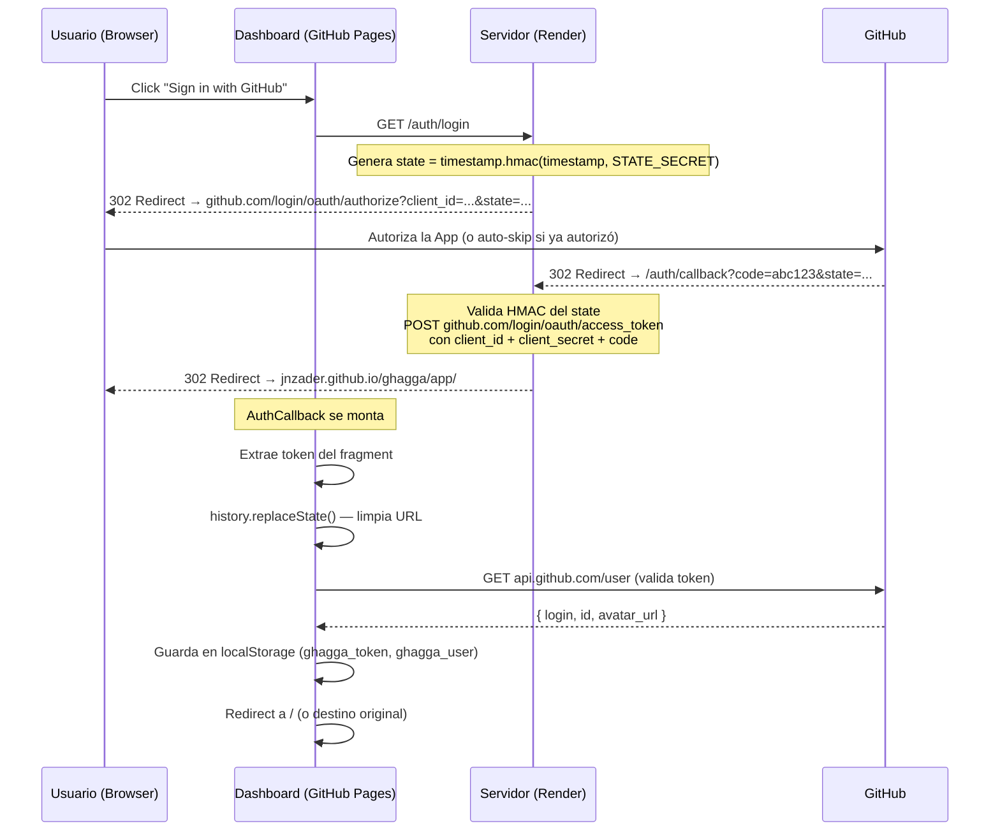
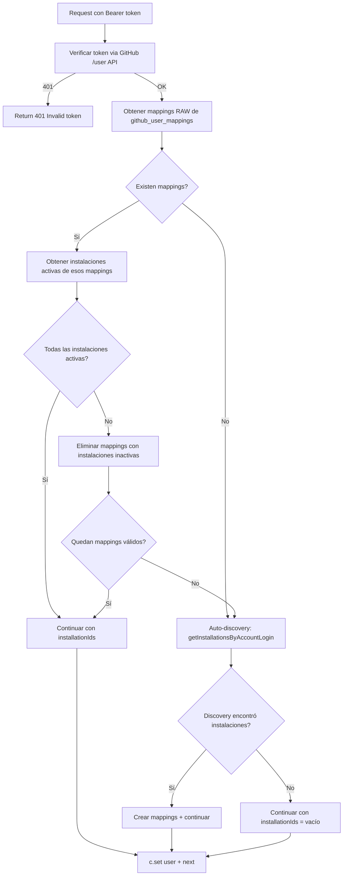

# Design: Fix Dashboard Authentication — Web Flow OAuth + Stale Mapping Cleanup

## Technical Approach

Este cambio reemplaza el OAuth Device Flow del Dashboard por un OAuth Web Flow estándar, usando el servidor Hono en Render como intermediario de callback, y corrige el problema de mappings obsoletos en `github_user_mappings` que provocan reinstalaciones fantasma de la GitHub App.

La estrategia técnica tiene dos ejes ortogonales:

1. **Web Flow OAuth**: El servidor Render (ya existente) actúa como callback endpoint de GitHub. Tras recibir el `code`, lo intercambia por un `access_token` usando el `CLIENT_SECRET`, y redirige al Dashboard (GitHub Pages) con el token en el URL fragment (`#`). El Dashboard extrae el token, lo valida, lo guarda en localStorage y limpia la URL.

2. **Stale Mapping Cleanup**: Se refuerza el auth middleware para detectar mappings que apuntan a instalaciones inactivas/inexistentes, limpiarlos, y re-ejecutar auto-discovery. Complementariamente, el webhook `installation.deleted` limpia proactivamente los mappings asociados.

Ambos ejes son independientes entre sí y pueden desplegarse/revertirse por separado.

Refs: proposal.md, specs/dashboard-auth/spec.md (R1-R12, CC1-CC4).

---

## Architecture Decisions

### AD1: Token Delivery — URL Fragment Redirect

**Choice**: El servidor redirige al Dashboard con el token en el URL fragment: `https://jnzader.github.io/ghagga/app/#/auth/callback?token={access_token}`.

**Alternatives considered**:
- **Temporary token exchange (one-time code)**: El servidor almacena el token con un código temporal, redirige al Dashboard con el código, y el Dashboard lo intercambia vía API. Más seguro pero requiere almacenamiento server-side — problemático en Render free tier (una instancia stateless, cold starts).
- **PostMessage popup**: Abrir GitHub auth en popup, el callback del servidor usa `window.opener.postMessage()` para enviar el token al Dashboard. Limpio pero complejo, y los popups son bloqueados por muchos navegadores.

**Rationale**: El URL fragment (`#`) nunca se envía al servidor HTTP — GitHub Pages no lo ve en sus logs. El token ya estará en localStorage de todas formas (visible a cualquier JS en el mismo origen), así que la exposición momentánea en el fragment no añade riesgo material. Se limpia inmediatamente con `history.replaceState()`. Es la solución más simple, sin dependencias de estado server-side, y funciona con cold starts de Render. Cumple R1, R4, R5, CC1.

---

### AD2: State Parameter Anti-CSRF — HMAC-Signed Stateless

**Choice**: State basado en HMAC-SHA256 sin almacenamiento server-side. Formato: `{timestamp}.{hmac_hex}` donde `hmac = HMAC-SHA256(timestamp, STATE_SECRET)`.

**Alternatives considered**:
- **State en memoria del servidor**: Simple pero no sobrevive restarts ni cold starts de Render.
- **State en base de datos**: Sobrevive restarts pero añade latencia y complejidad (limpieza de states expirados).
- **State en cookie firmada**: Requiere que el callback llegue del mismo browser — funciona, pero el HMAC stateless es más simple.

**Rationale**: `STATE_SECRET` es una variable de entorno de Render (persistente entre deploys). El servidor genera el state en `/auth/login` y lo valida en `/auth/callback` usando solo la clave — no necesita recordar nada. El timestamp permite expiración (5 minutos). Sobrevive cold starts porque `STATE_SECRET` es la misma env var. Cumple R2 (S-R2.1 a S-R2.6).

**Detalle de implementación**:
```typescript
// Generación (en /auth/login)
const timestamp = Date.now().toString(36);
const hmac = createHmac('sha256', STATE_SECRET).update(timestamp).digest('hex');
const state = `${timestamp}.${hmac}`;

// Validación (en /auth/callback)
const [ts, sig] = state.split('.');
const expectedSig = createHmac('sha256', STATE_SECRET).update(ts).digest('hex');
const isValid = timingSafeEqual(Buffer.from(sig), Buffer.from(expectedSig));
const isNotExpired = Date.now() - parseInt(ts, 36) < 5 * 60 * 1000;
```

Se usa `timingSafeEqual` para prevenir timing attacks en la comparación HMAC.

---

### AD3: Stale Mapping Detection — JOIN con Instalaciones Activas

**Choice**: Modificar `getInstallationsByUserId()` para hacer JOIN con la tabla `installations` filtrando `is_active = true`. Si el resultado está vacío pero existían mappings, eliminar los mappings obsoletos y re-ejecutar auto-discovery.

**Alternatives considered**:
- **Validar contra GitHub API en cada request**: Preciso pero añade una llamada HTTP por request y consume rate limit.
- **Validar solo en login**: Menos overhead pero no detecta desinstalaciones que ocurren entre sesiones.
- **Lazy check + webhook cleanup only**: El webhook limpia proactivamente, el middleware solo reacciona cuando falla. Más eficiente pero depende de que los webhooks lleguen correctamente.

**Rationale**: `getInstallationsByUserId()` ya hace un JOIN con `installations` filtrando `is_active = true` (líneas 519-536 de queries.ts). El problema es que el middleware NO compara el resultado con los mappings originales. Si hay mappings pero todas las instalaciones están inactivas, el resultado es vacío — pero el middleware no sabe que había mappings, solo ve `[]` y NO re-descubre (porque la condición actual es `userInstallations.length === 0` que solo se evalúa sobre el resultado del JOIN, que ya filtra inactivas).

La solución: obtener primero los mappings RAW, luego filtrar contra instalaciones activas, y si quedó vacío habiendo tenido mappings → cleanup + re-discovery. Esto es UNA query adicional (obtener mappings raw) pero evita llamadas a GitHub API. Cumple R9, R12.

---

### AD4: DB Migration — Drizzle Kit SQL Migration

**Choice**: Nuevo archivo SQL de migración (`packages/db/drizzle/0004_fix_user_mapping_constraint.sql`) que: (1) elimina el constraint UNIQUE en `github_user_id`, (2) crea un nuevo constraint UNIQUE en `(github_user_id, installation_id)`.

**Alternatives considered**:
- **Usar `drizzle-kit generate`**: Genera la migración automáticamente desde el schema diff. Viable pero el resultado puede necesitar ajustes manuales para limpiar duplicados.
- **No hacer migración, solo cambiar schema**: Drizzle ORM no fuerza constraints en runtime, pero la BD sí. Sin la migración, inserts de múltiples mappings fallarían.

**Rationale**: El proyecto ya usa migraciones SQL manuales en `packages/db/drizzle/` (0000-0003). La migración manual es más segura porque podemos añadir lógica de limpieza de datos pre-existentes. Actualizamos `schema.ts` para reflejar el nuevo constraint y creamos la migración SQL correspondiente. Cumple R11.

**Nota sobre datos existentes**: Con el constraint UNIQUE actual en `github_user_id`, no puede haber duplicados `(github_user_id, installation_id)` — porque ni siquiera hay duplicados `github_user_id`. La migración es segura sin limpieza previa.

---

### AD5: Dashboard Routing — Nueva Ruta Pública en HashRouter

**Choice**: Agregar `<Route path="/auth/callback" element={<AuthCallback />} />` como ruta pública (sin `ProtectedRoute`) en `App.tsx`.

**Alternatives considered**:
- **Procesar el callback en Login.tsx**: Verificar si hay token en la URL al montar Login.tsx. Más compacto pero mezcla responsabilidades.
- **Componente wrapper en AuthProvider**: AuthProvider detecta el token en la URL globalmente. Muy acoplado y difícil de testear.

**Rationale**: Un componente dedicado `AuthCallback` con su propia ruta es el patrón más limpio. Es lazy-loadable, testeable de forma aislada, y no contamina Login.tsx ni AuthProvider. La ruta es pública porque el token aún no está guardado cuando el componente se monta. Cumple R4.

---

### AD6: Error UX — Redirect con Código de Error en Fragment

**Choice**: Todos los errores del servidor redirigen al Dashboard con `#/auth/callback?error={error_code}`. El componente `AuthCallback` mapea códigos a mensajes descriptivos.

**Alternatives considered**:
- **Mostrar error en la página del servidor**: El servidor renderiza HTML con el error. Simple pero rompe la experiencia SPA y requiere templates HTML en el servidor.
- **Retornar JSON y dejar que el frontend lo maneje**: No funciona porque el callback es un redirect, no un fetch.

**Rationale**: Mantener toda la UI de errores en el Dashboard (SPA) es consistente con la arquitectura existente. Los códigos de error son descriptivos (`state_expired`, `exchange_failed`, `access_denied`, `missing_code`, `github_unavailable`, `server_error`) y el componente AuthCallback los mapea a mensajes en español/inglés con opciones de retry y fallback a PAT. Cumple CC2.

---

## Data Flow

### Web Flow OAuth — Secuencia Completa



### Stale Mapping Cleanup — Flujo en Auth Middleware



### Webhook Cleanup — installation.deleted

```
    GitHub ──webhook──> Servidor
                           │
                           ├─ deactivateInstallation(githubInstallationId)  [existente]
                           │     └─ installations.is_active = false
                           │
                           └─ deleteMappingsByInstallation(installationId)  [NUEVO]
                                 └─ DELETE FROM github_user_mappings
                                    WHERE installation_id = {id interno}
```

---

## File Changes

| File | Action | Description |
|------|--------|-------------|
| `apps/server/src/routes/oauth.ts` | Modify | Agregar endpoints `GET /auth/login` y `GET /auth/callback` para Web Flow. Mantener endpoints Device Flow existentes. Agregar helper functions para generación/validación de state HMAC. |
| `apps/server/src/middleware/auth.ts` | Modify | Refactorizar lookup de instalaciones: obtener mappings raw, filtrar contra instalaciones activas, limpiar mappings obsoletos, re-discovery cuando todos son stale. |
| `apps/server/src/routes/webhook.ts` | Modify | En handler `installation.deleted`, agregar limpieza de `github_user_mappings` asociados a la instalación eliminada. |
| `apps/dashboard/src/pages/AuthCallback.tsx` | Create | Nuevo componente que extrae token/error del URL fragment, valida, guarda en localStorage, limpia URL, redirige. |
| `apps/dashboard/src/pages/Login.tsx` | Modify | Reemplazar botón Device Flow por redirect a `/auth/login`. Eliminar UI de código/polling. Mantener PAT fallback. |
| `apps/dashboard/src/lib/auth.tsx` | Modify | Simplificar: eliminar lógica Device Flow del provider (startLogin, deviceCode, phases). Agregar `loginFromCallback(token)`. Guardar destino original antes del redirect. |
| `apps/dashboard/src/lib/oauth.ts` | Modify | Exportar `API_URL` (necesario para construir redirect URL). Eliminar `requestDeviceCode` y `pollForAccessToken` del frontend (quedan en servidor para CLI). Mantener `fetchGitHubUser`, `isServerAvailable`, `GITHUB_CLIENT_ID`. |
| `apps/dashboard/src/App.tsx` | Modify | Agregar ruta `/auth/callback` (pública, lazy-loaded, sin ProtectedRoute). |
| `packages/db/src/schema.ts` | Modify | Cambiar `.unique()` en `githubUserId` (línea 183) por un constraint UNIQUE compuesto `(github_user_id, installation_id)`. |
| `packages/db/src/queries.ts` | Modify | (1) `upsertUserMapping`: buscar por `(githubUserId, installationId)` en vez de solo `githubUserId`. (2) Agregar `getRawMappingsByUserId()`: retorna mappings sin filtrar por instalación activa. (3) Agregar `deleteMappingsByInstallationId()`: DELETE WHERE installation_id = X. (4) Agregar `deleteStaleUserMappings()`: DELETE WHERE id IN [...]. |
| `packages/db/drizzle/0004_fix_user_mapping_constraint.sql` | Create | Migración SQL: DROP constraint UNIQUE en `github_user_id`, ADD constraint UNIQUE en `(github_user_id, installation_id)`. |
| `render.yaml` | Modify | Agregar `GITHUB_CLIENT_SECRET` y `STATE_SECRET` como env vars (`sync: false`). |

---

## Interfaces / Contracts

### Server: Nuevos Endpoints OAuth Web Flow

```typescript
// GET /auth/login
// Response: HTTP 302
// Location: https://github.com/login/oauth/authorize?client_id=...&redirect_uri=...&scope=public_repo&state=...

// GET /auth/callback?code=...&state=...
// Response (éxito): HTTP 302
// Location: https://jnzader.github.io/ghagga/app/#/auth/callback?token={access_token}

// Response (error): HTTP 302
// Location: https://jnzader.github.io/ghagga/app/#/auth/callback?error={error_code}

// Error codes:
//   - missing_code: No se recibió parámetro 'code'
//   - missing_state: No se recibió parámetro 'state'
//   - invalid_state: Firma HMAC no coincide
//   - state_expired: State tiene más de 5 minutos
//   - exchange_failed: GitHub rechazó el code (expirado, ya usado, inválido)
//   - access_denied: Usuario denegó la autorización en GitHub
//   - github_unavailable: GitHub API no responde
//   - server_error: Error interno del servidor
```

### Server: State HMAC Functions

```typescript
// apps/server/src/routes/oauth.ts

/** Genera un state HMAC-signed para OAuth */
function generateState(secret: string): string;
// Returns: "{timestamp_base36}.{hmac_sha256_hex}"

/** Valida un state HMAC-signed. Retorna { valid, error } */
function validateState(state: string, secret: string): { valid: boolean; error?: string };
// error puede ser: 'invalid_format' | 'invalid_signature' | 'expired'
```

### DB: Nuevas Query Functions

```typescript
// packages/db/src/queries.ts

/** Obtiene mappings raw (sin filtrar por instalación activa) */
export async function getRawMappingsByUserId(
  db: Database,
  githubUserId: number,
): Promise<Array<{ id: number; githubUserId: number; githubLogin: string; installationId: number }>>;

/** Elimina mappings específicos por sus IDs */
export async function deleteStaleUserMappings(
  db: Database,
  mappingIds: number[],
): Promise<void>;

/** Elimina TODOS los mappings de una instalación (para webhook cleanup) */
export async function deleteMappingsByInstallationId(
  db: Database,
  installationId: number,
): Promise<void>;
```

### DB: Schema Change

```typescript
// packages/db/src/schema.ts — ANTES
export const githubUserMappings = pgTable(
  'github_user_mappings',
  {
    id: serial('id').primaryKey(),
    githubUserId: integer('github_user_id').unique().notNull(),   // ← UNIQUE simple
    githubLogin: varchar('github_login', { length: 255 }).notNull(),
    installationId: integer('installation_id').references(() => installations.id).notNull(),
    createdAt: timestamp('created_at').defaultNow().notNull(),
  },
  (t) => [index('idx_user_mappings_github_user').on(t.githubUserId)],
);

// packages/db/src/schema.ts — DESPUÉS
import { unique } from 'drizzle-orm/pg-core';

export const githubUserMappings = pgTable(
  'github_user_mappings',
  {
    id: serial('id').primaryKey(),
    githubUserId: integer('github_user_id').notNull(),             // ← sin .unique()
    githubLogin: varchar('github_login', { length: 255 }).notNull(),
    installationId: integer('installation_id').references(() => installations.id).notNull(),
    createdAt: timestamp('created_at').defaultNow().notNull(),
  },
  (t) => [
    index('idx_user_mappings_github_user').on(t.githubUserId),
    unique('uq_user_installation').on(t.githubUserId, t.installationId),  // ← UNIQUE compuesto
  ],
);
```

### DB: Migration SQL

```sql
-- 0004_fix_user_mapping_constraint.sql

-- Drop the old UNIQUE constraint on github_user_id only
ALTER TABLE "github_user_mappings" DROP CONSTRAINT "github_user_mappings_github_user_id_unique";

-- Add composite UNIQUE constraint on (github_user_id, installation_id)
ALTER TABLE "github_user_mappings"
  ADD CONSTRAINT "uq_user_installation" UNIQUE ("github_user_id", "installation_id");
```

### Dashboard: AuthCallback Component Interface

```typescript
// apps/dashboard/src/pages/AuthCallback.tsx

/**
 * Procesa el callback de OAuth Web Flow.
 * Extrae token/error del URL fragment, valida, guarda, redirige.
 *
 * Rutas de entrada:
 *   #/auth/callback?token=gho_xxx          → Login exitoso
 *   #/auth/callback?error=state_expired     → Error, mostrar mensaje
 *   #/auth/callback                         → Sin params, redirigir a /login
 */
export function AuthCallback(): JSX.Element;
```

### Dashboard: Auth Provider Changes

```typescript
// apps/dashboard/src/lib/auth.tsx — Cambios en AuthContextType

interface AuthContextType {
  user: User | null;
  token: string | null;
  isAuthenticated: boolean;
  isLoading: boolean;

  /** Login con token obtenido del Web Flow callback */
  loginFromCallback: (token: string) => Promise<boolean>;

  /** Login con PAT manual (fallback) */
  loginWithToken: (token: string) => Promise<void>;

  /** Log out y limpiar credenciales */
  logout: () => void;

  /** Error message si algo falló */
  error: string | null;

  // ELIMINADOS: startLogin, cancelLogin, reAuthenticate, loginPhase, deviceCode
}
```

---

## Testing Strategy

| Layer | What to Test | Approach |
|-------|-------------|----------|
| Unit (Server) | `generateState()` y `validateState()` — generación, validación correcta, expiración, HMAC inválido | Vitest. Mock `Date.now()` para controlar expiración. Cubre S-R2.1 a S-R2.4. |
| Unit (Server) | `GET /auth/login` — redirect correcto con params | Vitest + Hono test client (`app.request()`). Verificar Location header, status 302, params. Cubre S-R1.1. |
| Unit (Server) | `GET /auth/callback` — intercambio de code, redirect con token/error | Vitest + mock de `fetch` a GitHub. Test cases: code válido, code inválido, state expirado, state inválido, code ausente, GitHub down. Cubre S-R1.2 a S-R1.4, S-R2.2, S-R2.3. |
| Unit (Server) | Auth middleware — stale mapping cleanup + re-discovery | Vitest + mock de DB queries. Test cases: mappings válidos, mappings a instalación inactiva, todos stale → re-discovery, mixto. Cubre S-R9.1 a S-R9.5, S-R12.1, S-R12.2. |
| Unit (Server) | Webhook `installation.deleted` — limpieza de mappings | Vitest. Verificar que se llama `deleteMappingsByInstallationId` tras `deactivateInstallation`. Cubre S-R10.1, S-R10.2. |
| Unit (Server) | Device Flow endpoints sin cambios | Vitest. Verificar que `/auth/device/code` y `/auth/device/token` siguen funcionando igual. Cubre S-R6.1, S-R6.2. |
| Unit (Dashboard) | `AuthCallback` — extracción de token, validación, limpieza URL, redirect | Vitest + Testing Library. Mock `fetchGitHubUser`, `window.history.replaceState`. Test cases: token válido, token inválido, error param, sin params, preservación destino. Cubre S-R4.1 a S-R4.5, S-R5.1, S-R5.2. |
| Unit (Dashboard) | `Login.tsx` — botón Web Flow, PAT fallback, server check | Vitest + Testing Library. Test cases: server online → botón redirect, server offline → PAT form, checking → spinner. Cubre S-R3.1 a S-R3.3, S-R7.1, S-R7.2. |
| Unit (DB) | `upsertUserMapping` con composite key | Vitest. Test cases: insert nuevo, upsert mismo (userId, installationId), insert diferente installationId. Cubre S-R11.1 a S-R11.3. |
| Unit (DB) | `getRawMappingsByUserId`, `deleteStaleUserMappings`, `deleteMappingsByInstallationId` | Vitest + mock DB. Verificar queries correctas. |
| Migration | `0004_fix_user_mapping_constraint.sql` up | Ejecutar contra DB de test. Verificar que el constraint compuesto existe y permite múltiples mappings por usuario. Cubre S-R11.4, S-MIG3. |
| Integration | Backward compatibility de tokens existentes | Verificar que tokens obtenidos por Device Flow o PAT siguen funcionando en auth middleware. Cubre S-CC4.1, S-CC4.2, S-MIG1, S-MIG2. |

---

## Migration / Rollout

### Pre-Deploy (Manual)

1. **GitHub OAuth App Settings**: Configurar callback URL `https://ghagga.onrender.com/auth/callback` en la GitHub OAuth App.
2. **Render Environment Variables**: Agregar:
   - `GITHUB_CLIENT_SECRET`: El client secret de la OAuth App.
   - `STATE_SECRET`: Una clave random de al menos 32 caracteres para HMAC. Generar con `openssl rand -hex 32`.

### Deploy Order

1. **DB Migration**: Ejecutar `0004_fix_user_mapping_constraint.sql` antes del deploy del servidor.
2. **Server Deploy**: Deploy con los nuevos endpoints + middleware refactorizado + webhook cleanup.
3. **Dashboard Deploy**: Push a GitHub Pages con nuevas páginas (AuthCallback, Login simplificado, router actualizado).

Los pasos 2 y 3 son independientes entre sí:
- Si solo se deploya el servidor: el Dashboard viejo sigue usando Device Flow (que sigue funcionando).
- Si solo se deploya el Dashboard: el botón "Sign in with GitHub" intentará redirigir a `/auth/login` que no existe → 404 → el usuario puede usar PAT fallback.

### Rollback

1. **Web Flow**: Los endpoints son aditivos. Revertir el Dashboard a Device Flow (revert Login.tsx + eliminar AuthCallback). Opcionalmente eliminar endpoints Web Flow del servidor.
2. **Stale Mapping Cleanup**: Revertir auth middleware al comportamiento anterior (`if (userInstallations.length === 0)`). No requiere rollback de DB.
3. **DB Constraint**: Migración inversa: DROP `uq_user_installation`, ADD UNIQUE en `github_user_id`. Solo necesario si el nuevo constraint causa problemas (poco probable dado que es un relajamiento).
4. **Env vars**: `GITHUB_CLIENT_SECRET` y `STATE_SECRET` se pueden eliminar de Render sin impacto en el Device Flow existente.

---

## Open Questions

- [x] **Nombre de env vars**: Usamos `GITHUB_CLIENT_SECRET` (consistente con `GITHUB_APP_ID`, `GITHUB_PRIVATE_KEY`, `GITHUB_WEBHOOK_SECRET`) y `STATE_SECRET` (específico para HMAC de OAuth state). ~~Decidido en este design.~~
- [ ] **Redirect URL configurable**: Actualmente hardcodeamos `https://jnzader.github.io/ghagga/app/` en el servidor. Si se necesita configurabilidad (ej. para forks o development local), considerar env var `DASHBOARD_URL`. No bloquea la implementación — se puede añadir después.
- [ ] **`reAuthenticate` en AuthProvider**: El flujo actual tiene `reAuthenticate()` que limpia credenciales y reinicia Device Flow (usado para scope upgrade). Con Web Flow, la re-autenticación es un redirect a `/auth/login`. Evaluar si mantener esta función o simplificar a `logout()` + redirect manual.
